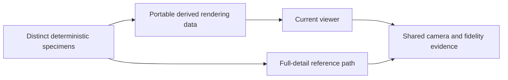

# Seamless full-fidelity tree rendering

## Goal & Context

Make the current viewer render a fully detailed tree cheaply while preserving its appearance continuously from individual needles and leaves to a distant crown. Keep the botanical source intact; solve rendering noise, ground-overlap flicker and runtime cost in rendering. Scale toward thousands of distinct generated specimens, including different structures, sizes and species, rather than repeated placements of one whole-tree mesh.

This is a concise plan with standard-depth research. Fn9 provides the species and reference evidence. Portability is an architectural direction; external-engine execution is not an acceptance gate. No plan-review or impl-review is requested.

## Architecture & Data Models

Retain an authoritative deterministic specimen and derive a renderer-facing representation with stable specimen identity, conservative bounds, coverage/material semantics, error information and explicit resource ownership. Keep portable numeric data separate from Three.js objects. Share reusable parts without collapsing different specimens into copies; do not retain 1,000 expanded full-detail matrix arrays merely to draw a forest.

Use the current WebGL viewer for a bounded candidate experiment before selecting a production representation. Compare spatial hierarchy/culling and coverage-preserving aggregates against the existing full-detail path. Near views must recover resolved anatomy; distant representations must preserve coverage, volume and lighting. A Nanite-like hierarchy is a research direction, not a mandated voxel format, engine or graphics API migration.



## API Contracts

The rendering boundary accepts specimen identity and immutable derived data; the viewer owns camera-dependent selection and graphics resources. Rebuilds invalidate derived data by source identity and representation version. Shared parts have one explicit lifetime owner; replacing or disposing one tree cannot invalidate another.

Reference and optimized modes consume the same specimen, camera and lighting conditions. If detail is not ready, retain a valid faithful representation or explicitly pause/report unavailable detail; never silently draw a thinner tree. Empty outputs remain valid, malformed/nonfinite data is rejected before upload, and canceled or failed builds release partial resources.

Measurement receipts identify hardware, backend, revision, native resolution/DPR, render flags, specimen and camera manifest, warmup, raw GPU samples, CPU costs and separately labeled memory domains. Unsupported/disjoint/timeout/context-loss results are unavailable evidence, never substituted wall-clock GPU measurements.

## Acceptance Criteria

- **R1:** Preserve visible anatomy, attachment, silhouette, volumetric foliage coverage, crown gaps and shading at every viewing distance. Full source detail remains recoverable on approach. Before candidate selection, pin screen-space, coverage, shading and temporal tolerances against full-detail references, including a converged reference where native sampling itself aliases. Fail for lost gaps, flattened sprays, thinning or unresolved reference disagreement; do not relax tolerances to fit an optimization.
- **R2:** Slow/fast orbit, dolly, zoom, reversals and repeated detail-boundary crossings show no visible stepping, popping, representation swaps, shimmer, ghosting or unexplained disappearance. Validate sequences as well as stills. Exercise cold detail requests, camera-inside-crown views, resize/DPR changes and invalidated bounds; missing data must use the explicit handling in API Contracts.
- **R3:** Demonstrate the 2 ms GPU hero-tree budget on RTX 3080 at declared native resolution/DPR with mature full-foliage spruce and additional species, across close, whole-tree and distant moving views. Pin a 1600×1000 physical-pixel, DPR 1 benchmark to match the existing rig; record the actual canvas and hardware. Use p95 steady-frame GPU time for budget acceptance and report p50, p99, maximum, cold preparation, CPU submission/update, uploads and memory. Retain the 4 ms vegetation target and measurement for at least 1,000 distinct generated specimens, with different seeds and verified distinct botanical structures plus a declared species/size mix; repeated whole-tree geometry is insufficient. Pin placement, overlap, visible-tree counts and forest camera paths before optimizing. Count all vegetation rendering/selection passes and report whole-stage GPU time separately. A hero miss fails its target; forest misses remain explicitly reported target misses. Missing timers, disjoint samples, interrupted runs, unsupported hardware and resource exhaustion cannot yield a pass or be hidden by fidelity reductions.
- **R4:** Reproduce and diagnose foliage/ground flicker, then remove it with correct depth, occlusion and contact in static, moving and grazing views across relevant depth/lighting modes. Reduce subpixel noise while preserving resolved anatomy and aggregate coverage. Hiding ground, forcing foliage on top or removing source foliage is not a fix; any selected depth/coverage mode must pass the same visual tests, including its capability fallback.
- **R5:** Document the portable data/viewer boundary and assumptions that constrain future engines. Preserve specimen identity, independent placement, conservative bounds and resource ownership while permitting reusable parts. Test replacement, disposal, interrupted preparation and shared-resource survival. No external-engine adapter, benchmark or proof is required; unsupported capabilities are explicit.
- **R6:** Retain a durable full-detail inspection path and reproducible source manifests, reference images, motion sequences, raw timings and verdicts for the current viewer. Baseline and optimized evidence use identical pinned conditions. Missing, stale, mismatched or uninspected evidence is identified and cannot count as a visual pass; independent visual and performance verdicts must remain visible.

## Edge Cases & Constraints

The fidelity contract concerns the visible image at output resolution, not submitting every original subpixel triangle. Botanical generation rules, seeds, counts and attachment anatomy cannot change to buy speed. Full-detail inspection can be regenerated deterministically rather than permanently resident for every forest specimen.

The forest manifest must prove structural distinctness with source-structure fingerprints, not just seed labels; any collision or generation failure is recorded and resolved before the population is accepted. Establish resident CPU/Wasm/graphics allocation limits from the measured machine before forest construction, track cold generation/packing and resident memory separately, and label estimated GPU allocation versus measured memory. Resource limits must not cause silent specimen omission, altered camera density or missing approached detail.

Current full-detail captures hide ground and do not cover temporal behavior; this pass adds those cases. Logarithmic depth, conventional depth, supported reversed depth, MSAA/coverage and any temporal filtering are measured candidates, not presumed fixes. GPU measurements run without competing benchmark jobs.

## Boundaries

Own rendering representation, continuous selection, noise/depth stability, distinct-forest rendering and evidence. Exclude GPU botanical generation (fn12), new botanical species/rules, bark/seasonal authoring (fn14), wind simulation (fn15), external integration (fn17), and a universal engine adapter framework. Preserve data semantics needed by later material/animation work without implementing it.

## Strategy Alignment

- **Surface and rendering at scale** — preserve visible fidelity within measured hero and varied-forest budgets.
- **The core and integration** — keep portable tree/render data independent of viewer resources.
- **Growth and botanical fidelity** — preserve the source anatomy and specimen identity through optimization.

## Decision Context

Repository research supports reusing the typed-array output boundary, existing disjoint GPU timing, memory-domain reporting and seeded reference capture protocol. Those findings confirm the need for durable evidence, explicit ownership and failure reporting previously marked as inferred. Exact representation and tolerance values are scheduled empirical work, not assumed facts.

Instancing alone reduces submission overhead but leaves dense geometry/overdraw and huge per-specimen matrix storage. Primary research supports testing coverage-preserving aggregate representations; hashed coverage or temporal accumulation can introduce noise and ghosting and must earn acceptance. Logarithmic depth can disable early fragment tests; changing it needs paired correctness and timing evidence.

Retain only fn9 as a formal spec dependency. Fn12 can proceed in a separate worktree on generation costs, with separate GPU benchmark windows and coordination if either track changes shared portable outputs. Fn14/fn15 overlap renderer/material/update behavior and are weaker parallel candidates. No reverse dependencies are added merely for potential future consumers.

## Approach & Early proof point

Six cohesive tasks: (1) pin references, motion/ground repro and measurement protocol; (2) test and select a feasible candidate; (3) implement portable derived data and ownership; (4) integrate continuous stable rendering; (5) support and measure the distinct forest; (6) complete acceptance evidence and documentation.

Task fn-13-tree-detail-by-viewing-distance.2 proves a candidate against task 1's fixed fidelity tests, hero GPU target and measured memory scaling on a small varied population. If none passes, retain the evidence and revise the approach before tasks 3–6; a promising screenshot or projected speedup is not a successful proof.

## Quick commands

```bash
npm run typecheck
npm test
npm run test:browser
```

These existing commands provide smoke/regression checks. Tasks add focused render/motion and forest commands; run expensive hardware acceptance after integration, with separate software visual and hardware performance results.

## Research references

- [Epic Nanite Foliage](https://dev.epicgames.com/documentation/en-us/unreal-engine/nanite-foliage): reusable assemblies and aggregate representations are useful directions, not an engine requirement.
- [Three WebGLRenderer](https://threejs.org/docs/pages/WebGLRenderer.html) and [Material](https://threejs.org/docs/pages/Material.html): depth capabilities and coverage/temporal tradeoffs require measured selection.
- [Khronos WebGL2 timer queries](https://registry.khronos.org/webgl/extensions/EXT_disjoint_timer_query_webgl2/): asynchronous GPU timing and invalid-sample handling.
- [NVIDIA hashed alpha testing](https://research.nvidia.com/sites/default/files/pubs/2017-02_Hashed-Alpha-Testing/Wyman2017Hashed.pdf) and [aggregate G-buffer antialiasing](https://research.nvidia.com/sites/default/files/pubs/2015-02_Aggregate-G-Buffer-Anti-Aliasing/AGAA_I3D2015_authors.pdf): subpixel coverage and orientation-aware aggregates; candidates must satisfy our noise contract.
- [Three BatchedMesh source](https://github.com/mrdoob/three.js/blob/dev/src/objects/BatchedMesh.js): per-object visibility/batching patterns, not a substitute for geometry and residency reduction. Recheck installed-version behavior before implementation.

## Requirement coverage

| Req | Task(s) | Gap justification |
|---|---|---|
| R1 | 1, 2, 3, 4, 6 | — |
| R2 | 1, 2, 4, 5, 6 | — |
| R3 | 1, 2, 5, 6 | — |
| R4 | 1, 2, 4, 6 | — |
| R5 | 2, 3, 5, 6 | — |
| R6 | 1, 6 | — |

## Conversation Evidence

> user: "those specs are excellent can you $flow-next-capture them?"
>
> user: "so with all those needles there's a lot of noise on the screen and rendering clearly isn't possible at full 60 fps"
>
> user: "it looks incredibly structurally accurate but the rendering suffers"
>
> user: "there's also some flickering when the foliage overlaps with the \"Ground\""
>
> user: "so should we do a rendering improvement pass?"
>
> user: "i want this renderer to not even break a sweat at one tree with full fidelity. It should never lose fidelity at any distance and no stepping. I guess something like nanite in unreal engine? Can we include this in this spec?"
>
> user: "also we should think about how we can have these trees also work in other game engines with the same fidelity reqs"

> user: "i don't think we need an external engine proof. We just need to keep that in mind architecturally. Maybe smth for $flow-next-strategy"

> user: "just to be clear we should be able to eventually have 1000s of trees that are different instances"
>
> user: "not just one instance drawn 1000 times"
