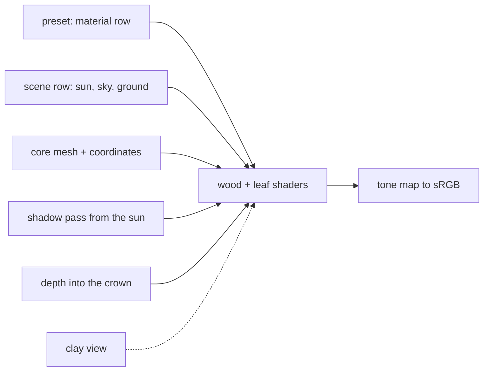

# Bark and foliage appearance

## Conversation Evidence

> user: "those specs are excellent can you $flow-next-capture them?"

This approves the preceding seven-item roadmap, including this outcome. [paraphrase]

> user (interview, 2026-09-10): "atm it's looking pretty bland and i want it to be more impressive soon."
> user (interview, 2026-09-10): "can we have biology dictate the range the leaf hue and brightness can be and we have random jitter within those ranges?"
> user (interview, 2026-09-10): "is there a way we can do full translucency properly? in the budget we have in this spec? or should we aim simpler and refine transclucency more later?"
> user (interview, 2026-09-11): "one thing that might need addressed also in this spec is the noise in the renderer. Does that just come from all the same color overlapping?"
> user (interview, 2026-09-11): "we can include but a lot of the noise is actually in the center of the tree with lots of overlapping leaves atm"
> user (plan, 2026-09-11): "ok /flow-next:plan fn-14"

Refined 2026-09-10 in a short technical interview after fn-24 made every family field a number and fn-25 cut the first walk for X. The owner chose full surface detail, procedural from preset rows, per-leaf variation inside biology-set ranges, one shadow map, two-sided leaf transmission, a sky, sun and ground on a separate scene row, coordinates emitted by the core, bark relief by normal perturbation, oak and spruce each judged beside a photograph kept out of git, up to 1.5 ms more on the frame, and, for the speckle the owner sees in the crown, interior darkening by depth into the crown and 4x multisampling inside the same budget. At write-back the owner split the set: this spec is the lit tree, and bark relief, leaf veins, transmission and the close-up verdicts moved to fn-26, which depends on it. Planned 2026-09-11 at short depth with no review backend, per the owner's routing.

## Goal & Context

Add species-specific bark and foliage appearance through procedural materials, texture coordinates and leaf translucency, using the geometry and anatomy established by the species templates. [paraphrase]

## Architecture & Data Models
<!-- Architecture & Data Models: 20% [strategy], 50% [paraphrase], 30% planned 2026-09-11 -->

Keep one lean, engine-independent core with small boundaries between botanical state and requested representations. [strategy:The core and integration]

- **Appearance is rows, like everything else.** A material row on each preset carries the bark colour, roughness, the leaf front and back colours, and the hue and brightness ranges a leaf may vary inside; fn-26 adds the relief, vein and transmission values to the same row. A separate scene row carries the sun direction and colour, the sky and the ground. Both are numeric, validated by range, and the blend walks them like any family field; no shader or renderer path branches on a species. [paraphrase]
- **The material row lives in the family; the scene row lives on the renderer.** The material row is one more struct in the family with rows in the wire table, so presets, the blend and the panel pick it up as they picked up the habit. The scene row is not a property of a tree: it is a renderer-side value table with a default, set the way the view is set today, carried by the headless command and the page session, and shown in the panel through the same generic numeric controls. A blend of two valid ranges stays valid because both ends interpolate linearly, so no re-validation is needed after a blend. [planned 2026-09-11]
- **The core emits surface coordinates.** The surface builder already computes each wood vertex's distance along its axis and its angle around it and discards them; it now writes them, and the mirrored attachment surface stays geometrically identical. The element builder already has each leaf vertex's position along and across the blade and writes them too. The coordinates are a separate buffer, two floats per vertex, so every existing buffer keeps its stride and the wasm binding gains one slot; positions, normals, indices, levels and placement records are unchanged. [paraphrase, refined in planning]
- **Bark and leaf surface detail come next.** Ridges, plates, veins and two-sided transmission are fn-26's, drawn along the coordinates this spec emits; here the bark is a coloured, rough surface under the sun and the leaf a coloured blade lit on both faces. [paraphrase]
- **Leaves.** The blade shader lights both faces under the sun and the hemisphere. Each leaf's colour is a seeded offset inside the row's hue and brightness ranges. The leaf's identity is its placement index, which the level list already hands the shader, so the offset is stable across levels and frames for one generated tree; a regenerated tree is a new tree and takes new offsets, as its skeleton does. [paraphrase, identity settled in planning]
- **One sun, one shadow map.** A depth-only pass from the sun over the wood and every leaf at the element's fixed coarsest level, one instanced draw over the whole placement buffer with no second selection, into a single-sample depth texture sized to the crown's bounds plus the ground shadow the sun's elevation throws; both shaders sample it for self-shadow and the ground disc for its shadow. The pass gets its own timestamp pair. [paraphrase, mechanism settled in planning]
- **The crown's interior reads as a mass.** The speckle in the middle of the crown is thousands of overlapping leaves with no occlusion cue. The submit path already computes the foliage bounds; they go into the uniforms, and the leaf shader attenuates the hemisphere by how far the leaf's placement sits inside the ellipsoid inscribed in those bounds, with the amount on the material row. An approximation of ambient occlusion by depth, judged by eye. [user, derivation settled in planning]
- **Edges.** 4x multisampling on colour and depth with a resolve into the single-sample target, on the headless target and the page; the shadow depth target stays single-sample; the pipeline helper takes the sample count. A device without 4x support falls back to one sample and the timing record says so. [paraphrase, refined in planning]
- **The room becomes outdoors.** The sky gradient, the sun and the ground colour come from the scene row; the clay room stays a selectable view, materials off, the hemisphere alone and no tone map, so it looks as it does today. The bare view is lit and shadowed wood; the leaf view lights one blade and skips the shadow pass. [paraphrase, views settled in planning]
- **Output.** Linear lighting with a simple filmic tone map to sRGB, applied once at the end of the lit frame and never in the clay view. [inferred]



## API Contracts
<!-- API Contracts: 60% [paraphrase], 40% planned 2026-09-11 -->

- **Material row.** Part of the family: bark colour, roughness; leaf front colour, back colour, hue range, brightness range, interior darkening amount. Validation rejects a value outside its range or non-finite naming the field, and a range whose low end exceeds its high end naming the field; the blend interpolates colours in linear space. [paraphrase]
- **Scene row.** Its own value table with a default: sun azimuth and elevation, sun colour, sky zenith and horizon colours, ground colour. Set on the renderer like the view; the headless command takes it as one flag carrying the row's JSON; the page session takes it through one setter; the panel shows it through the generic numeric controls. [paraphrase, transport settled in planning]
- **Mesh contract.** Wood and leaf meshes gain a coordinate buffer of two floats per vertex beside position and normal; the level ladder carries it through every level because a level is a subset of sections. The wasm binding exposes it as one more numbered slot. A consumer that ignores the buffer renders as before. [paraphrase]
- **Views.** Whole, bare and leaf views render lit; a clay view renders as today. The headless command takes a scene row and a view. [paraphrase]
- **Timing.** The timing session gains a third timestamp pair around the shadow pass and records the sample count; the multisample resolve is inside the vegetation pass and its cost is the difference between a 4x and a 1x run, recorded in the report. [inferred, refined in planning]

## Edge Cases & Constraints
<!-- Edge Cases & Constraints: 60% [paraphrase], 40% [inferred] -->

- **Levels.** A coarser leaf level has fewer sections; the coordinates survive because sections are kept whole, and every per-leaf term must read the same at every level or the crown shimmers when levels switch. [inferred]
- **The spruce.** 7 million needles in the shadow pass at their coarsest level; recorded, not gated. [inferred]
- **Budget.** Native oak vegetation plus selection plus shadow p50 at most 3.8 ms on the RTX 3080, 2.30 ms plus 1.5 ms, valid session; the browser orbit holds wall p95 under 16.7 ms and no frame over 33 ms. An unavailable, disjoint or contended session is recorded and does not count. [user]
- **References.** fn-9's reference manifest already catalogues the photographs: O-WHOLE, O-BARE and O-LEAF for the oak, S-WHOLE, S-BRANCH and S-NEEDLE for the spruce, with a retrieval command; downloads stay under the ignored references directory and are never redistributed, and the report names each source and checksum. The owner may add photographs of their own. Fetching them is not a GPU capture and does not count against the capture budget. [paraphrase]
- **Evidence.** The lit oak and spruce hero stills, viewed within the project's image budget per capture; close-up scales belong to fn-26; no forest captures. [paraphrase]
- **Interior darkening at the levels.** The depth term is per instance, so it reads the same at every level and does not flicker when a leaf changes level. [inferred]
- **Multisampling in the browser.** The page's surface must be created with the sample count; the headless target and the page use the same setting. [inferred]
- **Harness.** The scene row and the material row reach the panel through the generic numeric controls fn-24 added; no panel code per field. The panel file is already over the line rule and is split before it grows. [inferred, refined in planning]
- **Shadow frustum.** Sized from the crown bounds and the sun's elevation so a low sun's long ground shadow still lands inside the map; the 400 m disc is never the frustum. [planned 2026-09-11]
- **Later specs on the same files.** fn-4 and fn-20 will edit the surface builder after this spec; the coordinate write is one loop and its mirror, kept small so those merges stay simple. fn-21 will seed per-leaf shape off the same placement index; this spec records that convention. [planned 2026-09-11]

## Quick commands

```bash
cargo test --release --workspace                                   # coordinates, rows, renderer tests (skip without adapter)
cargo run --release -p telperion-render --example headless -- --preset oregon-white-oak --seed 7 --out /tmp/fn14-oak.png --timing /tmp/fn14-oak-timing.json
cargo run --release -p telperion-render --example headless -- --preset oregon-white-oak --seed 7 --view clay --out /tmp/fn14-oak-clay.png
npm run wasm:build && npm test && npm run typecheck              # regenerated metadata, panel tests
npm run render:build && npm run test:render                        # browser orbit under hardware WebGPU
```

## Acceptance Criteria

- **R1:** Selected species have reference-based bark and foliage appearance, including suitable texture coordinates and translucency; no error surface beyond R2. [paraphrase]
- **R2:** Validate appearance at trunk, branch and leaf scales under controlled lighting. Seams, stretched coordinates, missing resources and unsupported effects are exposed and handled with a usable fallback or explicit limitation. [inferred]
- **R3:** Keep neutral geometry inspection available and report material-related GPU and memory costs; visual improvement must not conceal structural regressions. [inferred]
- **R4:** Every appearance value is a numeric row: a material row on each preset and a separate scene row for sun, sky and ground; a blend between two presets walks the material rows, and no shader or renderer path branches on a species. [paraphrase] [strategy:The core and integration] Errors: a value outside its range or non-finite is rejected naming the field.
- **R5:** The core emits surface coordinates as two floats per wood and leaf vertex, along and around a branch, along and across a blade, carried through every level; positions, normals, indices, skeleton and placement pins are unchanged. [user] Errors: no error surface beyond the mesh validation that already exists.
- **R7:** Each leaf's colour is a seeded offset inside the preset row's hue and brightness ranges, the ranges taken from the botanical reference, so every leaf differs and the tree stays its species; same seed, same offsets. [user] Errors: a range whose low end exceeds its high end is rejected naming the field.
- **R9:** One shadow map from the sun gives self-shadow on wood and leaves and a ground shadow; the shadow pass draws leaves at their coarsest level and is timed on its own in the timing record. [user] Errors: without the timestamp feature the shadow number reads unavailable and the still still renders.
- **R10:** The sky, sun and ground come from the scene row and the clay room stays a selectable view; the harness and the headless command take a scene row. [user] Errors: no error surface beyond R4.
- **R11:** The owner judges the lit oak and spruce hero stills at seed 7 beside fn-9's catalogued reference photographs, O-WHOLE and S-WHOLE from the OSU Landscape Plants pages, re-fetched with fn-9's retrieval command into the ignored references directory, or others the owner supplies; the report names each source and checksum and the spec closes only on accepting verdicts for both. The close-up scales are judged in the follow-on spec. [user] Errors: a rejecting verdict stops the spec with the owner's words and a one-paragraph blocker.
- **R12:** The oak's native vegetation, selection and shadow p50 together stays at or under 3.8 ms on the RTX 3080 with a valid session, and the browser orbit holds wall p95 under 16.7 ms with no frame over 33 ms, recorded beside fn-24's numbers. [user] Errors: an unavailable, disjoint or contended session does not count; a number over the bound stops the spec with the number rather than another attempt.
- **R14:** Leaves inside the crown are darkened by their depth into it, an ambient-occlusion approximation with its amount on the material row, so the overlapping interior reads as a shaded mass rather than speckle; judged in the hero stills. [user] Errors: no error surface beyond R4.
- **R15:** Colour and depth render with 4x multisampling and a resolve on both the headless target and the page; its cost is inside the R12 bound and recorded in the timing record. [paraphrase] Errors: a device without 4x support falls back to 1 sample and the still records the fallback.

## Early proof point

Task fn-14-bark-and-foliage-appearance.3 validates the core approach: the sun and its shadow map inside the frame budget. If the shadow pass alone, with leaves at the coarsest level, costs more than the 1.5 ms the owner allowed, re-evaluate the shadow resolution and the leaf representation in the shadow pass before the look work in task 4 builds on it.

## Boundaries

Supernatural visual effects, seasonal transitions and lifecycle simulation are separate work. [inferred]

- No bark relief, leaf veins or transmission; those are fn-26's on top of this spec's coordinates and shadow map. [paraphrase]
- No image textures; every value is a row. [paraphrase]
- No change to positions, normals, indices, levels, skeleton or placement pins; the coordinate buffer is additive. [paraphrase]
- No shadow or interior term in the leaf view; no tone map in the clay view. [planned 2026-09-11]
- No spruce frame gate; the spruce's numbers are recorded, not gated. [planned 2026-09-11]
- The regrowth flicker of the walk video, the ordinary leader's bend, the low leaf counts and the files over the line rule from fn-24 stay with their own follow-ups. [planned 2026-09-11]

## Strategy Alignment

Active tracks served by this plan:
- **Surface and rendering at scale** — bark, leaves, light, shadow and edges through shared geometry and data contracts, with no species path in the renderer, measured on the same rig as fn-23 and fn-24.
- **Growth and botanical fidelity** — the oak and spruce judged lit beside real photographs, with per-leaf colour ranges taken from the botanical reference.
- **The core and integration** — the material row rides the family's value table and blend; the coordinate buffer is an additive extension of the engine-neutral mesh contract.

## Decision Context

Depends on Real-species profiles and procedural templates. Geometry and foliage anatomy precede appearance. [paraphrase]

### Implementation Tradeoffs

- Procedural from rows over image textures: the strategy makes every parameter a numeric trait that blends, and the walk between two trees then walks bark and leaf colour too; textures would be a species switch again. [paraphrase]
- Coordinates from the core over shader-derived world-space projection: the core knows every axis and section exactly, so the pattern is seam-free along a limb where a projection stretches and seams on every curve. [paraphrase]
- A separate coordinate buffer over an interleaved vertex: every existing stride, wasm slot and test pin stays untouched, at the cost of one more buffer to bind. [planned 2026-09-11]
- Normal perturbation over vertex displacement: the silhouette stays the generator's, and the fn-24 pins and level ladder are untouched. [paraphrase]
- A separate scene row over light on the preset: a tree is a species and the light is a scene; an oak and a spruce stand under one sky, and the walk keeps one light. [paraphrase]
- The shadow pass over the whole placement buffer at the fixed coarsest level, over reusing the camera's selection lists: the sun's view is not the camera's, a second selection dispatch would cost as much as the pass, and the coarsest level is a handful of triangles per leaf. [planned 2026-09-11]
- Depth into an inscribed ellipsoid over a neighbour-density term: the bounds already exist at submit, the term is one uniform and a few operations per leaf, and the owner judges it by eye. [planned 2026-09-11]
- Two-sided transmission over a single strength number or physically based scattering: three row values and the shadow map give the glow a crown has against the light inside the budget; multi-bounce scattering is invisible at crown scale and outside it. [paraphrase]
- Full surface detail in one spec over lit clay first: the owner wants it to look impressive soon; colour, light, relief and veins are one look judged together. [user]
- Photographs out of git: licensing is the owner's call and the evidence rules keep large media on disk. [paraphrase]
- Rejected: per-leaf colour stored in the instance record; the placement index the level list already carries gives a stable seed for free. [inferred]
- Interior darkening and multisampling ride in this spec because the owner's complaint is the crown's speckle, and colour and shadow alone would leave half of it. [user]
- Split at write-back: the lit tree here, surface detail in a follow-on spec that depends on it, because this spec carries every cross-cutting change (vertex layout, rows, shadow pass, tone map, sample count) and the follow-on touches only the two shaders and the evidence. [user]

## Resolved via Codebase

- The wood and leaf shaders shade one flat clay value under one hemisphere and nothing else (`crates/telperion-render/src/shaders/wood.wgsl:26-30`, `foliage.wgsl:42-45`); no key light, no shadow, no tone map exists.
- A wood vertex is position and normal only (`wood.wgsl:19`); a leaf instance is one 4 by 4 matrix with no colour slot (`foliage.wgsl:18`, `crates/telperion-core/src/foliage.rs:44-48`), which is why the coordinates come from the core and the per-leaf offset from the placement index.
- The room's colours are constants: clay, background, ground, sky light and ground light (`crates/telperion-render/src/scene.rs:12-19`); they become the scene row's defaults.
- The leaf element is sections with a per-frame level ladder (fn-23) and the fn-24 pins fix positions, indices, skeleton and placement; the coordinate attribute is additive to that contract.
- fn-9 froze a botanical reference manifest with six inspected OSU photographs and their retrieval command (`.flow/evidence/fn9/REFERENCES.md`); the original downloads under `.refs/fn9/` are ignored and currently absent from disk, so the judging task re-fetches them.
- Planning found the surface builder computing distance along the axis and angle around it per vertex and discarding both (`crates/telperion-core/src/surface.rs:230-248`), the level list handing the leaf shader its placement index (`foliage.wgsl:28-32`), the foliage bounds computed at submit (`crates/telperion-core/src/foliage.rs:71-79`), one shared pipeline helper with a fixed depth format and no multisampling (`crates/telperion-render/src/lib.rs:320-366`), and a timing session with two timestamp pairs in a query set of four (`crates/telperion-render/src/timing.rs:128-172`).

## Owner verdict

R11 is the owner's judgment of the lit oak and the lit spruce, recorded here in
the owner's own words. Compare `.flow/evidence/fn14/oregon-white-oak-hero.png`
with the photograph `.refs/fn9/quga788B.jpg` (O-WHOLE, OSU Landscape Plants,
SHA-256 `01bed8875ac98d92926404ad1dfd967a319509ad4f735731064ba2b1452407a4`), and
`.flow/evidence/fn14/norway-spruce-hero.png` with `.refs/fn9/piab977.jpg`
(S-WHOLE, OSU Landscape Plants, SHA-256
`49df5c91efafdf76d356a21a0adcac6c1d1d93cb6d86ca5cc889317cb5b8ec90`). Both
stills are seed 7, whole view, hero pose, 1600 by 1000, the default scene row,
four samples a pixel, on the RTX 3080, which is fn-24's framing on the same two
specimens; fn-24's own stills are the unlit sides of the pair. The question is
whether each tree reads as its species under light, at the trunk and crown
scales only. The close-up scales are fn-26's. `.flow/evidence/fn14/REPORT.md`
carries the measured aids, the sources and the checksums. The spec closes only
on two accepting verdicts, and a rejecting verdict stops the spec with the
owner's words and a one-paragraph blocker.

Separately from these two: the same report records the oak's native frame at a
total p50 of 4.9487 ms against R12's 3.8 ms bound, valid session, with the
browser orbit inside its bounds at a wall p95 of 10.10 ms and a worst frame of
10.20 ms. That stop is a number, not a verdict, and neither slot below clears
it. The lever the report names is a coarse wood caster for the sun's depth pass,
which draws the full-resolution wood today and costs 1.813 ms of the 4.949.

### Oregon white oak, hero pose, lit

> _verdict (owner, ):_

### Norway spruce, hero pose, lit

> _verdict (owner, ):_

### The frame number, R12

> _owner decision (owner, ):_

## References

- fn-24 spec and `.flow/evidence/fn24/`, the frame numbers this spec's R12 sits beside and the report shape it follows.
- fn-23 spec, the level ladder the coordinates ride and the shadow pass draws.
- fn-9 reference manifest, the photographs and their retrieval.
- fn-26 spec, the follow-on that draws relief, veins and transmission along this spec's coordinates.

## Requirement coverage

| Req | Description | Task(s) | Gap justification |
|-----|-------------|---------|-------------------|
| R1 | Reference-based appearance with coordinates and translucency | fn-14-bark-and-foliage-appearance.4, .6 | Translucency itself is fn-26's |
| R2 | Validated at three scales, seams exposed | fn-14-bark-and-foliage-appearance.6 | Close-up scales judged in fn-26 |
| R3 | Clay inspection kept; material costs reported | fn-14-bark-and-foliage-appearance.4, .6 | — |
| R4 | Material and scene rows, no species branch | fn-14-bark-and-foliage-appearance.2 | — |
| R5 | Coordinates from the core, pins unchanged | fn-14-bark-and-foliage-appearance.1 | — |
| R7 | Per-leaf colour inside biology ranges | fn-14-bark-and-foliage-appearance.4 | — |
| R9 | One shadow map, timed | fn-14-bark-and-foliage-appearance.3 | — |
| R10 | Scene row on page and headless; clay view | fn-14-bark-and-foliage-appearance.2, .4 | — |
| R11 | Owner verdicts on oak and spruce beside fn-9's photographs | fn-14-bark-and-foliage-appearance.6 | — |
| R12 | Frame within 3.8 ms native and 60 fps orbit | fn-14-bark-and-foliage-appearance.6 | — |
| R14 | Interior darkening by crown depth | fn-14-bark-and-foliage-appearance.4 | — |
| R15 | 4x multisampling with fallback, timed | fn-14-bark-and-foliage-appearance.5 | — |
| R6, R8, R13 | Moved to fn-26 | — | Bark relief, transmission, veins |
