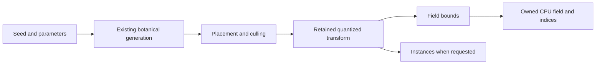

# Faster field generation

## Conversation Evidence

> user: "those are pretty small improvements. No order of magnitude improvements available?"
>
> user: "ok you wanna amend it with $flow-next-capture --rewrite?"
>
> user: "ok $flow-next-capture --rewrite it first then and $flow-next-plan it after no review"

## Goal & Context

Make complete CPU field construction faster and use less temporary memory without changing the generated tree. Fn12 measured roughly 81% of the giant build in foliage preparation and field construction; its GPU query experiment did not qualify as a production improvement. This work targets those construction costs for native and browser consumers. It introduces no UI, deployment configuration or public backend choice.

Pursue several-fold improvements and investigate a measured route to 10× complete first-build speed. Small percentage gains may contribute, but do not resolve the larger optimization ambition.

## Architecture & Data Models

Profile the complete generation path, including growth, foliage preparation, bounds conversion and indexing. Compare removal of unnecessary work, algorithmic changes and bounded multicore construction. Select approaches by their measured end-to-end potential; direct field bounds remain a candidate rather than the mandatory first implementation. Preserve exact output and deterministic behavior under each approach.



## API Contracts

Preserve synchronous build/query signatures, output selection, diagnostics, exact wood/foliage occupancy flags and ownership. Field-only builds still include the same retained foliage as the equivalent combined-output build, without returning render buffers. Preserve placement budgets against the number placed, even when many placements are culled.

Retain the existing f64-to-f32 matrix quantization before f64 bounds arithmetic, the eight-corner local-AABB transform, closed contact predicates, seeded order and botanical source. Equivalent-looking algebra is insufficient when it changes a boundary value. No epsilon relaxation or foliage thinning is allowed.

Snapshot schema 1 continues to export the live CPU field exactly, with owned arrays and its existing topology layout. An index optimization may change deterministic internal partition order across implementations; primitive bounds/wood source and query results must remain exact. Repeated builds of the same implementation must remain byte-identical. The comparison oracle must distinguish source identity from BVH ordering rather than demand old topology bytes or hide lost/duplicated primitives.

## Edge Cases & Constraints

Cover empty fields, no retained foliage, empty elements, zero-length/zero-extent geometry, rotations and nonuniform transforms, equal-centroid index partitions, closed face/edge/corner contacts, outside queries, malformed/nonfinite/overflow inputs, and placement/allocation limits. Preserve complete success or existing error behavior, including invalidation after failed rebuilds, stale/released/disposed handles, independent owned snapshots and valid queries after rejected query inputs. Do not add a general failure-injection or caching framework.

Pin the benchmark protocol before candidate implementation. Use fn12's exact full Ordinary and Telperion workloads as the performance anchors; add Norway spruce and English oak seed holdouts for correctness. Freeze all seeds, parameters, counts, output masks, binary hashes, compiler settings and host/browser versions. Run reference and candidate under equivalent conditions with exclusive CPU measurement access; coordinate with fn13's measurements. No planning-time timing run is required: fn12 supplies the bottleneck evidence, and task 1 captures the reproducible comparison baseline.

Use at least three warmups and ten paired measured rounds with alternating revision order. Compare fresh equivalent Wasm instances for cold first-build and memory observations separately from steady repeated builds. Save every raw sample, error and interruption; do not drop slow samples. Report median, p95 and maximum without describing ten-sample tails as stable population estimates. Hashing, snapshot extraction, artifact I/O and query-cell generation stay outside build timing and have separately reported costs. Instrumentation overhead must be checked against an uninstrumented build. Unavailable temporary-allocation telemetry makes the memory gate inconclusive; estimated totals cannot silently replace measured allocation lifetimes.

Use 3× complete giant first-build speed as the proposed several-fold target and 10× as the stretch investigation target. Quantify achievable speedups using measured stage costs and demonstrated candidate kernels, then validate any adopted combination end-to-end. Ordinary builds must also improve beyond repeatability noise. Record reached, missed and unproven targets separately; a smaller useful gain does not satisfy the several-fold target, and a projected 10× result is not a demonstrated one.

Reduce the giant peak of simultaneously live named temporary allocations by at least 10%; separately report retained field capacity and Wasm high-water, without adding contained allocations twice or presenting capacity as an OS peak. Fixed 32³/64³/contact query medians and equivalent combined-output build medians must not regress more than 5% beyond measurement noise; report tail changes and cold-build regressions explicitly. Pin the repeatability calculation and decision rules before changing the candidate. Inconclusive measurements or missed thresholds remain unresolved.

For multicore candidates, include scheduling, synchronization, worker startup and memory costs; preserve deterministic source output independent of execution order. State browser/native support and the behavior when parallel execution is unavailable. Evaluate limited edit-time reuse separately, including invalidation and exact equivalence to a full rebuild; it cannot qualify a first-build speed claim or justify a general caching framework by itself.

The primary 3× target is browser cold first-build latency on the pinned giant workload. Measure a fresh engine initialization through complete field construction and required output transfer, with compilation/download reported separately and identically conditioned. Also report the build-call-only duration and disposal cost. Fresh-instance comparisons cannot reuse a previous tree or worker warmup. Native latency, distinct-tree throughput and warmed rebuild results are supplemental, explicitly labeled by platform and lifecycle; they cannot satisfy the browser target.

Current browser construction remains sequential: the existing synchronous API cannot be replaced by asynchronous worker messaging or main-thread blocking waits. Evaluate bounded native parallelism behind an internal platform boundary, preserving the browser serial path. Missing native parallel support selects the exact serial implementation before work begins; a worker failure after dispatch returns a whole-build error with cleanup, never partial output. No new browser isolation-header requirement or public asynchronous API is introduced. Edit-time reuse is an evidence-only assessment unless an existing public ownership contract already supports it.

Each candidate is compared against both the pinned original and its immediate predecessor. A smaller useful exact-output improvement may be retained if it clears the noise and regression guardrails, but the overall 3× requirement remains unmet until demonstrated. Freeze a paired baseline-repeatability rule before optimization and retain all misses; do not relax thresholds after seeing results.

## Acceptance Criteria

- **R1:** Pursue the several-fold complete first-build target and evaluate the 10× route using measured growth, foliage, bounds/index and parallel overhead costs. Report achieved end-to-end speedup, temporary memory and remaining limiting stages for the fixed anchors. Errors/boundaries: mismatched inputs/binaries, capped output, missing samples, competing load, timer failures, cached inputs and projections cannot qualify as achieved speedup; misses remain explicit.
- **R2:** Preserve exact botanical source, retained foliage bounds, occupancy, seeded repeatability and field-only/combined-output equivalence under the API Contracts. Errors/boundaries: include contact and zero-extent cases, empty output, species holdouts, duplicate-centroid partitions, transform rounding/overflow and malformed queries; independently detect dropped/duplicated foliage or changed contact classification.
- **R3:** Compare algorithmic work reduction and multicore construction across the complete generation path, including growth; adopt only exact-output improvements supported by full lifecycle timing and the query/combined-output/memory limits. Assess edit-time reuse separately. Errors/boundaries: include unavailable parallel support, worker failure and scheduling overhead; reject changed source counts, nondeterministic results, stale reuse and hidden query or memory regressions.
- **R4:** Retain a reproducible reference-versus-candidate harness, raw evidence and focused resource/lifecycle regression tests, and document the resulting behavior and measured limits. Errors/boundaries: preserve placement-limit failures, overflow/allocation handling, failed-build invalidation, stale/released/disposed handles, owned snapshot independence and cleanup; distinguish controlled failure tests from observed hardware failures.

## Boundaries

Rendering remains fn13. New botanical rules, an external-engine proof and another GPU query backend are outside this work. Growth implementation changes, algorithmic restructuring and bounded multicore construction are in scope when they preserve exact source fidelity. Incremental editing is a separately measured candidate, not a substitute for accelerating initial generation. A general threading/caching framework or new public configuration surface is not required.

## Strategy Alignment

- **The core and integration** — reduce optional-output construction cost inside the lean, engine-independent Rust core while preserving small ownership boundaries.
- **Growth and botanical fidelity** — preserve the authoritative structure and retained foliage while changing its construction cost.

## Decision Context

Fn12's approximately 312 ms growth stage is about 19% of its 1.62 s giant build. Leaving growth unchanged limits even perfect elimination of every other stage to roughly 5× overall; a 10× route must also accelerate growth. This is a limit derived from that measured baseline, not a prediction that such a speedup is achievable.

Removing temporary matrices remains a plausible contribution, but the investigation must not stop there merely because a small acceptance threshold was crossed. Compare larger opportunities before selecting implementation order, and keep first-build latency, distinct-tree throughput and edit latency as separate measurements.

Research identifies ordered growth rounds and local shoot planning as candidate kernels; the current attractor lookup is already spatially indexed. Preserve original random streams, strict nearest-node tie behavior, floating-point accumulation order and serial append/budget decisions. A different seed-per-worker or seed-per-ordinal scheme would change the source and is excluded. Parallelize independent calculations only where ordered results can be committed exactly.

Use fn12's completed implementation as the executable baseline prerequisite. Fn11's future age simulation and fn13's renderer do not impose task dependencies; coordinate exclusive benchmark windows with fn13. The earlier inference that parallel browser construction could be added within the current API is resolved by platform documentation: native parallelism is feasible to investigate, browser worker messaging would require a separate API decision.

## Quick commands

```bash
cargo test --release -p telperion-core --test field
npm run typecheck
npm run test:browser
```

## References

- Fn12 completed implementation `6f3adb2` and its CPU generation evidence; task 1 pins the integrated baseline and exact runner paths.
- [Rust numeric casts](https://doc.rust-lang.org/reference/expressions/operator-expr.html#numeric-cast) — preserve the f32 rounding boundary.
- [Rust slice selection](https://doc.rust-lang.org/stable/core/primitive.slice.html#method.select_nth_unstable_by) — in-place median selection and unstable equal-key ordering.
- [Rust Vec](https://doc.rust-lang.org/std/vec/struct.Vec.html) — fallible reservation and allocation capacity.
- [WebAssembly numeric semantics](https://webassembly.github.io/spec/core/exec/numerics.html) — numerical behavior and exceptional values.
- [W3C User Timing](https://www.w3.org/TR/user-timing/) — browser measurement boundaries.
- [Parry BVH construction](https://github.com/dimforge/parry/blob/master/src/partitioning/bvh/bvh_ploc_build.rs) — an alternative to investigate only if measured costs justify it.
- [Rust scoped threads](https://doc.rust-lang.org/std/thread/struct.Scope.html) — bounded native work joined before returning.
- [Rust Wasm target](https://doc.rust-lang.org/rustc/platform-support/wasm32-unknown-unknown.html) — native thread spawning is unavailable on this target.
- [Worker messages](https://developer.mozilla.org/en-US/docs/Web/API/Worker/postMessage) and [Atomics.wait](https://developer.mozilla.org/en-US/docs/Web/JavaScript/Reference/Global_Objects/Atomics/wait) — browser messaging and main-thread blocking constraints.
- [Rayon iteration contracts](https://github.com/rayon-rs/rayon/blob/main/src/iter/mod.rs) — unspecified reduction order must not change reference floating-point sums; no dependency adoption is required.

## Early proof point

Task fn-18.1 freezes the stage-level savings budget and runs bounded candidate-kernel probes against the exact oracle before selecting production changes. Tasks fn-18.2 and fn-18.3 provide the first integrated growth and foliage proofs; failed candidates retain the reference and evidence, while fn-18.4 and fn-18.5 assess remaining index/native-parallel opportunities without assuming the 3× or 10× target is reachable.

## Requirement coverage

| Req | Description | Task(s) | Gap justification |
|---|---|---|---|
| R1 | Several-fold first-build target and measured 10× investigation | fn-18.1–fn-18.6 | — |
| R2 | Exact source, field and deterministic behavior | fn-18.1–fn-18.6 | — |
| R3 | Qualified algorithmic/parallel optimization and separate reuse assessment | fn-18.2–fn-18.6 | — |
| R4 | Reproduction, lifecycle validation and documentation | fn-18.1, fn-18.2, fn-18.3, fn-18.5, fn-18.6 | — |
