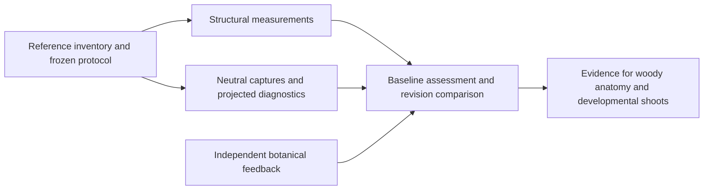

# Comparative botanical geometry benchmark

## Conversation Evidence

> user: "i want this to become sota. i think we can do it. check current uptodate state and screenshots and open specs and evaluate what's needed to get there"
> user: "first give me a steering prompt for the agent overseeing fn-13 and fn-18 to adapt to what you found and then draft next steps from here"
> user: "ok can you $flow-next-capture all these?"
> user: "yes having a template on how to expand our species catalogue would be excellent i want to add a pipeline where we just start pumping out specimen after specimen for new species in parallel"
> user: "so very good make that explicit."

## Goal & Context

Establish how Telperion compares with real trees and leading generators on biological plausibility and geometric detail. Begin with Oregon white oak and Norway spruce, using the existing species work as the baseline. [paraphrase]

Oak and spruce are the first benchmark cohort, not a catalogue limit. The catalogue is intended to expand continuously through a repeatable species-onboarding workflow, with independent species work running in parallel. A species template describes a botanical family; a specimen is one seeded realization of that template. Each admitted species must demonstrate multiple specimens, not only one showcase tree. [paraphrase]

## Architecture & Data Models

Keep attributed reference observations, generated specimen measurements and reviewer judgments distinguishable. Comparisons identify species, growing context, dimensions, source revision, seed and viewing conditions.

## Overview

Five bounded tasks build on the existing species measurement and neutral-capture foundation. Reference/protocol work precedes parallel tasks for structural measurements, visual diagnostics and the reusable onboarding template/workflow, followed by a baseline assessment and replay documentation. This is a short-depth plan with repository, spec, memory, documentation and flow-gap research. External research and reference acquisition are implementation work, not claimed completed research.

The owner and geometry implementers receive reproducible evidence for fn20/fn21. There is no new end-user viewer feature or production generator API. Existing fn9 output is the available baseline despite its open lifecycle status. Fn13 and fn18 remain independent concurrent workstreams.

## Approach

Create one versioned benchmark protocol and reference inventory, then one compact run manifest tying source, measurements, captures and assessments together. Reuse the existing native species measurement module and capture conventions without changing historical schemas or receipts. Benchmark-only runners and diagnostics may add the missing distributions and views; production botanical generation stays unchanged.



## API Contracts

The benchmark tooling consumes an explicit specimen manifest and output directory. It emits versioned machine-readable receipts plus a human-readable report; it introduces no library API. A run identifies protocol/reference version, source revision and content hashes, full specimen parameters, case IDs, tool versions and rendering conditions. A dirty worktree is permitted only with a complete content identity for relevant source and generated binaries; a Git revision alone cannot identify uncommitted output.

Reference records distinguish matched quantitative data, qualitative-only imagery and unavailable comparisons. Attribution, scientific species identity, growing context, anatomical scale and usage availability are recorded; unknown age, scale or context narrows admissible comparisons. Existing accessible assets and public documentation suffice for investigation. Paid asset acquisition or contacting reviewers requires separate user authorization.

Each result carries measured, estimated, unavailable or failed status with units, definition and evidence references. Numeric collection, capture completion, visual inspection and independent botanical assessment have separate dispositions. An absent value is never zero. Missing assets, mismatched manifests, nonfinite geometry, resource caps, timeouts and interrupted runs retain their cases and reasons.

Baseline/candidate comparisons require identical protocol, cases and declared comparison conditions. Source revisions may differ by design. Geometry changes may change output counts and bounds; do not require output hashes to match across candidates. Changed protocols, references or camera rules create a new benchmark version and leave prior results intact. Interrupted runs use new output directories; previously complete artifacts may be referenced only after identity verification. Never overwrite a prior run to repair a failure.

**Catalogue expansion contract.** Freeze means pinning the exact cohort and conditions for one comparison, never closing the species catalogue. Every new species receives its own stable identity, attributed profile, capability requirements, parameters and fixed/held-out specimen sets. A later benchmark version may add species, contexts and seeds while preserving older receipts. Comparison tooling accepts the declared species manifests and verifies support against the current generator; it must not hardcode an oak/spruce-only inventory. Unsupported anatomy is an explicit capability gap, not permission to relabel another species' geometry.

**Parallel onboarding workflow.** Document a reusable agent handoff from research/profile through capability assessment, template implementation, specimen generation, numeric/visual validation and catalogue integration. Use one species workstream with isolated worktree, species-owned files and evidence outputs. Research, profile authoring and independent template work can run concurrently. Shared core capabilities, registry/binding changes and integration require explicit ownership and dependency ordering; agents do not each implement competing versions of the same missing capability. Generation/measurement jobs use coordinated resource windows. Shared integration rechecks previously admitted species, and no worker may edit another cohort's frozen evidence to make its species pass. Existing Flow specs/tasks remain the work tracker.

## Edge Cases & Constraints

**Bounded initial population.** Reuse historical oak/spruce seed evidence for development. Freeze three additional previously unused unsigned 32-bit seeds per species before implementing diagnostics or examining their output; run all six holdouts plus historical seeds 1, 2 and 3 for a 12-specimen baseline. Once inspected, these are regression cases, not fresh holdouts for later tuning. A new evaluation generation can add fresh seeds without removing failures. The initial baseline is mature open-grown oak/spruce; inventory age/crowded-context reference gaps for fn21 without inventing current developmental support.

**Measurement semantics.** Preserve the existing operational branch-axis/order definition and its estimated botanical status. Summarize length and diameter by that order, parent/child angle at axis origins, and proximal/distal taper along defined runs. Exclude or flag degenerate axes and ambiguous dominant continuations. Foliage distribution uses biological-unit centroids in declared normalized crown-height/radial bins; publish counts and bin support, not inferred leaf area. Individual needles remain individual units. No source-backed distribution means descriptive output, not a biological pass threshold.

**Visual matching.** Freeze whole, bare, base, fork and attached-shoot views with surrounding connectivity preserved. Camera rules reference anatomical targets and scale, not unstable node IDs shared across revisions. Record selected targets and reject unresolvable targets. Each subject remains framed and each local fixture actually exposes its named anatomy. Matched generated assets share neutral material, projection, framing, resolution and leaf state; photography without controlled matching supports qualitative assessment only.

**Projected gaps.** Define crown regions and gap/coverage statistics on foliage-only converged coverage masks at fixed views and physical resolution. Record mask threshold, connectivity, exclusion of outside-crown background, binning and units before use. Report exterior openings separately from enclosed holes; never equate these diagnostics with three-dimensional crown voids or botanical leaf area. Synthetic masks must show that clipping, changed crop, empty crowns and threshold-sensitive holes cannot create a false favorable score. Beauty images retain wood and connected anatomy for visual judgment.

**Rendering and costs.** Reuse fn13's matched native/converged reference methodology from a pinned available revision, without depending on its unfinished optimized renderer. If a capture requires unavailable hardware, retain an unavailable result. Treat native/converged differences as rendering diagnostics. Record generation, capture/preparation, CPU memory, Wasm capacity, GPU allocation estimates and GPU timings as separate domains where available. No mandatory speedup or new performance target is introduced. Qualifying timing comparisons require equivalent lifecycle conditions and an exclusive measurement window coordinated with fn13/fn18; otherwise costs are observations only. Do not stop other sessions or silently reduce fidelity.

**Independent assessment.** Prepare a fixed rubric and evidence packet with reviewer role, relevant expertise, relation to the implementation, evidence IDs and per-trait supported/contradicted/unassessed findings. Actual reviewer feedback is preserved separately from the implementer's judgment. When no qualified independent feedback is available, the engineering baseline may be delivered with the expert assessment explicitly unassessed; R3's independent-assessment portion remains unresolved and biological superiority remains unestablished. Publication of an engineering report does not turn pending expert assessment into a pass. No external messages are sent automatically.

## Acceptance Criteria

- **R1:** Establish matched reference sets for whole crowns, bare structure, trunk bases, forks and connected shoots. Include real references and strong competing generator examples where available. Missing comparable assets or uncertain botanical context remain explicit limitations. [paraphrase]
- **R2:** Define reproducible views, held-out seeds and structural measurements covering branch lengths/diameters by order, taper, branching angles, foliage distribution and crown gaps. Freeze the protocol before tuning against it; unsupported measurements remain unavailable rather than passing.
- **R3:** Produce a baseline assessment separating biological plausibility, surface detail and rendering artifacts, with ranked discrepancies and independent botanical assessment. Missing expert input or unmatched comparisons cannot support an unqualified superiority claim.
- **R4:** Reuse the protocol to compare geometry revisions without hiding failed specimens or trading away anatomical detail. Record generation, memory and rendering costs separately where measured; incomparable or contended timings remain inconclusive.
- **R5:** Provide a reusable species-onboarding template and documented parallel-agent workflow covering reference profiles, capability gaps, seeded specimen sets, validation and coordinated catalogue integration. Demonstrate two independent onboarding packets and admission of an additional species manifest into a new benchmark version without changing an old cohort. Duplicate identities, unsupported anatomy, missing evidence and shared-file/resource conflicts remain explicit failures or unmet prerequisites; a documentation fixture is not an implemented or botanically validated species. [paraphrase]

## Boundaries

This work establishes comparative evidence. Geometry implementation belongs to the woody-anatomy and developmental-shoot workstreams. Materials, a large species catalogue and implementation of competing generators are outside this benchmark. [paraphrase]

The initial measured cohort remains oak and spruce. This spec delivers the onboarding template, workflow and extensible benchmark admission contract; it does not implement an arbitrary number of new species or a new autonomous orchestration service. The parallel workflow uses the existing agent/Flow execution machinery, and subsequent species implementations are separate workstreams.

No public UI, generic dataset service, asset marketplace integration or external reviewer service is required. Fn4 retains unrelated-branch collision repair and its numeric gate; fn19 records visible discrepancies but does not implement collision correction. Fn13 owns optimized rendering and temporal acceptance; fn18 owns generation optimization. fn19 changes neither workstream's source or frozen measurement inputs.

## Decision Context

Recognizable species and plausible organ counts provide a foundation; the state-of-the-art ambition needs comparative evidence at several scales. Reuse the species validation foundation rather than replacing its historical results. [paraphrase]

The benchmark is the first milestone and supplies acceptance references to the two geometry workstreams. [paraphrase]

The user approved all capture criteria before planning. Repository research confirms existing measured/estimated/unavailable states, immutable seed/reference evidence and separate capture/inspection outcomes. The plan retains these distinctions rather than treating proxy metrics as biological ground truth. Memory requires judging actual drawn geometry and visible camera postconditions rather than only internally consistent centrelines or camera values.

Fn20 and fn21 already depend on fn19; retain those edges. No new blocking dependency on fn9's stale open status or unfinished fn13/fn18 work is necessary. The engineering protocol can inform downstream planning while pending independent feedback remains a disclosed limitation, not a SOTA verdict.

## Quick commands

Existing focused smoke checks:

```bash
cargo test --release -p telperion-core --test species_metrics
npm run typecheck
```

Task-specific benchmark runners and analytic tests are added during implementation. No mature capture or expensive timing run is required during planning. Run broader integration checks once at the final task if shared harness or documentation entrypoints changed.

## Early proof point

Task fn-19.1 establishes usable real-reference coverage for both species and a frozen protocol with explicit comparator limits. If either species lacks enough evidence for the named scales, retain the gap and narrow the supported comparison claim before costly capture work; do not substitute species or invent measurements.

## References

- Existing fn9 frozen species profiles, source inventory and final numeric/visual receipts.
- Existing fn13 source/reference identity, converged capture method and unavailable-evidence semantics.
- [USFS Oregon white oak profile](https://research.fs.usda.gov/silvics/oregon-white-oak), a starting reference to verify and qualify during task 1.
- [The Grove growth model](https://www.thegrove3d.com/learn/grow/), a comparator discovery pointer, not a matched specimen.
- [SpeedTree modeling approach](https://docs9.speedtree.com/modeler/doku.php?id=kcmodelingapproach), a comparator discovery pointer, not a matched specimen.
- [Interactive Invigoration](https://storage.googleapis.com/pirk.io/projects/invigoration/index.html), a woody-detail research comparison to qualify during task 1.

## Strategy Alignment

Judge species anatomy against real trees and use visual evidence to expose mistakes that counts alone miss. [strategy:Growth and botanical fidelity]

## Requirement coverage

| Requirement | Task(s) | Gap justification |
|---|---|---|
| R1 | fn-19.1, fn-19.4 | Comparator availability remains explicit. |
| R2 | fn-19.1, fn-19.2, fn-19.3 | Unsupported biological quantities remain unavailable. |
| R3 | fn-19.3, fn-19.4 | Independent human assessment cannot be fabricated if unavailable. |
| R4 | fn-19.2, fn-19.3, fn-19.4 | Qualified timing requires a coordinated measurement window. |
| R5 | fn-19.1, fn-19.2, fn-19.3, fn-19.5, fn-19.4 | New-species fixtures validate admission/workflow mechanics, not botanical implementation. |
