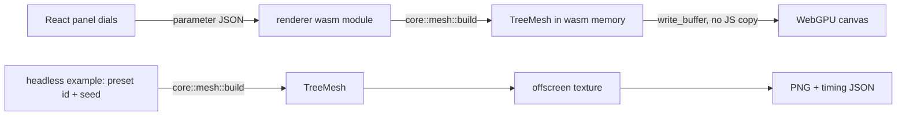

# Hero tree through a Rust wgpu renderer

## Conversation Evidence

> user (turn 1): "I'd like to instead of "make renderer super fast and efficient specs" take more manageable specs that can be reliably completed."
> user (turn 2): "I want those specs to compose to a generator and renderer that's fast and responsive and has the fidelity of basically real trees."
> user (turn 2): "And as i said no special code for tree templates it should all be parameterized and certain trees should just be configurations of the generator."
> user (turn 2): "I want to eventually have all major tree species as a template that through change of parameters proves the generator can handle those trees. That's the idea."
> user (turn 3): "each new species shouldn't necessarily be values only. If the generator isn't capable to produce a palm tree yet with parameters we need to extend the generator to allow for palms to be generated. Once that's in we the palm template is just a list of numbers yes."
> user (turn 4): "are we sure we want to merge this code? i want the code to be lean as possible. Elegant."
> user (turn 5): "should we also while we're at it port the renderer to wgpu in rust?"
> user (turn 6): "but we can still have trees in the browser also yea?"
> user (turn 7): "ok so map out the next spec for us before we capture it"
> user (turn 8): "i don't think we need pixel perfect parity from the old renderer. We'll have to iterate on the generator and renderer anyway."
> user (turn 9): "well we should have the panel though? I do want the renderer in browser with generator parameters being changeable in browser?"
> user (turn 10): "that sounds fine"
> user (earlier): "we have to be able to render everything"
> user (earlier): "it should be a preset of parameter numbers. not different way of building/rendering. The generator should be able to generate the trees if you set the right values. The presets should only store those values."
> user (earlier): "the forest is just a bunch of grey and it's super laggy.. will this be addressed?"
> user (earlier): "ok now it loads but it's super blurry while it load more detail and then it stutters when rotating"
> user (earlier): "that no color will arrive i know. I just thought you'd see some texture anyway"
> user (earlier): "and shading"
> user (earlier): "otherwise it's mad ugly"
> user (edit cycle 1): "but i still want a renderer for a website though"
> user (edit cycle 1): "The nice thing would be is if you could import telperion lib and have trees generated in your engine that look good and perform well."
> user (edit cycle 1): "I want each tree to have slightly different parameters set in telperion and another seed. To make each tree unique"
> user (edit cycle 1): "so i don't want to have to preexport trees"
> user (plan, 2026-09-08): "oh yes pls leave the fn-13 worktree.."
> user (plan, 2026-09-08): "why would we have separate threejs stuff? we want it clean no?"
> user (plan, 2026-09-08): "wouldn't it make sense to just rewrite to rust completely so we can delete the three.js stuff?"
> user (plan, 2026-09-08): "those things seem relatively small and also seem crucial for QA"

## Goal & Context
<!-- Goal & Context: 50% [user], 40% [paraphrase], 10% [inferred] -->

The fn-13 renderer branch proved the hero path in TypeScript and WebGPU but grew into a 230-commit prototype: 46 modules where master has 4, untyped JavaScript in production, and a forest that is slow, flat and unstable. The owner wants the opposite: small specs that can be reliably completed, composing toward a generator and renderer that is fast and responsive with the fidelity of real trees. [paraphrase]

This spec is the first of that series. It puts a lean Rust renderer on master, built on wgpu, that draws one hero tree from generator output in the browser with the existing parameter panel driving it, and in a headless native target for clean timing. [paraphrase] The renderer is written from scratch in Rust; the fn-13 branch stays as a reference prototype and is not merged. [user] The Three.js stage and adapter are removed in this spec, so the repo ends with one renderer. [user]

The owner's standing rule governs everything downstream: a template is only a row of parameter values, the generator produces any tree from values through one code path, and the renderer never knows the species. [user] Where the generator cannot yet express a species, the fix is a new general parameter, never a species branch. [user]

## Architecture & Data Models
<!-- Architecture & Data Models: 60% [paraphrase], 40% [planned 2026-09-08] -->

- **New Rust renderer crate** in the workspace, alongside the generation core. It compiles to wasm for the browser and to a native headless target. The generation core stays renderer-independent; the renderer depends on it, never the reverse. [paraphrase]
- **Two build targets, one renderer.** Browser: the crate draws into the page canvas through the browser's WebGPU. Native: an offscreen texture renders the same scene from a preset id and seed, writes a PNG, and reports GPU timing. No native window in this spec. [user]
- **One mesh output in the core.** The core gains a single call that turns a parameter family (seed included) and a detail budget into one `TreeMesh`: the wood surface as flat position, normal and index arrays, the foliage as one element mesh plus one affine matrix per instance, and the union bounds. It is assembled from the existing branching, surface and foliage stages, the same chain the wasm binding runs today, so the binding and the renderer produce identical geometry. Only the full-detail budget exists in this spec; the budget argument is the seam the coarse-first spec extends. [paraphrase] The same output is what a game-engine adapter consumes, so nothing in it is web-specific. [paraphrase]
- **Wood is the plaited surface.** The hero draws the generator's continuous wood surface as one indexed mesh, because the surface dials (radial segments, lobes, twist, flare, fork socket and swell) must stay visible when turned. The prototype's compact tapered-segment wood is a forest and detail-budget representation; it is deferred to the coarse-first and web-forest specs. Recorded full-detail sizes on master: oak about 0.5 million leaves and 5 million wood triangles, spruce about 5.2 million needles and 3.4 million wood triangles. [planned]
- **Foliage is one instanced draw.** The element mesh is uploaded once per tree; instances are drawn from the core's matrices as a per-instance vertex buffer, uploaded straight from the core's memory. [paraphrase]
- **Generation runs inline, in the renderer's own wasm module.** The renderer links the core, parses the panel's parameter JSON in Rust, generates, and uploads from its own linear memory. No second wasm instance, no worker, no transfer: "in place from library memory" holds by construction, and the browser and native targets share one code path from parameters to GPU buffers. The parameter panel keeps its existing live-versus-settle rebuild rule for expensive trees. A worker is reconsidered in the progressive-generation spec once generation is cheap enough to measure the difference. [planned]
- **Submission is append-ready.** The renderer allocates its wood and foliage buffers with headroom and tracks the used range, so the streamed-generation successor can add an append call without a re-layout. This spec only ever submits a whole tree. [user]
- **Parameter JSON lives in the core.** The JSON wire mirror of the parameter family moves from the wasm binding into the core behind a feature flag, so the binding and the renderer parse one schema. The binding's generated browser metadata stays byte-identical. [planned]
- **Scene ownership.** The Rust renderer owns its whole scene: ground disc, background, clay hemisphere lighting, the 1.8 m scale figure at the roots, camera and hero pose. [paraphrase] [user]
- **Views.** The renderer draws one of three views of a submitted tree: whole, bare (wood only) and single leaf (one element at generated scale), the same three the harness offers today, so QA keeps its inspection modes on the new renderer. [user]
- **The panel stays, the stage is replaced.** The React control panel with every generator parameter as a dial is retained unchanged in purpose; the one canvas beside it is drawn by the Rust renderer. A dial move regenerates and redraws. The camera keeps the harness's rule: framed once on the first tree and on request, never on a dial move or preset load. Generator, renderer and oversize errors all land in the panel's one alert with the error's own text. The pixel-ratio sweep button is replaced by the Rust timing session. [user] [planned]
- **Three.js leaves the repo.** The clay stage, the Three.js tree builder, the library's Three.js adapter and the three dependency are deleted once the Rust renderer carries every rig: the browser integration test runs on the Rust canvas and the species QA stills come from the headless target. [user]
- **Ported ideas, rewritten.** Two ideas from the prototype are carried over as fresh Rust with tests: the clay hemisphere lighting term and the GPU timing protocol with conditioning frames and a validity verdict. Hierarchy, aggregates, streaming and compact wood are not ported here. [planned]



## API Contracts
<!-- API Contracts: 30% [paraphrase], 70% [planned 2026-09-08] -->

- **Mesh output.** `mesh::build(&Family, Detail) -> Result<TreeMesh>` in the core. `Detail` has one constructor, full detail. `TreeMesh` carries `wood: SurfaceMesh`, `foliage: { element: Element, instances: Instances }` and `bounds: Bounds`, plus counts derived from them: wood vertex count, wood triangle count, foliage instance count. Errors are the core's own `Error::InvalidInput` and `Error::ResourceLimit`, unchanged. [paraphrase]
- **Parameter JSON.** `params::parse(&Value) -> Result<Family>` and `params::metadata(&Family) -> Value` move into the core behind a `json` feature with the same schema and the same messages; the wasm binding re-exports them. [planned]
- **Renderer creation.** Given a canvas (browser) or an offscreen size (native), returns a renderer or a typed error naming the failing condition: WebGPU absent; no hardware adapter, naming the fallback adapter that was offered instead; device request refused, naming the limit or feature that failed. The device is requested with the adapter's own maximum buffer size and, when the adapter offers it, timestamp queries. [paraphrase]
- **Tree submission.** `submit(&TreeMesh, Transform) -> Result<Submitted>` uploads the mesh and returns wood vertex count, wood triangle count, foliage instance count and bounds equal to the mesh's own. A mesh whose wood or foliage buffer exceeds the device's granted maximum buffer size is rejected with an error naming the buffer and both sizes; nothing is truncated. The fit check is a pure function testable without a device. Buffers keep their used range so a later append needs no re-layout. [planned]
- **View.** `set_view(View)` with `View::{Whole, Bare, Leaf}` selects what the next frame draws from the submitted tree; the counts in frame statistics reflect the view. [user]
- **Camera.** Accepts position, target and vertical field of view per frame. `hero_pose(bounds) -> Camera` returns the judging pose from the bounds alone: the harness's three-quarter direction and framing margin, so browser and headless stills share one pose by construction. [planned]
- **Frame.** Draws one frame and returns statistics: draw calls, triangles, instances, and when timing is enabled the vegetation GPU time for that frame with a validity flag. [paraphrase]
- **Timing session.** Runs the fixed conditioning frames, warmup and measured samples, and returns p50 and p95 with a verdict: valid; unavailable with the reason (timestamp feature missing, software adapter); disjoint (a non-finite or non-monotonic sample); or contended (p95 above twice p50). An invalid session carries no number that reads as a pass. [paraphrase]
- **Browser surface.** The wasm module exports a renderer object created from an `HTMLCanvasElement`, with `setTree(parameterJson)`, `setView`, `setCamera`, `resize(width, height)`, `frame()`, `timing()` and `dispose()`; every failure is a JavaScript error whose message is the Rust error's text. The TypeScript adapter owns the resize observer and the pixel-ratio cap of two the old stage used, and the renderer reconfigures its surface between frames. [planned]
- **Headless target.** `cargo run --release -p telperion-render --example headless -- --preset <id> --seed <n> --out <png> [--view whole|bare|leaf] [--timing <json>]` renders at the hero pose and exits zero; any failure prints the reason to stderr and exits non-zero. Species QA captures call this per profile and seed. [paraphrase] [user]

## Edge Cases & Constraints
<!-- Edge Cases & Constraints: 40% [user], 30% [paraphrase], 30% [planned] -->

- **Lean code.** The owner wants the code as lean as possible and elegant. [user] Typed Rust and TypeScript only; no code copied from the prototype without a rewrite and a test. [paraphrase] Files stay under about 400 lines and functions do one thing. The wasm-bindgen glue is generated at build time, gitignored, and typed by its emitted declarations; it is not authored code. [planned]
- **No species knowledge in the renderer.** Any preset or parameter set renders through the same path. The renderer crate's library never names a preset; only the headless entry point resolves a preset id. Unsupported input is an explicit, named error, never silent omission or a blank canvas. [user] [strategy:Surface and rendering at scale]
- **Buffer limits.** Spruce at full detail needs about 330 MB of instance matrices, above wgpu's 256 MiB default. The device is created with the adapter's maximum buffer size; oversize is judged against the granted value. [planned]
- **One device per canvas.** React's development double-mount creates and disposes a renderer once before the live one; the renderer must dispose cleanly and the live page must hold exactly one device and one canvas for its whole life. Resize reconfigures the surface only between frames, never while a surface texture is held, and clamps to the device's texture limit. [planned]
- **Browser timing is coarse.** Chrome quantizes WebGPU timestamps to 100 microseconds unless developer features are on, and timestamp queries need the unsafe-WebGPU flag. The browser session records the quantization and the flags used; a session without the feature reports unavailable. [planned]
- **Shared GPU.** Desktop timing is contended by the compositor and other browsers; the native headless target exists so a clean measurement is possible. Contended browser measurements are reported as invalid. [paraphrase]
- **Performance is reported, not gated.** The 2 ms hero target belongs to a later spec. This spec measures and records. [paraphrase]
- **Tests without a GPU.** Every device-backed test, the Playwright suite included, skips with a printed reason when no adapter is offered; it never fails for lack of hardware. [planned]
- **Rigs move before Three.js goes.** The browser integration test and the species QA capture run on the Rust renderer and pass before the Three.js code and dependency are deleted; the fn-19 geometry benchmark rig targeted the old renderer and is retired with a note rather than ported. [user]
- **Token and evidence budget.** No full-forest captures; evidence is PNG stills and small JSON. The per-task budget rules in the project instructions apply. [paraphrase]
- **Evidence layout.** The committed evidence directory for this spec holds one hero still per species from the headless target, one native and one browser timing JSON per species, the soak JSON, and a report with the numbers, their verdicts and one verdict slot per species for the owner. Stills always come from the headless target. [planned]

## Acceptance Criteria
<!-- scope: both -->

- **R1:** The browser page renders a hero oak or spruce from the generator through the Rust renderer, with every generator parameter changeable from the existing panel and the whole, bare and single-leaf views selectable; a dial move regenerates and redraws. [user] Errors: generator rejection or GPU failure shows a visible message in the panel with the reason, never a blank canvas; missing WebGPU or a fallback-only adapter shows a message naming the condition; a parameter set the generator rejects leaves the previous tree on screen beside the message.
- **R2:** The native headless target renders the same scene from a preset id and seed, writes a screenshot, and exits zero. [paraphrase] Errors: no adapter, device refusal, device loss during the render, an unknown preset id, an unknown view name, or an unwritable output path exits non-zero with the reason on stderr.
- **R3:** The renderer draws the core's mesh output in place from the memory the core wrote, with no JavaScript-side geometry copies, and a test asserts the submitted wood vertex count, wood triangle count, foliage instance count and bounds equal the core's report for oak and spruce. [paraphrase] The output is produced at runtime from seed and parameters; no tree asset is exported or stored. [user] Errors: a count or bounds mismatch fails the test; a mesh larger than the granted buffer limit is rejected with an error naming the buffer and sizes, not truncated; the test skips with a reason when no adapter exists.
- **R4:** Every shipped preset, and a random sample of at least twenty parameter sets, renders through the identical renderer path with no species or template branch in renderer code. [user] [strategy:Surface and rendering at scale] Errors: an input the generator rejects surfaces the generator's message naming the parameter, and the test exercises at least one such rejection; no silent omission; a rendered still that is entirely background fails the test.
- **R5:** GPU timing runs in the browser and in the native target with conditioning, warmup and measured samples, and the hero vegetation p50 and p95 for oak and spruce are recorded in the spec's evidence with their validity verdict. [paraphrase] Errors: a contended, disjoint or unavailable measurement is recorded as invalid and cannot read as a pass; the browser record names the flags and quantization it ran under.
- **R6:** A five minute idle soak in the browser keeps one canvas element and one live GPU device (created minus disposed, counted after React's development double-mount settles) with no self-initiated rebuild, and camera orbit responds throughout. [paraphrase] Errors: no error surface beyond R1.
- **R7:** One still per species at the hero pose is reviewed by the owner and the verdict is recorded in the spec, in the owner's eye sense of the strategy. [user] [strategy:Growth and botanical fidelity] Errors: no error surface beyond R1.
- **R8:** The Three.js stage, tree builder, library adapter and the three dependency are removed; the browser integration test and the species QA capture run on the Rust renderer and the headless target and pass; no file under `src`, `harness`, `tests` or `scripts` imports three. [user] Errors: a remaining three import or a rig that no longer passes fails the check; the retired fn-19 benchmark rig is recorded as retired in the migration notes, not silently deleted.

## Boundaries
<!-- scope: business -->

- No pixel or threshold parity with the old Three.js renderer. Correctness is by construction against the generator's own output and by the owner's eye. [user]
- No colour, bark or foliage materials. The scene is neutral clay. [user]
- No forest, aggregates, streaming, detail hierarchy or progressive generation. Those are later specs in the series. [paraphrase]
- No compact tapered wood and no detail budget below full; the mesh contract carries the budget argument but only full detail is exercised. [planned]
- No generation worker or second wasm instance; generation is inline and the worker question returns with progressive generation. [planned]
- No append call yet; submission is shaped for it, the streamed-generation successor adds it. [user]
- No Rust UI; the panel stays React and TypeScript. [user]
- No native window. The native target is headless offscreen only, for timing and screenshots. [user]
- No merge of the fn-13 branch. It remains a reference prototype; ideas are ported by rewriting. [user]
- No port of the fn-19 geometry benchmark rig; it is retired with a note. [planned]
- No species-specific code anywhere, in renderer or generator. [user]
- No LOD chain and no engine adapter. Game-engine integration is fn-17 and the Valheim proof follows the coarse-first spec. [paraphrase]
- No continuous integration wiring; the repo has none and this spec adds none.

## Strategy Alignment

Active tracks served by this plan:
- **The core and integration** — the core gains the one engine-neutral mesh call every consumer uses, the parameter schema moves into the core so browser and native share it, and the TypeScript rendering remnant leaves the repo.
- **Surface and rendering at scale** — the Rust renderer is the first rendering path that generalizes over every preset and random parameter set with no species branch, measured with GPU timer queries.
- **Growth and botanical fidelity** — the owner judges oak and spruce in clay at the hero pose, recorded in the spec, and species QA keeps its stills through the headless target.

## Decision Context
<!-- scope: both — substructured -->

### Motivation
<!-- scope: business -->

- Manageable specs that complete reliably are preferred over one large performance spec; fn-13 burned a full weekly quota on twenty-two full-forest captures without a pass. [user]
- Success for the series is a generator and renderer that is fast and responsive with the fidelity of real trees; success for this spec is a hero tree that renders on master through lean Rust with live parameters, and one renderer in the repo. [paraphrase] [user]
- Lean and elegant code outranks reusing the prototype's working but dense code, and clean means the old renderer is gone, not hidden. [user]
- The library must be importable into a game engine so that every tree is generated at runtime, unique per position and seed, never pre-exported; the web renderer is the reference consumer of that same output. [user]
- The user experience the owner reacted to, blurry loading and stutter on rotation, is the target of later specs; this spec establishes the renderer they build on. [paraphrase]

### Implementation Tradeoffs
<!-- scope: technical -->

- Rust with wgpu over continuing in TypeScript: the wasm boundary was where most of fn-13's cost lived, from transfer-list collection to retained JavaScript copies; one crate removes the copies and gives a native timing path for free. [paraphrase]
- Rewrite over merge: 10,700 dense lines with untyped modules would become the base for every later spec; porting two ideas is cheaper than maintaining that. [paraphrase]
- Plaited surface over compact tapered wood for the hero: the surface dials are generator parameters the panel exposes, and a segment representation would make them invisible. Compact wood is the right tool once a forest needs it. [planned]
- Inline generation over a worker: the harness already generates on the main thread with a settle delay for expensive trees, a worker would force a second wasm instance and a copy into renderer memory, and the parked question is answered by measurement in the progressive-generation spec. [planned]
- Parameter JSON in the core over linking the wasm binding into the renderer: linking the binding would export its C-ABI engine from the renderer module; moving the mirror behind a feature that is off by default keeps one schema, adds nothing to the core's default dependency surface, and carries a byte-identical metadata pin. [planned]
- Cutover over a switch: keeping Three.js behind a switch would have needed a second canvas, a second code path in the panel and a later spec to delete it; the view modes and rig migration are small and the QA rigs are what need them. [user]
- Headless stills over browser captures for species QA: a clean GPU, the exact hero pose and no compositor, from a command that already exists for R2. [planned]
- Headless native over a window now: timing and screenshots are all the native target is for in this spec; a window can come with the engine integration track. [paraphrase]
- Owner's-eye sign-off over image parity: parity would break with every generator change and would tie the new renderer to the old look. [paraphrase]
- Rejected wgpu's WebGL fallback backend as overkill: the spec wants an explicit WebGPU-absent message, and a second backend doubles the surface to test.
- Rejected an OffscreenCanvas render worker as overkill: one render thread is the spec's assumption and it keeps the panel wiring plain.
- Rejected a Rust panel (egui) as overkill: the dials are a small typed React component and the browser edge is the right place for them.

### Successor specs (agreed 2026-09-08, not yet captured)

Captured one at a time as each becomes next. Order: one foliage placement path with templates as pure value tables (every preset and random parameter sets render, spruce and oak hashes unchanged); fast hero (2 ms on an idle GPU, smooth rotation, compact instance records); coarse-first generation with detail budgets, identical refinement and streamed submission through the append seam, the enabler for unique runtime trees in a seeded game, where compact tapered wood and the worker question return; a third species reached by generalizing the generator then writing values; Unreal integration through fn-17 with Nanite foliage; a Valheim mod as the Unity proof of unique per-position runtime trees; a modest web forest. Shaded aggregates fold into the web forest. Viewer stability is R6 here.

Findings parked for the first successor (the single placement path with templates as pure value tables), recorded 2026-09-08 while the owner drove the Rust renderer:
- The density dial maps to the attractor count, and attractors are sampled only under the colonizing habit; the spreading (oak) and tiered (spruce) habits build their scaffolds from their own rules and ignore it. Either those habits take the same budget to decide limbs, subdivisions and tiers, or the dial is renamed to say what it is and the habits get their own dials.
- The lobed-blade outline function in the foliage element is named after the oak, and a scaffold audit module inside the core names the oak and spruce presets to hash their skeletons; both are the last species names left in the core library.

## Quick commands

```bash
cargo test --release --workspace                                   # core contract, renderer tests (skip without adapter)
cargo run --release -p telperion-render --example headless -- --preset norway-spruce --seed 7 --out .flow/evidence/fn22/spruce-hero.png --timing .flow/evidence/fn22/spruce-native-timing.json
npm run render:build && npm run dev                                # browser: Rust renderer on the harness canvas
npm run test:render                                                # Playwright WebGPU conformance (SOAK=1 adds the five minute soak)
npm run species:qa                                                 # species stills through the headless target
```

## Early proof point

Task fn-22-hero-tree-through-a-rust-wgpu-renderer.2 validates the core approach: a wgpu device created with typed errors, the plaited wood surface uploaded from core memory and rendered offscreen to a PNG at the hero pose. If it fails, re-evaluate wgpu on this toolchain and the surface-mesh choice before continuing with the foliage, timing and browser tasks.

## Requirement coverage

| Req | Description | Task(s) | Gap justification |
|-----|-------------|---------|-------------------|
| R1 | Browser hero through the Rust renderer, every dial live, three views, visible errors | fn-22-hero-tree-through-a-rust-wgpu-renderer.3, fn-22-hero-tree-through-a-rust-wgpu-renderer.5, fn-22-hero-tree-through-a-rust-wgpu-renderer.6 | — |
| R2 | Native headless still from preset id, seed and view | fn-22-hero-tree-through-a-rust-wgpu-renderer.2, fn-22-hero-tree-through-a-rust-wgpu-renderer.3 | — |
| R3 | In-place upload, counts and bounds equal the core's, oversize rejected | fn-22-hero-tree-through-a-rust-wgpu-renderer.1, fn-22-hero-tree-through-a-rust-wgpu-renderer.3 | — |
| R4 | Every preset and twenty random sets through one path | fn-22-hero-tree-through-a-rust-wgpu-renderer.3 | — |
| R5 | Timing session native and browser, recorded with verdicts | fn-22-hero-tree-through-a-rust-wgpu-renderer.4, fn-22-hero-tree-through-a-rust-wgpu-renderer.6 | — |
| R6 | Five minute idle soak, one device, orbit responds | fn-22-hero-tree-through-a-rust-wgpu-renderer.6 | — |
| R7 | Owner's verdict on oak and spruce stills | fn-22-hero-tree-through-a-rust-wgpu-renderer.4, fn-22-hero-tree-through-a-rust-wgpu-renderer.6 | Owner records the verdict after the stills land |
| R8 | Three.js removed, rigs run on the Rust renderer and headless target | fn-22-hero-tree-through-a-rust-wgpu-renderer.7 | — |

## References

- wgpu 30 on docs.rs: `Instance`, `RequestAdapterOptions`, `DeviceDescriptor`, `Features::TIMESTAMP_QUERY`, `PassTimestampWrites`, `TexelCopyBufferInfo`, `COPY_BYTES_PER_ROW_ALIGNMENT`, `SurfaceTarget::Canvas`.
- wgpu examples `timestamp_queries` and `render_to_texture` in the gfx-rs/wgpu repository (features examples).
- wasm-bindgen guide, deployment without a bundler (`--target web`).
- Chrome WebGPU developer features and troubleshooting pages (timestamp quantization, unsafe-WebGPU flag).
- Learn Wgpu windowless showcase (padded readback to PNG).
