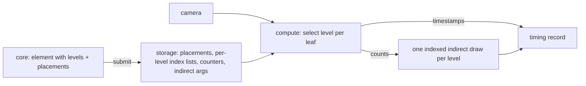

# Fast hero: the oak inside the frame budget

## Conversation Evidence

> user (turn 6): "ok what's the next reasonable spec to capture or work on after fn-22? I want to push towards a beautiful performant renderer in the browser that is botanically accurate to sota degree asap."
> user (turn 6): "I want to update my website with a tree growing from sapling to full tree and sway in the wind. Looking basically realistic at 60fps."
> user (turn 6): "I want to get there in small specs that are highly likely achievable."
> user (turn 4): "that fn-13 stuff is crucial i think"
> user (turn 5): "we should have the representation possibility so we could stream trees into minecraft or other voxel based wordls"
> user (turn 7): "ok /flow-next:capture it"
> user (edit cycle 1): "so what's the strategy on how we achieve 2ms rendering time if we render the same amount of tris?"
> user (edit cycle 1): "so how does this differ to fn-13 which took forever and couldn't achieve smooth rendering in the way you described?"
> user (edit cycle 1): "what's the tesselation per instance mechanism explain it"
> user (edit cycle 1): "can this decision per leaf be made fast enough as to not introduce overhead?"
> user (edit cycle 1): "how does this compare to nanite (which I think fn-13 was trying to approximate)"
> user (edit cycle 1): "ok so let's nail this next spec now. Keep it lean as possible."
> user (plan, 2026-09-09): "fn-23 don't review"
> user (recorded in fn-22, 2026-09-08, carried): "I want those specs to compose to a generator and renderer that's fast and responsive and has the fidelity of basically real trees."
> user (recorded in fn-22, earlier, carried): "ok now it loads but it's super blurry while it load more detail and then it stutters when rotating"
> user (recorded in fn-22, earlier, carried): "it should be a preset of parameter numbers. not different way of building/rendering. The generator should be able to generate the trees if you set the right values. The presets should only store those values."
> user (recorded in fn-22 owner verdict, 2026-09-09, carried): "it looks good, almost the same as the previous render in JS, just slightly darker."

The agent proposed a seven-spec sequence toward the website goal (fast hero, shading, wind, one placement path, growth replay, appearance, website page); the user approved capturing the first with turn 7. In edit cycle 1 the agent explained the per-instance leaf tessellation mechanism, its cost, its contrast with fn-13 and with Nanite, and the user asked to nail the spec on that basis, lean. The fast-hero spec was already named as a successor in fn-22's decision context, agreed with the owner on 2026-09-08. Planned 2026-09-09 at short depth with no review backend, per the owner's routing.

## Goal & Context
<!-- Goal & Context: 45% [user], 45% [paraphrase], 10% [inferred] -->

The owner wants a beautiful, performant browser renderer that is botanically accurate to a state-of-the-art degree, as soon as possible, and a website showing one tree growing from sapling to full tree and swaying in the wind, looking basically realistic at 60 frames per second, reached through small specs that are each highly likely to complete. [user]

fn-22 measured the oak hero at 18 ms of vegetation GPU time on the RTX 3080, native and browser alike. The strategy's hero metric is 2 ms on that machine and a 60 fps page has under 17 ms for everything, so nothing planned after this spec can be judged until the frame budget is met. [paraphrase]

Where the oak frame goes: 555 thousand leaf instances, each a 268-triangle lobed blade, 149 million foliage triangles per frame, most of them on leaves a few pixels tall. The wood, 5 million triangles, costs under a millisecond. The strategy is to draw the same tree with far fewer triangles: the same leaf outline at several nested triangle counts, each leaf picking per frame the cheapest count whose outline error is below a pixel at its distance. The tree the core generated is drawn exactly, with edges simplified only where a pixel cannot show the difference. [paraphrase]

This is Nanite's selection principle applied at the one place the tree's structure makes the rest of Nanite unnecessary. The foliage is instances of one element, so the detail graph is a handful of levels of one leaf, built in microseconds, resident from the first frame; nothing is streamed, evicted or replaced. fn-13 took Nanite's outer systems, hierarchy, residency, streaming and aggregation, without an error-bounded selection, tried them at runtime for a forest, on spruce first, in TypeScript, and produced popping, shimmer and loading holes. This spec takes only the selection, for one oak, in Rust. [paraphrase]

## Architecture & Data Models
<!-- Architecture & Data Models: 60% [paraphrase], 40% planned 2026-09-09 -->

- **The element at nested levels, chosen by deviation.** The core's foliage element already carries its transverse sections from base to tip. A level is a subset of those sections, always including the base, the tip and the widest section, chosen so that every dropped section's vertices lie within a tolerance of the surface spanned between the kept neighbours; each level halves the tolerance of the one before, and the finest level keeps every section and is byte-identical to today's element. The tolerance is the level's recorded deviation, in metres. Triangles are rebuilt between consecutive kept sections with the element's existing lateral topology, so a coarser level's vertices are a subset of a finer one's. The rule reads only sections and positions, so the lobed blade, the four-sided needle and the generic blade all get levels through one code path with no anatomy branch; a needle with four sections simply has fewer levels. The coarsest oak level is single-digit triangles. [paraphrase, refined in planning]
- **Selection per instance, per frame, on the GPU, stateless.** A compute pass with one thread per leaf reads its placement, projects the element's extent to a pixel size from the camera, and picks the coarsest level whose deviation projects below half a pixel; a leaf outside the frustum goes to a none bucket. Each thread appends its instance index to the chosen level's list; counts are accumulated per workgroup and added to the level's counter once per workgroup. There is no previous-frame state and no hysteresis; the sub-pixel switch is the flicker control, and a state buffer is added only if the owner sees flicker. [planned 2026-09-09]
- **Plain indirect draws, one per level.** The compute pass writes each level's indirect argument block with its instance count. The renderer issues one indexed indirect draw per level over the level's index range, instance count read from the arguments. Instance placements move from a per-instance vertex buffer to a read-only storage buffer, and the vertex shader reads its placement through the level's index list. Everything used is WebGPU core: compute, storage buffers, atomics, indirect draw, timestamp writes on a compute pass under the same timestamp feature. No multi-draw and no indirect count. [planned 2026-09-09]
- **Views.** The whole view runs selection. The bare view skips the compute dispatch and draws no foliage, as today. The single-leaf view draws the finest level once at identity and never runs selection, so it stays one instance and the full blade. [planned 2026-09-09]
- **Statistics semantics.** Frame statistics keep their three fields. Instances stays the count submitted to selection; triangles and draw calls report what was issued. Per-level drawn counts are read back only inside a timing session and land in its record, so the panel text and the test rig's parsers are unchanged. [planned 2026-09-09]
- **The core's mesh output stays the contract.** The element gains its levels as additional data beside its positions and indices; the mesh call, its counts, bounds and the placement are untouched. Generator parameters and their meaning are untouched and a preset remains a value table. [paraphrase]
- **Identity is proven, not asserted.** The core's counts, bounds and the skeleton and placement hashes are unchanged; a leaf is never merged, dropped or moved. [paraphrase]
- **Both targets, one path.** Browser and native headless share the compute pass and the indirect draws. [paraphrase]
- **The selection pass is timed on its own.** A second timestamp pair brackets it so its cost is a number in the evidence beside the vegetation pass. [confirmed in planning: the timing session already resolves one pair per frame]



## API Contracts
<!-- API Contracts: 70% [paraphrase], 30% planned 2026-09-09 -->

- **Element levels.** The core element exposes an ordered list of levels, coarsest first, each naming an index range into one shared index buffer and a deviation in metres; the last level is the whole element. Validation rejects a level list whose finest entry is not the full element or whose deviations do not decrease. [planned 2026-09-09]
- **Timing session** keeps fn-22's protocol and verdicts and adds the selection pass p50 and p95 and the per-level instance counts of the measured frames to the record. An orbit session runs the same protocol while the camera sweeps one full turn around the hero pose at the hero distance and elevation, and reports frame-to-frame wall time p50, p95 and maximum beside the GPU numbers. Both targets can run both sessions. [paraphrase]
- **Headless command.** The existing command gains `--level <n>` to force every leaf to one level for a measurement, and `--orbit` to run the orbit session into the timing file. [confirmed in planning]
- **Submission.** The fit check names the new per-level buffers beside the existing four and refuses an oversize tree whole, as today. [paraphrase]

## Edge Cases & Constraints
<!-- Edge Cases & Constraints: 60% [paraphrase], 40% planned 2026-09-09 -->

- **The gate is native, idle, valid.** R1 is judged on a valid session on an idle RTX 3080 through the headless target at native pixel ratio; contended, disjoint or unavailable sessions are recorded and do not count. [paraphrase]
- **Below a pixel or through the owner.** A level switch whose projected deviation is under the threshold is not a visible change. Anything that changes pixels beyond that at the hero pose goes through the owner's verdict before it is accepted. [paraphrase]
- **Spruce rides along unchanged in contract.** The same path applies to the spruce; its numbers are recorded and reported, never gated. Its needles need levels above the needle, a later spec. [paraphrase]
- **Zero instances.** A tree with no foliage instances submits empty lists, dispatches nothing and draws nothing, without error. [planned 2026-09-09]
- **Budget.** No forest captures. Evidence is timing JSON, one still per species and a short report; every cut is proven on the timing record before a still is made. The per-task budget rules in the project instructions apply, and R1's stop rule ends the spec rather than a further attempt. [paraphrase]
- **Tests without a GPU** skip with a printed reason; the identity checks run without a device, and the level construction and threshold rule are unit-tested against the true outline. [confirmed in planning]
- **File size.** The timing module is already over the project's line rule and gains fields here, so it is split before it grows; selection lives in its own module and shader. [planned 2026-09-09]

## Early proof point

Task fn-23-fast-hero-the-oak-inside-the-frame.1 validates the core approach. It forces every leaf to a stand-in of two triangles spanning the element's extent and reads the oak's vegetation time from the existing timer. Under 2 ms means the frame is vertex-bound and the levels are the answer; near 18 ms means it is fill-bound and overdraw control replaces levels as the plan. If it fails, re-evaluate the mechanism before continuing with task 2 onward.

## Quick commands

```bash
cargo test --release --workspace                                   # core levels + identity, renderer tests (skip without adapter)
cargo run --release -p telperion-render --example headless -- --preset oregon-white-oak --seed 7 --out .flow/evidence/fn23/oak-hero.png --timing .flow/evidence/fn23/oak-native-timing.json
cargo run --release -p telperion-render --example headless -- --preset oregon-white-oak --seed 7 --out /tmp/oak-orbit.png --orbit --timing .flow/evidence/fn23/oak-native-orbit.json
npm run render:build && npm run test:render                        # browser conformance + orbit session under hardware WebGPU
npm run species:qa                                                 # stills for every preset through the headless target
```

## Acceptance Criteria
<!-- scope: both -->

- **R1:** The Oregon white oak preset at seed 7, whole view, hero pose, 1600 by 1000 at native pixel ratio, renders its vegetation pass including selection in a p50 of 2 ms or less on the RTX 3080 through the native headless target, with a valid verdict. [strategy:Surface and rendering at scale] Errors: an unavailable, disjoint or contended session does not count; a p50 above 2 ms with every level and the culling bucket in place stops the spec with the number and a one-paragraph blocker rather than another attempt.
- **R2:** The same oak in the browser page on the same machine holds 60 frames per second through a ten-second orbit at native pixel ratio: frame-to-frame wall time p95 under 16.7 ms and no frame above 33 ms, recorded by the orbit session with the flags and quantization it ran under. [user] Errors: without the timestamp feature the wall-time numbers stand and GPU time reads unavailable; a frame above 33 ms fails and is named.
- **R3:** The core's wood vertex and triangle counts, foliage instance count, bounds, and skeleton and placement hashes for oak and spruce are byte-identical before and after this spec, and every leaf's placement is reproduced exactly at every level, asserted in tests that run without a device. [paraphrase] Errors: any mismatch fails; no tolerance.
- **R4:** The owner judges the oak still from the headless target at the hero pose against the fn-22 oak still and records the verdict in this spec; the spec closes only on an accepting verdict. [paraphrase] [strategy:Growth and botanical fidelity] Errors: no error surface beyond R1.
- **R5:** Every shipped preset and a random sample of at least twenty parameter sets render through the identical path with no species or template branch in renderer code, and the spruce's native and browser numbers are recorded beside the oak's with verdicts, reported and not gated. [paraphrase] Errors: a still that is entirely background fails; a generator rejection surfaces the generator's own message.

## Boundaries
<!-- scope: business -->

- No growth, no wind, no materials, shadows or lighting changes. Each is its own later spec on top of this floor. [paraphrase]
- No spruce gate and no levels above the leaf; needle aggregation is a later spec. [paraphrase]
- No forest, no streaming, no residency, no occlusion culling against depth. Crown-interior occlusion is a later lever only if R1's number demands it. [paraphrase]
- No hysteresis state, no multi-draw indirect, no compact placement records; each is a follow-on only if a measured number or the owner's eye asks for it.
- No change to any generator parameter's meaning, no new generator features, no species branch anywhere. [user]
- No website page and no engine work; the fn-22 page and headless target are the measuring surfaces. [paraphrase]
- The fn-22 parked findings on the density dial, the oak-named outline function, the panel's lost test coverage and the QA still's ground disc stay parked for the placement-path spec.

## Strategy Alignment

Active tracks served by this plan:
- **Surface and rendering at scale** — level of detail chosen by projected error keeps the hero tree inside the frame budget without species-specific paths, needle-specific assumptions or visible stepping.
- **The core and integration** — the element's levels are additional optional core output beside the unchanged mesh contract, and the same instanced representation is what the engine proof consumes.
- **Growth and botanical fidelity** — the owner judges the oak still at the hero pose against the fn-22 still, recorded in the spec.

## Decision Context
<!-- scope: both — substructured -->

### Motivation
<!-- scope: business -->

- The outcome is a website tree growing from sapling to full tree and swaying in the wind, basically realistic at 60 fps, through small specs that are highly likely achievable; the frame budget precedes look, motion and growth because every later spec adds cost. [user]
- Oak before spruce: the oak is 555 thousand leaves at a few pixels each, affordable as individual instances once each costs single-digit triangles; the spruce is 7.9 million sub-pixel needles, an aggregation problem, and fn-13 showed what gating on it costs. [paraphrase]
- The representation this commits to, a wood mesh plus one leaf element instanced, is the shape Unreal's Nanite assemblies consume, so nothing here is undone by the engine proof in the strategy. [paraphrase]

### Implementation Tradeoffs
<!-- scope: technical -->

- Per-instance level selection over a cluster hierarchy: the foliage is instances of one element, so the detail graph is trivial to build at runtime and needs no streaming; a hierarchy is what fn-13 built and what a runtime-generated tree cannot afford to build per specimen. [paraphrase]
- Deviation-driven section selection over stride subsampling: a stride drops the widest section and turns a lobed leaf into a sliver at the coarsest level, thinning the crown visibly; keeping base, tip and widest and choosing the rest by tolerance preserves silhouette and gives every anatomy levels through one rule. [planned 2026-09-09]
- Per frame over on-camera-change: the pass costs on the order of 0.05 ms for 555 thousand leaves, and change detection would add state and a first-frame hitch for nothing. [paraphrase]
- Stateless over hysteresis: a state buffer needs a lifecycle across resubmission, view switches and camera cuts, and the switch it would smooth is already below a pixel by construction. Rejected as overkill until observed. [planned 2026-09-09]
- Per-level index lists each sized to the instance count over a two-pass prefix scatter: five lists of 555 thousand indices are 11 MB and one pass; the prefix design saves memory the device does not lack and adds a pass. [planned 2026-09-09]
- A bounding-quad stand-in for the probe over building the coarsest level first: the probe's question is whether fewer triangles per leaf move the frame at all, and a two-triangle quad answers it in an afternoon with no level machinery to build or throw away. [planned 2026-09-09]
- Indirect draws per level over vertex-shader collapse: collapsing unused vertices to degenerate triangles still processes them, so it saves nothing on a vertex-bound frame.
- Rejected: folding shading into this spec. It would make the 2 ms number unattributable; shading is measured on top of a known floor.
- Compact instance records are a bandwidth win, not a frame win at this instance count; they are not a goal here.

## Parked unknowns

- The spruce browser-versus-native gap, 63 ms against 94 ms on the same tree and GPU, unexplained by fn-22; task 4's selection timing may explain it as a side effect, otherwise it belongs to the needle spec.
- What a website visitor's machine is. No second machine is named; the website spec inherits the 3080 number and the page's own frame timing until the owner names one.

## Requirement coverage

| Req | Description | Task(s) | Gap justification |
|-----|-------------|---------|-------------------|
| R1 | Oak vegetation p50 at or under 2 ms, native, valid | fn-23-fast-hero-the-oak-inside-the-frame.1, .3, .4 | — |
| R2 | Browser orbit at 60 fps, wall-time p95 under 16.7 ms, no frame over 33 ms | fn-23-fast-hero-the-oak-inside-the-frame.5 | — |
| R3 | Core counts, bounds, hashes byte-identical; placement exact at every level | fn-23-fast-hero-the-oak-inside-the-frame.2 | — |
| R4 | Owner verdict on the oak still against fn-22's | fn-23-fast-hero-the-oak-inside-the-frame.6 | — |
| R5 | Every preset and twenty random sets through one path; spruce recorded, not gated | fn-23-fast-hero-the-oak-inside-the-frame.3, .6 | — |

## Owner verdict

R4 is the owner's judgment of the oak still, recorded here in the owner's own
words. Compare `.flow/evidence/fn23/oak-hero.png` with
`.flow/evidence/fn22/oak-hero.png`: Oregon white oak, seed 7, whole view, hero
pose, 1600 by 1000, the same machine, one drawn with every leaf at the finest
level and one with each leaf at the coarsest level its projected error allowed.
`.flow/evidence/fn23/REPORT.md` carries the measured pixel difference between
them as an aid. The spec closes only on an accepting verdict.

### Oregon white oak, hero pose

> _verdict (owner, 2026-09-09):_ side by side they look exactly the same so we achieved the goal

## References

- fn-22 evidence report and timing records under `.flow/evidence/fn22/`, the numeric baseline and the report shape this spec's evidence follows.
- fn-22 spec, the mesh contract, timing protocol and browser surface this spec extends.
- fn-13 spec closure, the prototype whose hierarchy and streaming this spec deliberately does not port.
