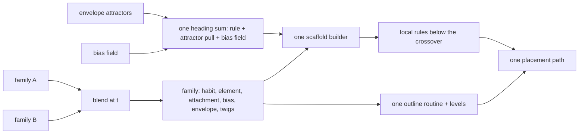

# Continuous tree space: habit and leaf as traits

## Conversation Evidence

> user (turn 4): "ok i want to keep working towards more fidelity and a more unified/efficient generator."
> user (turn 4): "Currently the parameters don't seem to apply across species and the branching model doesn't seem exposed (the enum that allows switching between normal, oak, spruce)."
> user (turn 4): "Does this need to be an enum or could it be more of a continuos parameter?"
> user (turn 5): "ok /flow-next:capture it"
> user (recorded in fn-22, carried into fn-23): "it should be a preset of parameter numbers. not different way of building/rendering. The generator should be able to generate the trees if you set the right values. The presets should only store those values."
> user (recorded in fn-22, 2026-09-08, carried into fn-23): "I want those specs to compose to a generator and renderer that's fast and responsive and has the fidelity of basically real trees."
> user (recorded in fn-23, 2026-09-09): "I want to get there in small specs that are highly likely achievable."
> user (edit cycle 1): "I don't need to have things to be byte identical. Ideally the generator improves all models over time so they're allowed to look different."
> user (edit cycle 1): "There's one point that supernatural stuff won't be touched. That's fine but currently the spruce i don't think is affected by the supernatural dials. After this spec they should apply because of the unified generation approach?"
> user (edit cycle 1): "This should be be made a permanent req that we're stepping through continuous tree space. We want smooth interpoloation between any kind of tree. A template is just a point in that multi dimensional space. This should probably go into strategy."
> user (edit cycle 1): "I think one cool thing that could come out as a receipt is a rendered video that transitions smoothly between the oak and the spruce, demonstrating the continuous tree space. Incorporate this but keep the spec lean."
> user (edit cycle 2): "We need continouuity for the leaves also to achieve continuous interpolation between the two trees. I don't see that as part of the spec?"
> user (plan, 2026-09-10): "fn-24 standard depth no review"

The agent read the generator on 2026-09-10 and reported that the habit is a three-way enum with a separate builder per variant, that each variant carries private knobs, that the harness exposes only the current variant's numbers and no way to switch, and that the local rules below the crossover branch on the variant in four places. The agent recommended continuous traits with the three habits as regions of one trait space; the user asked for the capture on that basis. Planned 2026-09-10 at standard depth with no review backend, per the owner's routing.

## Goal & Context
<!-- Goal & Context: 45% [user], 40% [paraphrase], 15% [inferred] -->

The owner wants a more unified and efficient generator with more fidelity, where every parameter applies across species and the branching model is a dial rather than a hidden switch. [user]

The standing requirement behind this spec is a continuous tree space: smooth interpolation between any kind of tree, where a template is just a point in that multi-dimensional space. This spec is the first proof of that requirement, and the strategy now states it. Earlier trees need not survive byte for byte; the generator is allowed to improve every model over time, so every preset may look different after this spec as long as it still reads as its species to the owner. Continuity has to hold for the leaves as well as the branches, or there is no interpolation between the two trees. [user]

The leaf is switched twice today. The element anatomy is a three-way enum where the oak's lobed blade is a fixed table of five lobes, the spruce's needle is its own four-sided shaft routine, and only the generic blade reads the numeric outline parameters. The attachment is a second enum with three hand-set formulas for how a leaf leans off its shoot and whether it sits on the wood's contact surface. Neither blends, so a transition between the oak and the spruce would jump at one frame. [paraphrase]

The oak and spruce presets set every supernatural term to zero, and the builders apply the bias field on crooked axes and tiered secondaries but never on the trunk or leader, so the supernatural dials do not reach the spruce today. After this spec every growth unit of every axis passes through the same field. [paraphrase, confirmed in planning]

Today the skeleton's habit is an enum with three variants, colonizing, spreading and tiered, each built by its own routine. Spreading owns scaffold limbs, subdivisions and crookedness; tiered owns tiers, branches per tier, secondary spacing, secondary length and upturn; colonizing owns the attractor count. A number that means something on the oak has no field to land on for the spruce, which is why the parameters do not apply across species. The harness shows the numeric fields of whichever habit the preset chose and prints the kind as a label with no control, so the branching model is set only by the preset. Below the crossover the local rules test the variant four times: crookedness is zeroed outside spreading, hanging secondaries exist only for tiered, twig tips are a quarter as thick outside colonizing, and shedding runs only for colonizing. Those are species constants the owner cannot see or move, and the project's rule that presets are value tables with no species branch in the generator is broken in the one place it matters most. [paraphrase]

Tree architecture in the sense of Hallé and Oldeman is a handful of continuous traits, and the named models are regions of that space. Monopodial against sympodial is the degree of apical dominance. Rhythmic against continuous branching is how clustered laterals are along an axis. Orthotropic against plagiotropic is the pitch and gravitropism of laterals. An oak and a spruce differ in the values, so one builder driven by those traits produces both, and every trait moves every tree. This spec extends the value-table philosophy that already governs everything below the crossover up into the scaffold. Planning found no public generator that ships this trait table whole; the Weber and Penn parameter row is the nearest convention, and attractor pull as a weighted direction term is the mechanism its own authors use. [inferred, grounded in planning]

## Architecture & Data Models
<!-- Architecture & Data Models: 20% [paraphrase], 50% [inferred], 30% planned 2026-09-10 -->

- **One scaffold builder.** The three builders and the separate attractor sampling path are replaced by one process that grows axes in growth units. At each unit the apical dominance trait decides whether the axis continues or yields to forks, the whorl traits decide where laterals attach and how many, the pitch and rise traits set each lateral's initial heading and its bend over length, crookedness perturbs successive units, and the attractor weight blends a pull toward the envelope's attractor points into the heading. Colonization stops being a separate algorithm and becomes the direction term at full attractor weight. [inferred]
- **One heading composition point.** Every growth unit's heading is one weighted sum of the rule heading, the attractor pull and the bias field, normalised once. This is the only place a direction term enters, so the supernatural terms reach the trunk, the leader and every lateral, and fn-4's occupancy term later lands as one more term in the same sum. [planned 2026-09-10]
- **Per-axis random streams.** Each axis derives its own stream from the family seed, its parent axis and its child index, so a trait that changes how many laterals one station bears reshuffles only that station's descendants. A single sequential stream would let one trait step rearrange the whole crown, and the sweep would generate at every step while looking like a different tree at each. [planned 2026-09-10]
- **The trait table.** Every trait is a numeric field present on every family, validated by range, with a preset supplying a value for each. Starting rows are calibrated in the first task against the frozen oak and spruce profiles; the values below are the starting points, and the attractor count stays the numeric skeleton field it already is, sampled only when the weight is positive. [inferred, refined in planning]

| Trait | Range | Meaning | Oak (start) | Spruce (start) | Ordinary (start) |
|-------|-------|---------|-------------|----------------|------------------|
| apical dominance | 0 to 1 | how far the leader persists before yielding to forks | 0.1 | 1.0 | 0.5 |
| whorl strength | 0 to 1 | clustering of laterals at nodes against scattering along the axis | 0.1 | 1.0 | 0.3 |
| leader internode | metres | spacing between lateral stations on the leader | 2.0 | 0.9 | 1.5 |
| laterals per station | count | laterals attached at one station | 5 | 5 | 3 |
| lateral pitch | degrees from vertical, with variation | initial heading of a lateral | 55 ± 20 | 88 ± 4 | 60 ± 15 |
| rise per order | -1 to 1 | signed bend over length, positive rises, negative hangs; distinct from the bias field's gravitropism, which stays global | +0.12 primary, 0 secondary | +0.12 primary, -0.8 secondary | +0.05 primary, 0 secondary |
| crookedness | 0 to 60 degrees | heading change between successive units | 24 | 0 | 12 |
| lateral spacing and length ratio | metres, fraction | spacing of second-order axes along a lateral and their length | 0.35, 0.45 | 0.20, 0.30 | 0.35, 0.40 |
| lateral orders | count | depth of rule-built orders before the crossover | 5 | 2 | 3 |
| attractor weight | 0 to 1 | pull of envelope attractors on every heading | 0 | 0 | 1 |
| twig tip taper | fraction | distal twig radius against the nominal twig radius | 0.25 | 0.25 | 1.0 |
| shedding threshold | 0 to 1 | interior shedding after the scaffold; 0 skips the pass | 0 | 0 | 0.45 |

- **The local rules read the same traits.** The four variant tests below the crossover disappear; crookedness, hanging secondaries, tip taper and shedding are read from the family for every tree. [inferred]
- **Wire shape.** The habit object becomes flat numeric fields with no kind tag. The wire schema is one macro table in the core, so the wasm binding needs no change and the browser's preset metadata regenerates with the flat fields; the second copy of the wire logic under the geometry benchmark example is deleted rather than kept in step. A kind tag on input is rejected by the closed schema with an error naming the field; there is no compatibility shim. [inferred, confirmed in planning]
- **Every axis passes through the bias field.** The one builder applies the bias field, gravitropism, lean and the supernatural terms, to every growth unit of every axis, scaffold and local alike, so the field reaches the spruce and the oak exactly as it reaches Telperion. The field's terms and their meaning are untouched. [paraphrase]
- **Presets are rows.** The five presets set their traits in the same value table as their envelope, twig and element parameters, with no habit-specific construction. [paraphrase]
- **The leaf and its attachment are traits.** One outline routine builds every element from the numeric outline parameters that already exist, widest point, base fullness, tip sharpness, cup, curl and connector length, plus a lobe term and a section term that dissolve the anatomy enum. One placement routine leans every leaf off its shoot from numeric terms that dissolve the attachment enum, and the wood contact surface is a weight rather than a mode. The fn-23 level ladder builds from the sections as before, so every point in the space gets its levels. [inferred]

| Trait | Range | Meaning | Oak (start) | Spruce (start) | Ordinary (start) |
|-------|-------|---------|-------------|----------------|------------------|
| lobe count | 0 to 8 | lobes along each margin; 0 is an entire margin | 5 | 0 | 0 |
| lobe depth | 0 to 1 | how far each sinus cuts toward the midrib | 0.7 | 0 | 0 |
| section roundness | 0 to 1 | flat blade at 0, four-sided shaft at 1 | 0 | 1 | 0 |
| forward lean | 0 to 1 | lean along the shoot as a fraction of the radial | 0.25 | 0.05 | 0 |
| lean rise | 0 to 2 | extra forward lean on upward-facing radials | 0 | 1.2 | 0 |
| surface contact | 0 to 1 | station on the shoot axis at 0, on the wood's contact surface at 1 | 0 | 1 | 0 |

- **Sections carry the lobes.** A lobed margin needs a crest and a sinus section per lobe plus the base and the tip, so the element's axial section count must be at least twice the lobe count plus two whenever lobe depth is positive; validation names both fields when it is not. Both sides of that rule are linear in the blend, so a blend of two valid families is valid, and the blend rounds lobe count down and section counts up so rounding cannot break it. [planned 2026-09-10]
- **One placement path.** Placement always walks the twig runs the twig layer marks and leans every leaf from the numeric terms; the separate generic path and its one-station-per-internode guard go with the enum. Stations per internode stays a numeric twig parameter. [planned 2026-09-10]
- **A blend is a point between two rows.** Interpolating two families is per-field linear interpolation of every numeric parameter at the same seed, habit, envelope, twigs, radii, element, attachment and bias alike. Angles interpolate as angles; integer counts round last, under the rounding rule above. No field in a family is an enum any more, so any point between two shipped presets is itself a valid family and a transition has no switch frame. [inferred, refined in planning]



## API Contracts
<!-- API Contracts: 30% [paraphrase], 40% [inferred], 30% planned 2026-09-10 -->

- **Family parameters.** The skeleton carries a habit struct, the element carries the outline and lobe and section traits, and the canopy carries the lean and contact traits, each numeric with a validation range; validation rejects a value outside its range or a non-finite value with an error naming the trait. Every preset encodes every trait and no family field is an enum. [inferred]
- **Blend.** The core exposes a blend of two families at a parameter between 0 and 1 that returns a family; 0 and 1 return the inputs exactly, and the result validates whenever both inputs do. [planned 2026-09-10]
- **Harness.** The parameter panel renders every habit, element and attachment trait as a numeric control on every preset, through the generic number-field mapping it already has, and the habit and anatomy label line goes away. No renderer code changes. [paraphrase, confirmed in planning]
- **Transition.** The headless command gains a second preset and a frame count; with both it blends the two families per frame at one seed, renders each frame at the hero pose of the first frame's bounds into a numbered PNG sequence, and assembles a video with the system encoder when one is present, printing a one-line notice and keeping the sequence when it is not. The record beside the sequence names both presets, the seed, the size, the frame count and the frame rate. Default 240 frames at 24 frames per second. [planned 2026-09-10]
- **Tests.** The scaffold audit pins oak and spruce scaffold hashes, re-recorded once with the owner's verdict on the stills. A cross-preset test moves each habit trait and each bias term by one step on each shipped preset and asserts the skeleton hash changes, and moves each element and attachment trait and asserts the element or placement hash changes. A sweep test walks between every pair of shipped presets in ten linear steps and asserts each step validates and generates. [inferred, confirmed in planning]

## Edge Cases & Constraints
<!-- Edge Cases & Constraints: 30% [paraphrase], 50% [inferred], 20% planned 2026-09-10 -->

- **The extremes are trees.** Apical dominance at 1 still reaches the envelope height with a single leader; at 0 the bole ends where the crown base says and forks carry the crown. Whorl strength at 0 and 1, rise per order at both signs and attractor weight at 0 and 1 all generate without error or non-finite positions, through the same code with no special case at either end. [inferred]
- **The leaf extremes are elements.** Lobe depth at 1, section roundness at 1 and lobe count at 0 and 8 each build a valid element with a level ladder; a section count below the lobe rule is an invalid input naming both. [inferred]
- **Attractors and weight.** A positive attractor weight with zero attractors is an invalid input naming both fields; a zero weight with attractors set samples none and costs nothing. [inferred]
- **Node ceiling.** The unified builder honours the same node cap and the same headroom rule as today, and reports capping in the diagnostics as today. [inferred]
- **Fidelity band holds.** Each shipped preset keeps a leaf count inside the band the fidelity metric names for its size. [strategy:Growth and botanical fidelity]
- **The colonizing presets change too.** Ordinary, Telperion and Laurelin are built by the one builder at full attractor weight; their scaffolds will differ from today's. Their stills are produced and recorded beside the oak and spruce; the owner's verdict gates the oak and spruce only, and fn-10 owns any later verdict on the Two Trees. [planned 2026-09-10]
- **Budget.** Evidence is the skeleton hashes, one still per preset at the hero pose, one oak-to-spruce transition video, and one re-run of fn-23's oak native timing and browser orbit at the end. No forest captures. The video is rendered once for the owner's eye; agents never open videos or frame sequences, per the project's evidence rules. An unavailable, disjoint or contended timing session is recorded and does not count, as in fn-23. The per-task budget rules in the project instructions apply. [paraphrase]
- **File size.** The four files in play are already over the project's line rule, so the builder, the element and the placement each land as modules under it and the retired builders are deleted, never kept behind a flag. [paraphrase, confirmed in planning]

## Quick commands

```bash
cargo test --release --workspace                                   # builder, traits, hashes, sweeps, renderer tests (skip without adapter)
cargo run --release -p telperion-render --example headless -- --preset oregon-white-oak --seed 7 --out .flow/evidence/fn24/oak-hero.png
cargo run --release -p telperion-render --example headless -- --preset oregon-white-oak --to norway-spruce --seed 7 --frames 240 --out .flow/evidence/fn24/transition/frame.png
cargo run --release -p telperion-render --example headless -- --preset oregon-white-oak --seed 7 --out /tmp/oak.png --timing .flow/evidence/fn24/oak-native-timing.json
npm run wasm:build && npm test                                     # regenerated preset metadata, harness tests
npm run render:build && npm run test:render                        # browser orbit under hardware WebGPU
npm run species:qa                                                 # stills for every preset through the headless target
```

## Acceptance Criteria
<!-- scope: both -->

- **R1:** The skeleton's branching habit is a table of numeric traits present on every family, with no kind field and no variant-specific field; every shipped preset is a value row that sets each trait, and the generator holds one scaffold builder and one set of local rules with no habit branch. [paraphrase] Errors: a trait outside its range or non-finite is rejected with an error naming the trait; a kind tag on input is rejected naming the field.
- **R2:** Moving any single habit trait, or any single bias term including the supernatural ones, by one step on the oak, the spruce or the ordinary preset changes that preset's skeleton hash, asserted in a test that runs without a device. [paraphrase] [strategy:The supernatural field] Errors: no error surface beyond R1.
- **R3:** The owner judges the oak and spruce stills from the headless target at the hero pose beside the fn-23 oak still and the fn-22 spruce still, asking whether each still reads as its species at least as well as before, never whether it is identical, and records the verdict in this spec; the spec closes only on an accepting verdict for both. [paraphrase] [strategy:Growth and botanical fidelity] Errors: a rejecting verdict stops the spec with the owner's words and a one-paragraph blocker.
- **R4:** Ten linear steps between every pair of shipped presets each validate and generate a tree without error or non-finite position, and the leaf count of each shipped preset stays inside the fidelity band for its size; the headless target renders one oak-to-spruce transition video at one seed, and the owner records in this spec whether it reads as a smooth passage through one tree space. [paraphrase] [strategy:Growth and botanical fidelity] Errors: a step that fails is named with its trait values; a rejecting verdict on the video stops the spec with the owner's words; a missing system encoder leaves the frame sequence and a one-line notice, never a failure.
- **R5:** The harness shows every habit, element and attachment trait as a control on every preset and the renderer is untouched; the same seed and parameters reproduce the same tree across runs, asserted in tests. [paraphrase] [strategy:The core and integration] Errors: no error surface beyond R1.
- **R6:** After the change, fn-23's oak native timing and browser orbit re-run once and their numbers are recorded beside fn-23's; the oak holds its 2 ms native p50 and its 60 frames per second orbit. [confirmed in planning: the fn-23 rig and evidence layout exist] [strategy:Surface and rendering at scale] Errors: an unavailable, disjoint or contended session is recorded and does not count; a regression stops the spec with the number and a one-paragraph blocker rather than another attempt.
- **R7:** The foliage element and its attachment are numeric traits present on every family with no anatomy or attachment enum; the oak's lobed blade and the spruce's needle are rows, moving any element or attachment trait by one step on any shipped preset changes its element or placement hash, and the leaf in the oak-to-spruce transition changes shape and lean continuously with no switch frame. [paraphrase] [strategy:Growth and botanical fidelity] Errors: a trait outside its range is rejected naming the trait; a section count below the lobe rule is rejected naming both fields; an anatomy or attachment tag on input is rejected naming the field.

## Early proof point

Task fn-24-continuous-tree-space-habit-and-leaf-as.1 validates the core approach: one builder driven by the habit trait table produces a scaffold the owner reads as an oak from the oak row and as a spruce from the spruce row, with the bias field on every axis and per-axis random streams. If the owner rejects either scaffold after the task's calibration budget, re-evaluate the trait set, not the builder count, before continuing with the leaf tasks.

## Boundaries
<!-- scope: business -->

- No growth, no within-species variation, no light response. fn-11 owns the timeline and fn-21 owns the jitter on these traits; this spec supplies the trait space they act on. [paraphrase]
- No new species presets; the five presets are re-expressed as rows and none is added. [inferred]
- No renderer changes and no change to the mesh contract; the element's output shape, sections, levels and placement records, is what it was after fn-23. [paraphrase]
- The bias field's terms and their meaning are untouched; only their reach changes, to every axis of every tree. [paraphrase]
- No catalogue of named architectural models; the traits are the interface and no model table is shipped. [inferred]
- No new reference material; oak and spruce are judged by the owner's eye beside their existing stills, equal or better, never identical. [paraphrase]
- No new leaf shapes; the lobe, section, lean and contact traits are calibrated only as far as the oak blade and the spruce needle need, and the card flag and the element's mesh contract stay as they are. [inferred]
- No limb avoidance. fn-4's occupancy term is a later term in the builder's heading sum; this spec leaves that seam and builds nothing into it. [planned 2026-09-10]
- No spruce frame gate and no spruce timing re-run; R6 is the oak, as fn-23 was. [planned 2026-09-10]
- No per-leaf variation; seeded leaf variants and per-instance deformation are fn-21's, on top of the trait space this spec supplies. [planned 2026-09-10]

## Strategy Alignment

Active tracks served by this plan:
- **Growth and botanical fidelity** — the scaffold and the leaf are built from continuous architectural traits judged against real trees, and the owner's eye holds the oak and spruce to their existing stills.
- **The core and integration** — one lean builder replaces three, presets stay value tables, and no renderer code changes for any parameter move.
- **The supernatural field** — every axis of every tree passes through the one field, so the supernatural dials reach the spruce and the oak as they reach Telperion.
- **Surface and rendering at scale** — the fn-23 frame numbers are re-measured so the fast hero is not undone by a different scaffold.

## Decision Context
<!-- scope: both — flat -->

- Continuous traits over an exposed enum: a kind selector in the harness would show the switch but leave every trait species-private and keep four hidden constants in the local rules; the traits make every slider act on every tree and remove the species branch the project rule forbids. [paraphrase]
- One builder over three calibrated ones: the retired builders are about four hundred lines of tuned constants; the replacement is smaller and the calibration is redone once in the trait space against the frozen profiles, with the oak expected to need the most attention. [inferred]
- Colonization as a direction term over a fourth algorithm: the envelope attractors already exist and the bias field already steers headings, so attractor pull as a weighted term keeps one process and lets a preset choose any mix of rule and attraction. [inferred]
- Per-axis streams over one sequential stream: the sequential stream is what the retired builders use, and under it one trait step reshuffles every later draw; hierarchical seeding is the standard answer and costs one hash per axis. [planned 2026-09-10]
- Earlier trees are not preserved: the owner allows every model to look different as the generator improves, so the pinned scaffold hashes are re-recorded once and the stills are judged as species, equal or better, never as identity. Reproducibility from seed and parameters stays. [paraphrase]
- Rejected: a compatibility shim that maps the old kind tags to trait rows. Presets are regenerated from the core and no consumer stores the old shape. [inferred]
- Rejected as overkill: a separate frame-capture module and an encoder dependency. The transition loops the readback and PNG writer the headless target already has and calls the system encoder when present. [planned 2026-09-10]
- The leaf enums dissolve in the same spec rather than a later one: with them in place the transition has a switch frame and the continuous space is only half proven. [paraphrase]
- The transition video is the receipt the owner asked for and the one artefact that shows the continuous space rather than two points in it; it costs one headless render and no agent ever opens it. [paraphrase]

## Owner verdict

R3 is the owner's judgment of the oak and the spruce stills, and R4's second
half is the owner's judgment of the transition video, each recorded here in the
owner's own words. Compare `.flow/evidence/fn24/oregon-white-oak-hero.png` with
`.flow/evidence/fn23/oak-hero.png`, and `.flow/evidence/fn24/norway-spruce-hero.png`
with `.flow/evidence/fn22/spruce-hero.png`: the same preset, seed, whole view,
hero pose, 1600 by 1000 and machine on both sides, one grown by three habit
builders and one by the single trait-driven builder. The question is whether
each still reads as its species at least as well as before, never whether it is
identical. The video is `.flow/evidence/fn24/transition/transition.mp4`, 240
frames at 24 per second from the oak row to the spruce row at seed 7; the
question there is whether it reads as a smooth passage through one tree space.
`.flow/evidence/fn24/REPORT.md` carries the measured aids. The spec closes only
on three accepting verdicts, and a rejecting verdict stops the spec with the
owner's words and a one-paragraph blocker.

Separately from these three: the same report records the oak's native frame at a
p50 of 2.3043 ms against R6's 2 ms budget, with the browser orbit inside its
bounds. That stop is a number, not a verdict, and none of the three slots below
clears it.

### Oregon white oak, hero pose

> _verdict (owner, YYYY-MM-DD):_ 

### Norway spruce, hero pose

> _verdict (owner, YYYY-MM-DD):_ 

### Oak to spruce, the transition video

> _verdict (owner, YYYY-MM-DD):_ 

## References

- fn-23 spec and `.flow/evidence/fn23/`, the timing protocol, verdict vocabulary and evidence layout this spec's R6 and report follow.
- fn-22 spec, the parameter panel, wasm metadata pipeline and mesh contract this spec keeps.
- fn-9 spec, the frozen oak and spruce profiles the trait rows are calibrated against.
- Runions, Lane and Prusinkiewicz, "Modeling Trees with a Space Colonization Algorithm", the attractor pull as one weighted direction term.
- Hallé, Oldeman and Tomlinson, "Tropical Trees and Forests", the architectural traits the habit table names.

## Requirement coverage

| Req | Description | Task(s) | Gap justification |
|-----|-------------|---------|-------------------|
| R1 | Numeric habit trait table, one builder, no habit branch | fn-24-continuous-tree-space-habit-and-leaf-as.1, .4 | — |
| R2 | Every habit trait and every bias term moves every preset's skeleton hash | fn-24-continuous-tree-space-habit-and-leaf-as.1 | — |
| R3 | Owner verdict on oak and spruce stills, species not identity | fn-24-continuous-tree-space-habit-and-leaf-as.6 | — |
| R4 | Sweeps between every preset pair generate; oak-to-spruce video judged | fn-24-continuous-tree-space-habit-and-leaf-as.5, .6 | — |
| R5 | Harness shows every trait; renderer untouched; reproducible from seed | fn-24-continuous-tree-space-habit-and-leaf-as.4 | — |
| R6 | fn-23 oak frame numbers re-run and held | fn-24-continuous-tree-space-habit-and-leaf-as.6 | — |
| R7 | Leaf and attachment as traits; no switch frame in the transition | fn-24-continuous-tree-space-habit-and-leaf-as.2, .3, .5 | — |
