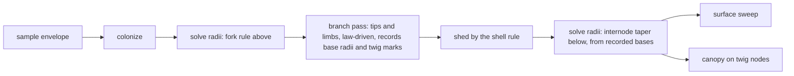

# Branch generations below the crossover, and one fixed twig

## Conversation Evidence

> user: "can you come up with a new preset for them where they ship with appropriate orders and i'll judge"
> user: "now see that doesn't look right to me.. Those branches/twigs have to fill out the volume not just bushel up at the massive trunks"
> user: "i mean i'm still confused by having 8 orders of twigs to be honest.."
> user: "isn't biologically correct always 1 order of twigs we increase the order of branches?"
> user: "well i see a problem with usability though when we make big trees all branch down to realistic twig size it'll impact performance. But I guess we can think about that later? i'd like to really push the envelope here maybe make an opensource alternative to speedtree."
> user: "I feel we have a seed of smth a bit special because I'd like to see trees with branching like this in games and i've never seen it.."
> user: "can we have thousands of realtime generated trees in a scene with this approach?"
> user: "so that it would be usable in a new version of valheim for example"
> user: "do we need to be more ambitious with frame targets? if it's to be used in games there's other stuff that takes rendering time"
> user: "we also probably need to account for procedural leaves? and have them be generated from seeds? that'd be awesome if it's achievable"
> user (edit cycle 1): "we should review the biological accuracy of this. It should be structurally close to natural in the way we generate but we should allow for supernatural parameters (not limited by size as we are in this reality, or have twisting trees etc.)"
> user (carried from fn-5's evidence): "but definitionally branches should branch until the last depths are twigs that attach to leaves no?"
> user (standing principle, carried): "hm well i'd like to take this as far as we can to get to a high perf high fidelity tree generator."
> user (standing principle, carried): "I want it to be as efficient as possible should be snappy. Top tier engineering. Each component worthy of its own library."
> user (amendment, 2026-09-05): "we need to be able to simulate a tree growing procedurally with a timestep function" / "from seed to actual tree"
> user (amendment, 2026-09-05): "we'll be working on fn-6 now have to check how that interacts?" / "can you make amendments to fn-6 to ensure compatibility"

## Goal & Context
<!-- scope: business -->
<!-- Goal & Context: 35% [user], 50% [paraphrase], 15% [inferred] -->

fn-5 built the recursion below colonization and shipped both presets at eight orders of it. Seen in clay, the result is wrong in a way the owner named at once: the fine wood does not fill the crown's volume, it bushels up at the ends of massive limbs [user]. Measured, the cause is structural rather than a dial. On Telperion, colonization hands 133 tips of 79 cm wood to the second pass, and that pass reaches 4.7 mm twigs in eight forks that together span 8 m of length, because each order is a single segment whose length is the growth step times 0.6 per order. A 79 cm limb on a real tree carries on the order of 20 m of further branching, with laterals along the whole of it. Nothing sprouts along the length of any limb in the current pass, and a finer colonization step does not help: at a quarter step the handoff wood is 31 cm on 976 tips and each cluster spans 1.9 m. The tufts get smaller and more numerous, and the volume stays empty [paraphrase].

The owner's second observation is the architecture [user]: botanically there is always one order of twig, and what grows with the tree is the number of orders of branch. A twig is the terminal shoot, a few millimetres across, with leaves along it; its size is set by the leaf's own hydraulics and does not scale with the tree. A 150 m tree and a 15 m tree have the same twig and differ in how many generations of branch lie between trunk and twig. fn-5 named its pass a twig pass and gave every generation a twig's anatomy: one short segment forking at its end. That is right for the last two or three generations and wrong for the five or six above them, which are branches metres long. "Eight orders of twigs" was the wrong name for "the branches, branchlets and twigs colonization never reached", and the confusion it caused the owner is the same defect seen from the parameter side [paraphrase].

This spec replaces the local rules below the crossover with two things: branch generations that have a branch's anatomy, and one fixed twig. The count of generations stops being a dial and follows from the wood, since it is the number of halvings of cross-section from the trunk's radius to the twig's [paraphrase]. The owner's standard for it is stated in one line: structurally close to natural in the way we generate, while allowing supernatural parameters, not limited by size as we are in this reality, or twisting trees [user]. So every rule rests on the botany and is reviewed against it before it ships, and every constant the botany sets is a dial that can be driven past its natural value without the structure breaking [paraphrase]. It keeps everything fn-5 proved: the continuity assertion at the seam, the bias field consulted at every step, the shell rule, the search-radius floor, and the determinism the whole library rests on [paraphrase].

Amended on 2026-09-05, before planning, for a request that arrived after capture: the owner wants the tree simulated growing, seed to mature tree, under a timestep function [user]. That is its own spec, fn-7, and it is not built here. It was checked against this design before this spec was planned, and the check found the design compatible on one condition: the pass below the crossover has to be a function of the wood it is handed, and of nothing else [paraphrase]. Colonization is already a round-by-round simulation, each round extending every active tip by one internode and appending in round order, so the tree at round r is a prefix of the mature node array; the tree at any age is then that prefix, its radii solved on the wood it has, and this spec's pass run on the result. A young tree's tips are thin under the pipe model, so they hand off at twig scale and the seedling comes out as colonization plus one twig per tip, which is correct, and the laterals this spec grows along limbs are exactly the twigs a limb bore when its segment was the tip, taken as a snapshot. None of the rules change for it. What the amendment adds is the three properties the pass must have so that a later spec can re-run it on a younger tree, stated in the Architecture, held by R8, and bounded below [paraphrase].

It serves the strategy directly. The Growth track is "the one recursion from trunk to twig: branch generations with real length and laterals, the twig as a fixed botanical anatomy" [strategy:Growth]. The frame this spec is measured against is the strategy's game budget, not the whole frame: a hero tree inside 2 ms of GPU time on the named machine [strategy:Rendering at scale]. The owner's ambition is an open-source alternative to SpeedTree, usable for forests in a game like Valheim, with branching nobody has seen in a game [user]; this spec is the structural half of that, and the rendering half is bounded out below so it can be its own spec.

## Architecture & Data Models
<!-- scope: technical -->

- **One twig, fixed.** The terminal generation is a single anatomy stated once at botanical defaults with sources: diameter, internode length, leaf stations per internode, and the phyllotaxis the canopy already places leaves with. It does not scale with envelope height or trunk radius, and both presets share it; what differs between the Two Trees at twig scale is the field that bends them and their stiffness, never the twig itself. [paraphrase]
- **Branch generations are branches.** Every generation below the crossover is a branch: a run of several internodes, with a length taken from its parent branch's length by the taper ratio, bearing laterals along its length at the divergence angle, each lateral the root of the next generation. For the first generation the parent length is the colonization run the tip belongs to, or the limb's diameter through allometry; planning picks, having measured both. The bias field is consulted at every internode and the turn limit binds every step, exactly as in fn-5. [paraphrase]
- **The generation count is derived, not authored.** How many generations lie between the crossover and the twig follows from the handoff wood's radius, the twig's radius, and the radius law's share per fork. The `levels` dial is retired; the panel shows the derived count as a read-out. The dials that remain are the allometric ratios: fork exponent, length taper, branching angle, phyllotaxis, internodes per branch, and the supernatural terms. [paraphrase]
- **Laterals sprout along colonization limbs too.** Every colonization node whose wood is under a stated radius bears laterals of the first branch generation, not only the tips. This is what puts fine wood between the big limbs. The shell rule then sheds what lies deep inside the crown, as it does now, and becomes load-bearing rather than cosmetic. [paraphrase]
- **The crossover is now many seams, and the same invariant.** fn-5's continuity criterion applies at every point where the local pass takes over from colonization, tip or lateral origin, and its bias-field criterion applies to every branch internode. The radius solve keeps its own steeper law below the crossover, anchored to the parent's actual radius at each handoff. [paraphrase]
- **Natural at rest, supernatural by dial, and reviewed for the first half.** Every rule below the crossover has a resting value from a named botanical source and a stated rail, and the set of rules is reviewed against the literature as work of this spec before the presets are judged, so the tree at rest is structurally a real tree. The rails are not the limits of this reality: a trunk no real tree could carry, a generation count no real tree reaches, and torsion no real wood survives are all legal, because the supernatural terms drive the same rules past their resting values rather than switching to different rules. [paraphrase]
- **The pass is a pure function of the wood it is handed, so a younger tree can be asked for.** Three properties, each cheap now and expensive to retrofit, and all three are what fn-7 (growth over time) will run this pass on a prefix of colonization with. First, the radius field comes before the pass: the order is colonize, solve the fork rule above the crossover, run this pass on that field, solve the fine orders below. Today the twig pass runs before the solve and reads no radius; this spec's laterals-under-a-stated-radius and derived generation count both read one, so the pass takes the field as an argument rather than re-deriving thickness from geometry. Second, per-node determinism: the laterals a colonization node bears are a function of that node's own state, its arrival direction, its lineage phase and its radius, and never of whether it is currently a tip, of a global counter, or of the order the tips were visited in. A node that is a tip at one round and a limb at the next then bears the same laterals both times, and the fine wood of a tree being aged does not flicker. The current pass carries the phyllotactic phase per lineage from the tip, which is the right mechanism; the laterals-along-limbs rule seeds the same frame from the node's own arrival direction. Third, the twig never scales, which R2 already holds: it is what lets a seedling and a landmark bear the same twig. [paraphrase]
- **Radii first, and the pass owns the law below the crossover.** The order is colonize, solve the fork rule over the colonization skeleton under the tree's own thickness parameters, run the pass on that field, then solve below under the same parameters. The growth entry points therefore take the thickness parameters alongside the skeleton parameters, and a preset's radii reach both solves; a harness dial on trunk radius or fork exponent changes the handoff radii and with them the generations. The pass computes every appended branch's base radius from its parent's radius by the allometric fork rule, child radius equal to parent radius times the length ratio to a stated power, and records what it assigned; the solve below the crossover reads those base radii and applies only the length taper along each internode. One owner for the law, and a young tree handed the same field grows the same wood. [paraphrase]
- **The first generation's length comes from the wood, not the run.** A branch leaving a handoff node has the length elastic similarity gives its diameter, length proportional to radius to the two thirds, anchored so that the shipped trees' handoff wood carries the length their diameter implies. The colonization run's own length is not used, because a node's run is unfinished while it is a tip and finished once it is a limb, and R8 needs the two to agree. [paraphrase]
- **Recursion ends on radius, not on a counter, and the twig is the radius it ends at.** A branch whose law-given base radius is at or below the twig's radius is a twig, and the radius recorded for it is the twig's own, not the law's smaller value; a twig carries no thinning along its length beyond the stated tip fraction. That is what makes the twig one anatomy across handoffs of different radii, envelope heights and presets, and it is the one place the recorded radius departs from the recursive law. Anything thicker is a branch that bears laterals and a leader. The generation count is therefore per handoff and emerges from the wood, and the level cap is a safety stop that is reported when hit, never the thing that decides depth. [paraphrase]
- **Laterals collide against the node's own arrival direction.** Today a lateral is dropped when it lies within half the branching angle of the accepted leader. For R8 a node's laterals must not depend on whether it currently carries a leader, so the reference direction for the collision test is the direction the node was arrived at, which a tip and the limb it becomes share. The leader itself is exempt from the test. [paraphrase]
- **A lateral's radius is its own, not a share of its parent.** The fine-order solve today shares a parent's radius among the children it appended; a lateral leaving a 2 m limb would inherit the limb. Under the allometric rule a lateral's base radius follows from its length ratio to the parent branch, and the limb keeps its radius, which is what the pipe model says of a limb that thickened for wood above it. [paraphrase]
- **The pass's records survive shedding.** The shell rule removes nodes and re-indexes the survivors; the branch ids, base radii and twig marks the pass recorded are compacted with them and the branch ids remapped through the same index map, so the solve and the canopy downstream read records that name the nodes that are still there. [paraphrase]
- **The pass refuses what it cannot grow, and says so.** A skeleton whose parent indices are not parent-before-child, or a field whose length is not the skeleton's, is returned unchanged with the refusal named in the result; nothing throws, which is the library's rule, and nothing grows on invalid input, which is R8's. [paraphrase]
- **The twig is the natural instanced element.** Because the twig never scales, one twig with its leaves can become the unit the canopy instances, the way games draw twig cards. This spec only has to leave the twig's anatomy stateable as a single element; drawing it that way is the rendering spec's. [paraphrase]

## Edge Cases & Constraints
<!-- scope: technical -->

- The node budget is re-derived from what a branch generation can add, since laterals along limbs multiply the count colonization hands over; reaching the ceiling is reported and never silently truncates. [paraphrase]
- A skeleton with fewer than two nodes yields no branches; non-finite parameters fall back to documented defaults through the same rail idiom every stage uses. [paraphrase]
- A colonization tip whose wood is already at or below twig radius gets a twig and no branch generations; a handoff whose recursion reaches the level cap before twig radius is reported as such rather than clamped silently. [paraphrase]
- Same seed and parameters give a byte-identical tree; the colonization stage above the crossover is unchanged byte for byte on both presets, so every difference is attributable to this pass. [paraphrase]
- fn-7 will rebuild the fine wood once per age sample, so this spec's build time (R6) is what will bound an age dial's drag. With per-node determinism the pass can cache each colonization node's subtree and re-run only the nodes whose radius has moved; that cache is fn-7's to build, and this spec's design must not preclude it, which per-node determinism is sufficient for. [paraphrase]
- The CPU build is the constraint fn-5 measured, not the GPU. The build time at the shipped configuration is measured and reported on both presets, and the harness's settle-after-the-last-notch mechanism keeps the dial draggable. [paraphrase]

## Approach

Seven tasks, in dependency order, each sized for one work iteration.

1. **The law before the pass, and the tuft measured before it is replaced.** A pure module states the branch law: length from radius by elastic similarity, child radius from the length ratio to a stated power, the fixed twig anatomy, and generations-until-twig for a handoff radius. It is measured on both presets' colonization skeletons before anything grows: how much branching each handoff carries, how many generations, how many nodes the whole pass would add. The two fill metrics are written here too, in shedding's own shell units, and taken on the shipped eight-order trees so R4 has the tuft as its baseline before task 2 removes the dial that made it. The biological review of every rule and its source is recorded here. This is the early proof point.
2. **Branches from the tips, and thickness that reads the pass.** The pass is rewritten to grow a branch from every handoff tip under the law, taking the radius field as an argument, recording per appended node its branch and the base radius assigned, recursing until twig radius, marking twigs at the twig's own radius, refusing invalid input by name, and carrying its records through shedding. In the same commit the solve below the crossover consumes those base radii and applies internode taper, `twigTaper` is retired, and the continuity suite generalises from one crossover to every handoff. The two were planned as tasks 2 and 3 and re-planned into one on 2026-09-05 after two worker attempts showed they cannot be gated apart: with the new pass in place and the old fine-order law still running, eight continuity tests fail, and neither half can be green without the other. The growth entry points take the thickness parameters so both solves share them. The `levels` dial and the per-order twig anatomy go; the structural-key tests and the fixtures that meant colonization alone follow.
3. **Receipt for the former task 3.** Kept so the dependency graph and R5's coverage keep their shape; marked done when task 2 is, pointing at its commit.
4. **Laterals along the limbs.** Colonization nodes under the stated radius bear laterals under the same law, colliding against their own arrival direction; the node budget is re-derived; the pass is proven a per-node pure function by the R8 prefix test.
5. **Fill, shed, and the twig's leaves.** The two metrics from task 1 are taken on the new trees against the tuft baseline, and thresholds are chosen by the stated procedure; the shell rule is checked as load-bearing; the canopy keys its shoots on twig nodes so the leaf sits on the twig.
6. **The harness and the two trees.** After the foliage sits on the twig, the orders dial is retired for a read-out of generations and handoffs, the ceiling notice is reworded, both presets state the twig and the ratios and no depth, the round-trip tests follow, and the owner's R7 verdict is taken; any preset value the verdict moves is re-measured against R4 before it ships.
8. **The twig has a length, and the branch its own resolution (from the first R7 pass).** The owner's first clay pass on task 6's build returned "not yet": too few leaves on both trees, and Telperion's fine wood too coarse. Both trace to the pass: a twig was one 20 mm internode with one leaf, and a branch was three internodes whatever its length, with laterals counted per internode so finer resolution exploded the node count. The twig gains a length and is grown as a shoot; laterals are counted per branch; internode length follows the wood's diameter through a stated factor; rest values are chosen by measurement against the ceiling and the build. R7 is taken again on this build.
7. **The cost on the named machine, and the docs.** Both presets measured with the rig at the display's own pixel ratio, the rig's sweep extended to reach it, against the 2 ms hero budget and the build timer; every module header, the README, the barrel and the harness comments that still say orders are rewritten.



## Quick commands

```bash
npx vitest run src/skeleton/twigs.test.ts src/skeleton/continuity.test.ts src/skeleton/grow.test.ts
npx vitest run src/presets src/radius.test.ts harness
npx tsc --noEmit
npx vitest run
```

## Acceptance Criteria
<!-- scope: both -->

- **R1:** Below the crossover, every generation is a branch: a run of several internodes whose length derives from its parent's, bearing laterals along its length at the divergence angle, with the bias field consulted and the turn limit enforced at every internode. Colonization nodes under a stated radius bear laterals of the first generation as well as tips. Every rule's resting value is stated with its botanical source and the set is reviewed against the literature before the presets are judged, with the review recorded in the spec. Measured on Telperion, the branching carried by a handoff limb spans a total length within the allometric range for its diameter, on the order of 20 m for 79 cm wood, rather than the 8 m of one segment per order. Errors: a branch whose derived length is under one internode collapses to a twig rather than a zero-length run; a lateral that would leave below the bare-trunk line is not placed. [paraphrase] [strategy:Growth]
- **R2:** There is one twig. Its diameter, internode and leaf stations are stated once at botanical defaults with sources, are identical on both presets at rest, and the tree never scales them: envelope height, trunk radius and the derived generation count leave the twig as it is. A preset may still drive the twig's terms past their resting values, because that is a dial and not the tree's size doing it. The leaf stays a botanical multiple of the twig it hangs on at rest. Errors: no error surface beyond R1's rails. [paraphrase]
- **R3:** The number of branch generations is derived from the handoff radius, the twig radius and the radius law, never authored. The `levels` dial is retired from the library's parameters and the panel, and the derived count is shown as a read-out on both presets. Changing trunk radius or fork exponent changes the count; changing envelope height alone does not change the twig. The ratios the count derives from carry no ceiling taken from this reality: a trunk, a height or a count no real tree reaches is legal, and the structure stays one recursion under it. Errors: a derived count above the level cap is reported with the cap applied, never silently clamped. [paraphrase]
- **R4:** Fine wood fills the crown's shell rather than clustering at colonization tips. Measured on both presets against a threshold taken first on the tight case and then set at the number a clay render cannot distinguish: the fraction of the envelope's shell volume that contains leaf-bearing wood, and the fraction of twig nodes lying within a stated distance of a colonization tip, both reported and both held. Errors: a shell rule that sheds everything or nothing fails by the leaf culler's own floor-and-ceiling guard. [paraphrase]
- **R5:** fn-5's continuity criterion holds at every handoff, tip and lateral origin alike, and its bias-field criterion holds for every branch internode: one term driven to an extreme moves the branches with the limbs, and every term at zero reproduces an unbiased recursion byte-identically. Errors: a parameter set with no handoffs is reported as untested rather than passing vacuously. [paraphrase]
- **R6:** The cost is measured on both presets at the shipped configuration: nodes, twigs, leaves, triangles, CPU build time, and GPU frame cost from the existing rig at native pixel ratio on the RTX 3080. The hero tree renders inside 2 ms of GPU time. Hitting the node ceiling is reported, and the build stays draggable by the mechanism fn-5 shipped. Errors: when the timer-query extension is unavailable the panel says so and reports no number; a configuration the machine cannot build interactively is reported rather than hanging the tab; a shipped tree that cannot meet 2 ms is reported as the reason the rendering spec is needed sooner, not clamped. [strategy:Rendering at scale] [paraphrase]
- **R8:** The pass below the crossover is a pure function of the colonization skeleton, its radius field and its parameters, taking the field as an argument, with the solve above the crossover run before it and the fine orders' solve after. Per node, it is deterministic in that node's own state: run on a round-boundary prefix of colonization under the mature tree's own radii, it appends for every node present in both the same laterals, byte for byte, as it appends on the mature tree, the prefix's tips differing only by the leader continuation a tip carries and a limb does not. Errors: a skeleton whose parent indices are not parent-before-child (a self parent, a forward parent, an out-of-range parent) is returned unchanged with the refusal named in the result, never grown; a field whose length is not the skeleton's is refused the same way, not padded. The pass cannot see colonization's round boundaries in a node array, so a prefix cut mid-round is a valid skeleton to it and grows a valid tree; refusing or exposing round boundaries is fn-7's contract, when colonization learns to report them. [paraphrase]
- **R7:** The owner confirms in clay that the branches fill the crown's volume rather than bushelling at the ends of the limbs, that the tree reads as a tree of its size, and that Telperion still reads as Telperion and Laurelin as Laurelin with every supernatural term at its preset value. [user]

## Boundaries
<!-- scope: business -->

- **Rendering at scale is a separate spec:** instanced twigs, the LOD ladder, GPU or worker generation, archetypes instanced into forests, engine export. This spec leaves the twig stateable as one element and measures the frame; it does not change how anything is drawn. [paraphrase]
- **Growth over time is fn-7, not this spec.** No timestep function, no age dial, no age profile for the envelope, and no shedding of colonization wood are built here. This spec only holds the three properties in R8 that let fn-7 run the pass on a younger tree. The one approximation that will follow from running a snapshot pass on an aging tree is stated here so it is not mistaken for a defect of this spec: a lateral disappears when its limb thickens past the stated radius, where a real tree would have made it a branch or shed it. That is fine-scale and reads as self-pruning; it is fn-7's to measure. [paraphrase]
- **Rejected, and recorded so it is not re-proposed under fn-7: a developmental model** in which every bud extends every year, laterals are born and persist, wood thickens by the pipe model and shaded wood is shed (Palubicki et al. 2009, "Self-organizing tree models for image synthesis"). It would make the laterals history rather than a snapshot, and it would replace fn-5 and this spec rather than sit on them; a 150 m tree's life under it is tens of millions of internodes, which is not a build a dial can drag. Per-node determinism (R8) is what keeps that door open without walking through it. [paraphrase]
- **Procedural leaves generated from seeds are a separate spec.** The owner asked for them and they are recorded here so they are not lost; the flat placeholder element stands until that spec lands. [user]
- **Performance beyond the measurement in R6 is deferred on purpose:** "we can think about that later". [user]
- Limb interpenetration and blunt tips stay fn-4's. [paraphrase]
- No change to the envelope's authored silhouette, the bias field's terms, or the plaited surface. [paraphrase]
- Not a light-competition simulation; the shell rule is the stated approximation. [paraphrase]
- No wind, sway or animation. [paraphrase]

## Strategy Alignment

Active tracks served by this plan:
- **Growth** — this is the track's own sentence: branch generations with real length and laterals, the twig as a fixed botanical anatomy, continuity asserted at every seam.
- **The supernatural field** — the bias field is consulted at every branch internode, and every botanical constant is a dial that can be driven past nature; the presets are re-stated without a depth and judged in clay.
- **Rendering at scale** — the twig becomes one stateable element, the frame is measured against the 2 ms hero budget, and the pass's per-node purity is what a later age dial and a per-node cache rest on.

## Decision Context
<!-- scope: both -->

### Motivation
<!-- scope: business -->

- **The owner's biology is the architecture.** "Always 1 order of twigs, we increase the order of branches" is the correct framing and a better parameterization than fn-5's: it dissolves the depth dial and R8's judgement of a depth, because the tree's own size decides the count. What the owner judges instead is whether branches read as branches and twigs as twigs. [user]
- **Natural in structure, unlimited in parameter.** The owner's standard on read-back: "structurally close to natural in the way we generate but we should allow for supernatural parameters (not limited by size as we are in this reality, or have twisting trees etc.)". The botany supplies the rules and their resting values, and is reviewed for accuracy; the supernatural is what the same rules do when driven past them. A second rule set for magical trees is rejected, because it would put the seam back at the point where nature ends. [user]
- **Rejected: the colonization run's length as the first generation's parent length.** It is unfinished while a node is a tip and finished once it is a limb, so a pass that read it could not be a per-node pure function (R8). Allometry from the node's own radius is the same number in both states. [paraphrase]
- **Rejected: an authored or global generation count.** Apical dominance means the leader keeps most of the cross-section, so a balanced-fork estimate is wrong and a single number misleads the read-out. Recursion until twig radius, per handoff, is what the wood does; the panel shows the range. [paraphrase]
- **Rejected: sharing the parent's radius among laterals.** It is the current fine-order rule and it gives a lateral off a metre-thick limb the limb's own radius. Weber and Penn's radius-from-length-ratio rule, the one tree-gen and Arbaro ship, is the botanical one and it keeps limbs where they are. [paraphrase]
- **Re-planned once, on evidence.** Two Codex worker attempts at the pass-only task returned without edits and with the same diagnosis: the pass and the solve below the crossover are one gate boundary, and three fixtures that meant colonization alone had been left outside the write surface. The plan folded task 3 into task 2 and widened the surface rather than admit a hidden compatibility branch or a widened budget. [paraphrase]
- **The first R7 pass sent the anatomy back, not the presets.** The owner judged task 6's build "not yet": not enough leaves anywhere, and Telperion's growth not fine enough at full size. Measured, both were anatomy: one leaf per 20 mm twig, and three internodes per branch with laterals coupled to internodes (six internodes put both presets at the ceiling). Task 8 gives the twig a length and decouples resolution from laterals; no preset value was moved to flatter the eye. [user]
- **The seam moved, it did not go away.** fn-5 merged two specs to kill a seam between a skeleton and a twig layer, then reintroduced the defect one level down by giving branches a twig's anatomy. The continuity machinery is the part that was right and it carries over whole. [paraphrase]
- **Rejected: a finer colonization step.** Measured at half and a quarter of the shipped step the tufts shrink and multiply and the volume stays empty. Attractors decide where the tree is asked to grow; length and laterals decide whether it fills what it reaches. [paraphrase]
- **Rejected: fewer orders.** Six orders leave 2 cm wood at the tips with leaves stuck on it, which is fn-5's original defect again. The count of eight was right; the anatomy per generation was wrong. [paraphrase]
- **Rejected: treating count and ratio as the criterion.** fn-5 hit its leaf count and its leaf-to-twig ratio on tufts, exactly the failure its own Decision Context warned of. R4 is the structural criterion that was missing. [paraphrase]
- **The frame budget is a game's, not a demo's.** The owner asked whether 16.7 ms was ambitious enough given what else a game renders; the strategy now holds a hero tree to 2 ms and this spec inherits it. [user]
- **Compatibility with growth over time was checked before planning, not after.** The owner raised the timestep simulation while this spec was captured and unplanned and asked how it interacts. The finding: the rules here are already the snapshot of what a tree grows over time, and only the shape of the pass, radii first and per node, decides whether fn-7 can reuse it or has to rewrite it. Three properties added to a pass that is being written cost nothing; retrofitting them into one that has shipped and been judged in clay would re-open R7. [user]
- **Performance is deferred knowingly, and the twig is the reason it can be.** A fixed twig is the unit every engine instances as a card, so the biology framing also opens the rendering path; the owner chose to build the structure first and think about the cost later. [user]

## Measured

Telperion as shipped after fn-5, and the two finer steps, in the unit-test sweep on this machine. Handoff wood is the median diameter of colonization tips; reach is the summed internode length of one cluster.

| step | orders | colonization nodes | tips handed off | handoff wood | cluster reach | median tip | leaves |
|---|---|---|---|---|---|---|---|
| 3.26 m (shipped) | 8 | 808 | 133 | 79 cm | 8.0 m | 4.7 mm | 136,808 |
| 1.63 m | 6 | 3,140 | 472 | 44 cm | 3.9 m | 10.4 mm | 123,695 |
| 0.81 m | 6 | 8,626 | 976 | 31 cm | 1.9 m | 10.4 mm | 231,561 |

Elastic similarity puts about 21 m of branching on 79 cm wood in a tree whose 14.8 m trunk carries 148 m. Eight orders in 8 m is the tuft.

Colonization's own clock, measured for the amendment on both presets as shipped: Telperion is 51 rounds (19 of them the bare-trunk climb, 32 of crown growth) to 808 nodes, Laurelin 57 rounds (11 climb, 46 crown) to 2,442, and colonization alone is under 20 ms on either. Every round boundary is a valid prefix of the mature node array, which is the property R8 is written against; at Telperion's 60th percentile round the prefix is 136 nodes on 27 tips at 90 m, and its tips solve thinner than the mature handoff wood, which is why a young tree hands off at twig scale under this spec's derived count.

### Task 1 biological review and law proof (2026-09-05)

The law module states a selected broadleaf anatomy and separates the literature's findings from its modelling choices. No growth entry point, preset, shedding rule or existing radius solve changed in this task.

- **First branch length.** `L = C r^(2/3)`, with radius in metres and `C = 148 / 7.4^(2/3) = 38.9739032075 m^(1/3)`. [McMahon 1975](https://doi.org/10.1038/scientificamerican0775-92) supplies elastic similarity. The calibration is ours, using Telperion's height and trunk radius, and gives the large handoff wood a branch of the intended scale. [Niklas & Spatz 2004](https://pubmed.ncbi.nlm.nih.gov/15505224/) finds 2/3 asymptotically at large diameters and rejects a single exponent across sizes. We use it for the first branch; descendant lengths follow their parent ratio and the fixed twig stops the extrapolation. This does not claim that elastic similarity describes twig hydraulics. The coefficient's numerical rail is 1e-6..1e6.
- **Lateral radius and length.** `r_child = r_parent * lengthRatio^ratioPower`, resting at `lengthRatio = 0.4`, `ratioPower = 1.3`. [Weber & Penn 1995](https://doi.org/10.1145/218380.218427), section 4.3 and p.126, gives Aspen's Ratio/RatioPower as 0.015/1.2 and Tupelo's as 0.015/1.3, with fine-level nLength values 0.6 and 0.4. We repeat Tupelo's fine-level pair. Ratio is their trunk radius/length ratio and is not multiplied in at every fork. This graphics model supplies a structural precedent; its parameters are not universal botanical constants. Rails are 0.05..1 for length ratio and 0..8 for power. A non-shrinking combination is legal and reports the level cap.
- **One fixed twig.** Diameter 5 mm, internode 20 mm, one leaf station per internode. The 120 mm library leaf is 24 times that diameter. [Corner 1949](https://doi.org/10.1093/oxfordjournals.aob.a083225) and [Pickup et al. 2005](https://doi.org/10.1111/j.0269-8463.2005.00927.x) support the relation between twig and leaf size, rather than a universal 24:1 ratio. [Bian et al. 2019](https://pmc.ncbi.nlm.nih.gov/articles/PMC6801603/), section 2.3 and fig.4, reports 90% of wild-type birch internodes at 15..25 mm; 20 mm selects a value within that observed range. One station selects alternate phyllotaxis, with the canopy's existing spiral arrangement ([Jean 1994](https://doi.org/10.1017/CBO9780511666933)). These dimensions are selected anatomy with sources, not species-independent constants. They do not scale with a 132 m or 148 m tree. The radius stop holds an authored twig diameter to 1e-6..1e6 m.
- **Pipe area and apical dominance.** [Shinozaki et al. 1964](https://doi.org/10.18960/seitai.14.3_97) relates supported foliage to conducting cross-section and retains disused pipes in older wood. [Minamino & Tateno 2014](https://journals.plos.org/plosone/article?id=10.1371/journal.pone.0093535), PMC3979699, discusses departures from Leonardo's rule around 1.04..1.3. Its 1.04 is a model example at a 10:1 main/lateral weight ratio, not a universal measured lower bound. Neither that interval nor a balanced-area logarithm sets the generation count here. Repeated lateral radii do; the leader remains the internode run of its branch.
- **Stopping.** `generationsUntilTwig` counts lateral reductions to 2.5 mm radius, excluding the terminal twig. It returns zero for wood already at twig scale. The existing 12-level safety cap reports `capped: true` only if the remaining radius is still above the twig threshold. Non-finite parameters use resting values, and non-finite or negative input radius means zero wood.

The tip-only node estimate uses an explicit sampled topology. Each branch has three internodes along its leader, two laterals at one and two thirds of its length, and one fixed terminal twig continuing the leader. The leader runs to its terminal twig within that branch length; it is not another recursive branch at unchanged radius. Each lateral takes the full 0.4 parent-length ratio and radius factor `0.4^1.3`, without positional thinning. A terminal twig adds one node. Thus `N(r) = 1` at twig radius, otherwise `N(r) = 4 + 2 N(childRadius(r, 0.4, 1.3))`. The three internodes are a coarse axis sampling choice, not a claim that living broadleaf internodes are metres long. This estimate includes all those laterals and leaders before collision rejection or shedding, plus the unchanged colonization nodes. It excludes the additional colonization-limb laterals whose budget task 4 must measure. A different topology in task 2 must re-run this proof; the law alone cannot guarantee a node budget for arbitrary branching counts.

Measured with both presets at zero orders through `bare()`, then `solveRadii` with each preset's own thickness parameters. The solver gives all colonization tips the same radius within a preset, so each range currently collapses to one value. The test reports every handoff's radius, diameter, first branch length, generation count and node estimate.

| preset | colonization nodes | handoffs | median handoff diameter | first branch length, min / median / max | lateral generations, min..max | cap-bound handoffs | appended node estimate | total node estimate / 250,000 |
|---|---|---|---|---|---|---|---|---|
| Telperion | 808 | 133 | 0.790864 m | 20.996890 / 20.996890 / 20.996890 m | 5..5 | 0 | 20,748 | 21,556 |
| Laurelin | 2,442 | 376 | 1.161219 m | 27.124593 / 27.124593 / 27.124593 m | 5..5 | 0 | 58,656 | 61,098 |

Each handoff's estimate is 156 appended nodes under this topology. The length column is the first leader's branch length, rather than the sum of all edges in its branching subtree. It gives Telperion's 79 cm wood about 21 m of axial reach before any lateral extends it. All handoffs reach twig radius within the cap, and both total estimates fit the ceiling for the stated tip-only topology.

### Task 1 tuft baseline for R4

The baseline runs the unchanged shipped growth pipeline, including shedding, at eight orders and at zero orders. The caller marks appended nodes with no children as terminals. Zero orders therefore reports **untested (no-terminals)** for both metrics, rather than a false zero.

The voxel edge is **0.02 times envelope height** (2.96 m on Telperion, 2.64 m on Laurelin), on a world-origin grid. Shell membership uses the centre of each voxel within the finite crown and shedding's radial-slack/profile-depth predicate. A voxel counts as occupied once if it contains a terminal that itself lies within the crown shell. This is a voxel approximation of occupied shell volume, not solid wood volume. The shell thickness is **0.45 times maximum envelope radius**, exactly shedding's conversion (15.984 m and 34.452 m respectively). Clustering is the fraction of terminals within **0.05 times height** (7.4 m and 6.6 m) of any colonization tip, including equality. Reference tips are classified within the colonization prefix, ignoring appended children. Keep these resolutions, distances and predicates fixed for task 5's comparison.

| preset | orders | nodes after shedding | terminal nodes | occupied / shell voxels | shell occupancy | terminals near a colonization tip | tip clustering |
|---|---|---|---|---|---|---|---|
| Telperion | 0 | 808 | 0 | untested | untested | untested | untested |
| Telperion | 8 | 37,562 | 18,280 | 193 / 6,352 | 0.030384131 (3.0384%) | 9,860 / 18,280 | 0.539387309 (53.9387%) |
| Laurelin | 0 | 2,442 | 0 | untested | untested | untested | untested |
| Laurelin | 8 | 152,046 | 74,982 | 1,747 / 74,072 | 0.023585160 (2.3585%) | 38,180 / 74,982 | 0.509188872 (50.9189%) |

No baseline run hit the node ceiling. These are reference measurements, not the eventual clay-derived R4 thresholds. Reproduce the tables and per-handoff rows with `npx vitest run src/skeleton/law.test.ts src/skeleton/fill.test.ts --pool=threads --reporter=verbose --silent=false`. The default fork pool passes the tests but suppresses worker stdout on this environment; the thread pool exposes the measurement rows. The canonical gates still use their unchanged commands.

### Task 5 shell fill and the leaf on the twig (2026-09-05)

Both trees use their shipped rest parameters, including limbRadius 0.1.
`growReport` measures after shedding; its surviving twig marks classify the
leaf-bearing nodes. The grid, 0.05-height clustering distance and shell
predicate remain exactly those of task 1. No metric was redefined or
re-baselined.

| preset | nodes after shedding | twig marks | occupied / shell voxels | shell occupancy | near-tip / twig marks | tip clustering | appended nodes shed / grown |
|---|---|---|---|---|---|---|---|
| Telperion | 49,713 | 19,744 | 1,282 / 6,352 | 20.1826% | 12,700 / 19,744 | 64.3233% | 5,527 / 54,432 |
| Laurelin | 104,335 | 40,781 | 6,207 / 74,072 | 8.3797% | 12,759 / 40,781 | 31.2866% | 7,584 / 109,477 |

Occupancy grows 6.64 times on Telperion and 3.55 times on Laurelin against
the eight-order tuft baseline. Telperion's clustering **worsens**, from
53.9387% to 64.3233%, while Laurelin's improves from 50.9189% to 31.2866%.
Laterals can fill previously empty shell cells while staying within the
same 7.4 m neighbourhood of a Telperion colonization tip. Occupancy is the
fill criterion; the clustering ceiling guards further concentration and
does not establish an improvement over the tuft on Telperion. Reconsidering
that neighbourhood is future measurement work requiring a new baseline.

The tight first bounds were occupancy at least 21% / 9% and clustering at
most 64% / 31% for Telperion / Laurelin. All four failed before selecting
the shipped bounds. The nearby limbRadius sweep gave:

| preset | limbRadius | shell occupancy | tip clustering |
|---|---|---|---|
| Telperion | 0.09 | 19.4270% | 63.7760% |
| Telperion | 0.095 | 19.5844% | 64.1895% |
| Telperion | 0.099 | 20.0724% | 64.3837% |
| Telperion | 0.1 | 20.1826% | 64.3233% |
| Laurelin | 0.09, 0.095, 0.099, 0.1 | 8.3797% | 31.2866% |

The 0.099 and 0.1 candidates were compared in grey clay from the front and
at 45 degrees, with fixed orthographic framing. The software render uses
the production `buildSurface` triangles, a z-buffer and diffuse grey
shading, rasterized at 960 by 1200 and reduced to 480 by 600 per view.
At that whole-tree scale I could not distinguish their crown fill. Laurelin
has identical geometry throughout this interval. This supports the narrow
rounding margin around the measured rest, rather than a claim that every
possible tree with the same voxel fraction looks equivalent.

The shipped occupancy floors are **20% on Telperion and 8.3% on Laurelin**.
Clustering ceilings are **65% and 32%**, respectively. The Telperion floor
admits the visually indistinguishable 0.099 candidate and rejects 0.095;
Laurelin's floor rounds down its unchanged occupancy to the next tenth of
a percentage point. Both ceilings round up the observed clustering to the
next percentage point, holding the measured distribution without claiming
that the clustering metric itself is a visual score. Both shipped trees
pass, and both tuft baselines fail the occupancy floors.

The render comparison is `.flow/tmp/task5-clay-comparison.png`; its source
is `.flow/tmp/task5-cpu-clay.ts`. The local server and Chromium were denied
by the sandbox, so these are software clay comparisons, with no browser,
GPU or owner approval claimed. R7's owner judgement remains task 6.
Raw sweep rows are in `.flow/tmp/task5-visual-measure.log`; the tight failed
run is `.flow/tmp/task5-tight-fill.log`. Reproduce the rest measurements with
`npx vitest run src/skeleton/fill.test.ts --pool=threads --reporter=verbose --silent=false`.

The shell predicate needed no change. Telperion keeps 89.85% of appended
nodes and Laurelin 93.07%, inside the existing greater-than-50% and
less-than-95% guard. `DEFAULT_SHED` remains the same object as `DEFAULT_CULL`,
so wood and foliage keep the same 0.45 shell depth.

`buildCanopy` accepts optional `TwigAnatomy`; the harness passes the authored
twig anatomy. With anatomy and pass records, marked incoming twig edges
bear leaves at metre-based internodes, with the stated stations at each
internode and the existing divergence between internodes. Two stations
sit opposite one another. Spacing and tip clumps retain their former shoot
behaviour when anatomy or records are absent. Petiole offsets use each
twig edge's start radius, so a thick parent cannot push a leaf off the twig.
The preset ratio test now measures marked twigs and checks every placed
petiole against its twig foot. Both presets retain the 5 mm twig and a
leaf-to-twig diameter ratio above 10.

### Task 4 limb threshold and build cost (2026-09-05)

`limbRadius` rests at **0.1 times the solved root radius**, with a 0..1 rail.
This is a measured modelling choice, not a botanical constant. It admits
laterals at colonization nodes strictly below that radius, from each node's
arrival frame and node-index phase, including nodes that are still tips.
Interior nodes have no leader continuation. Origins and candidates must both
be at or above the bare-trunk line.

The candidates below use each preset's own radius parameters and all other
preset values unchanged. Colonization stays at 808 nodes / 133 tips for
Telperion and 2,442 nodes / 376 tips for Laurelin. Handoffs count accepted
edges from colonization into the branch pass, including tip leaders and limb
laterals; the second number is the surviving count after shedding. The level
cap flag is false for every candidate, so level-capped handoffs are exactly
zero without adding a count to the pass's boolean record shape.

| preset | limbRadius | handoffs before / after shedding | level-capped handoffs | nodes before / after shedding | full CPU build median (range), ms |
|---|---|---|---|---|---|
| Telperion | 0.075 | 513 / 485 | 0 | 45,277 / 42,006 | 720 (686–800) |
| Telperion | **0.1** | **654 / 604** | **0** | **55,240 / 49,713** | **798 (771–837)** |
| Telperion | 0.15 | 755 / 691 | 0 | 64,331 / 56,378 | 896 (879–911) |
| Laurelin | 0.075 | 371 / 362 | 0 | 46,517 / 43,199 | 598 (577–628) |
| Laurelin | **0.1** | **1,398 / 1,336** | **0** | **111,919 / 104,335** | **1,432 (1,429–1,502)** |
| Laurelin | 0.15 | 1,975 / 1,890 | 0 | 159,314 / 149,826 | 2,079 (2,070–2,088) |

Every candidate finishes without hitting the node ceiling, both in the direct
pass and through `growReport`'s law-derived budget. At 0.075 Laurelin's threshold
is below even its tip radius, so it adds no colonization laterals. The shared
0.1 rest gives both trees laterals while saving 31% of Laurelin's 0.15 build
time and 45,491 surviving nodes. Whether that wood fills the shell sufficiently
is task 5's measurement and the owner's clay judgement, not a claim from these
counts.

Timing is `buildPreset(...).stats.buildMs`, including colonization, both radius
solves, branching, shedding, surface, vertex normals, canopy placement and
culling, and Three.js object construction with foliage enabled. Each preset
was warmed once at rest, then each candidate built three times in one serial
Node/Vitest thread on this machine. Geometry and instance resources were
disposed after each build. These are CPU measurements without a browser or
GPU; task 7 still owns the native-pixel-ratio GPU measurement and the 2 ms
rendering budget. The measurement harness and raw rows are preserved in
`.flow/tmp/task4-measure.test.ts` and `.flow/tmp/task4-measure.log`; reproduce with
`npx vitest run --config .flow/tmp/task4-measure.config.ts --pool=threads --reporter=verbose --silent=false`.

The budget counts potential tip-leader and eligible lateral handoffs using the
solved field. For each handoff the law supplies generations to twig radius;
`N(0) = 1` and `N(g) = internodes + 1 + (internodes - 1) * laterals * N(g - 1)`
bound its appended nodes. Handoff count times the median-radius estimate sets
the base, with each thicker handoff's excess added so the upper tail cannot
truncate a finished branch. Collisions and short-run collapse can only reduce
that bound. Colonization plus this headroom is limited by the caller's budget
and the unchanged 250,000-node ceiling. `GrowthReport.capped` reports that node
stop separately from the boolean `levelCapped` generation stop.

The R8 regression locates a complete colonization round by counting bias
callbacks in capped runs: all candidates are evaluated before that round's
nodes are appended, so a new callback batch when the cap advances by one
proves the previous cap ended a round. Under the mature field sliced to that
prefix, every shared origin's entire lateral subtree matches, including
positions, recorded radii, twig marks and branch-start structure. Former tips
have an additional leader only in the prefix. The unsliced mature field is
refused by name. Colonization production code and its output are unchanged.

### First R7 pass, on task 6's build (2026-09-05)

The owner, in the harness: "for telperion at original size the resolution of the growth doesn't seem fine enough. Laurelin seems okish. In general there's not even close to enough leaves on any of them." Diagnosed on the shipped presets before any change:

| preset | nodes | twigs | leaves placed | mean first-generation internode | mean appended edge |
|---|---|---|---|---|---|
| Telperion | 49,713 | 19,744 | 19,744 | 3.92 m | 0.42 m |
| Laurelin | 104,335 | 40,781 | 40,781 | 5.11 m | 0.55 m |

Leaves equal twigs because a twig is one 20 mm internode and placement puts one leaf per internode. Raising `internodes` per branch from 3 to 6 takes Telperion to 214,658 nodes and Laurelin to 232,127, both at the ceiling, because laterals are counted per internode. Task 8 answers both.

### Task 8 as shipped (2026-09-05)

Finished by the conductor on Fable from the third Codex dispatch's state, after two dispatches ended on design findings. The twig is one skeleton edge of 25 cm; the canopy's station walk places a leaf every 20 mm along it. Wood at or under a bearing diameter of 5 cm is the last order: it carries a twig at every internode station, spaced no closer than a twig's length, and no lateral branch. Thicker wood bears two laterals per branch at even stations, departing at 45 degrees with a 10 degree and 15 percent vigour spread drawn per node from the seed, and `limitTurn` is applied from the wanted direction so the field can swing a bud no more than the turn limit. Internode length is a stated multiple of the branch's diameter, and each preset states its own.

Why the rule: with two laterals per branch every internode factor capped both presets, and with one lateral the trees fit but bore about 3,000 twigs, because a twig appeared only at a branch's terminal. Twigs along the last order is what real trees do and what bounds the count. Before the spacing rule the fine wood carried a shoot every 8 cm and the harness built in 9 to 13 s.

Sweep with the rule, laterals 2, both presets, growth only, machine load average 30 to 39 throughout:

| preset | internode factor | nodes after shedding | capped | twigs | leaves | shell occupancy | tip clustering | first internode |
|---|---|---|---|---|---|---|---|---|
| Telperion | 2.5 | 124,329 | no | 32,038 | 416,494 | 26.1% | 71.1% | 1.91 m |
| Telperion | 3 | at ceiling before the rule | yes | | | | | 2.33 m |
| Telperion | 3.5 | 105,974 | no | 31,894 | 414,622 | 28.5% | 70.4% | 2.62 m |
| Laurelin | 4 | 191,807 | no | 62,478 | 812,214 | 11.8% | 31.8% | 4.52 m |
| Laurelin | 6 | 164,511 | no | 60,604 | 787,852 | 12.3% | 30.0% | 6.78 m |

Rests: Telperion 3.5 (3 capped before the spacing rule and was not re-swept; 2.5 fits with the rule at 124,329 nodes and is a later choice the owner may make), Laurelin 6. The node ceiling stays at 250,000; the conductor's permission to raise it was not needed. Leaf counts sit inside R5's range. Task 5's occupancy floors hold; Telperion's clustering ceiling moved from 65% to 75% to hold the measured 70.4%, because tips now bear laterals and the fine wood bears twigs at every station, both of which put terminals near colonization tips by construction.

Lateral departure, measured on the shipped presets as p10 / median / p90: before this task 17 / 26 / 26 degrees on Telperion and 30 / 46 / 46 on Laurelin, the turn limits; after it 20 / 32 / 53 and 30 / 46 / 69. Telperion's median sits under the 45 degree bud because its 0.95 gravitropism pulls laterals upward within the turn limit.

Build: the harness's full build measured 4.1 to 6.7 s on Telperion and 6.8 to 7.1 s on Laurelin, at a machine load average of 39 on 32 CPUs from other agents' work; the task's "under about 3 s" is not met. The cost is the surface sweep drawing every 5 mm twig as a full-resolution tube (7.7 M and 7.2 M triangles) and the canopy's 0.4 M and 0.8 M instances, not the growth, which is 1.3 and 1.6 s. The lever is the surface's ring resolution following the wood's radius, which is task 7's measurement and the rendering spec's territory; recorded here, not hidden. Telperion's first internode is 2.62 m at rest against the 2.5 m the acceptance named; 3 diameters capped before the spacing rule and 2.5 fits now, so the owner may take either.

Second R7 pass on that build: the default-sized tree passes; Telperion at full size does not, "the fine wood is still coarse". The twig is 5 mm, so the coarseness is the generations above it: two laterals per branch put two side branches on a 24 cm, 8 m branch, and the crown's haze of fine wood was thin. Three laterals capped the ceiling at a 25 cm shoot spacing (215,644 nodes); spacing the shoots 40 cm apart along the bearing wood fits: 216,211 nodes, 65,270 twigs, 1,305,400 leaves, 37.8% of the shell occupied, about 24,000 fine branches under 15 cm against 21,000 at the cap. Four laterals cap at any spacing. Telperion rests at three laterals with 40 cm shoots; Laurelin keeps two (three caps its 1,336 handoffs) with the same 40 cm shoot: 124,425 nodes, 41,150 twigs. A finer colonization step (0.0155) was measured as the other lever, 42.6% occupancy at 212,815 nodes, and is left as the step dial the owner may move. At a quiet machine Telperion builds in 1.8 s at the earlier setting and about 3.6 s at this one.

Third R7 pass, with the owner's close-up: "it's not branching right inward. It's too parallel, that's not how a tree would behave. It needs to fill out the canopy, it looks like a cactus." The fine wood combed into parallel streams. Cause: the bias field returns a blended direction and `limitTurn` allowed the full turn limit on every internode however short, so a branch of ten 0.8 m internodes converged onto the field's flow within a few metres while a limb taking 3.26 m steps bends far less per metre; below the crossover the field was the only voice, with no attractor to answer it. Fix: the turn budget per internode is the turn limit scaled by internode length over the growth step, so fine wood bends per metre as the limbs do and holds its departure heading; the field is still consulted at every internode. Straighter fine wood collides and sheds less, so Telperion overshot the ceiling at 40 cm shoots and rests at 50 cm shoots (a vigorous current-year shoot), three laterals, factor 3.5: 204,616 nodes, 57,898 twigs, 1,447,450 leaves, 68.4% of the shell occupied against 37.8% before, tip clustering 68.9%. Laurelin at the same shoot: 130,483 nodes, 43,248 twigs, 1,081,200 leaves, 15.1% occupied, 27.3% clustering. Lateral departure medians unchanged at the bud; the difference is downstream of it.

Fourth R7 pass, with a second close-up: "very thick branches ending at the border of the canopy, and those reaching out". Structural, and the last of the four findings: Telperion's first branch is 21 m by the law and its crown is 17.8 m from trunk to shell, and colonization filled the whole authored envelope, so its 79 cm tips ended exactly at the shell (37 of 133 within a tenth of the crown radius of it) and the branches grown from them shot straight out past it. In a real crown the thick wood ends inside and the outer shell is fine wood. Two changes: a stated `reach` term, the share of the crown's depth colonization leaves for the branches (its attractors fill an inner envelope shrunk by that share; the bare trunk keeps its height), and the pass clips to the authored silhouette, turning a branch that would leave the crown toward the axis by no more than the turn limit and ending it if it still leaves. Measured at reach 0.2 on Telperion: 526 colonization nodes and 75 tips, 2 of them near the shell; the room the clip frees under the ceiling pays for four laterals per branch: 182,787 nodes, 61,420 twigs, 1.54 M leaves, 62% of the shell occupied. Laurelin at reach 0.2 with two laterals: 95,344 nodes, 31,637 twigs, no thick tip near the shell, 13.1% occupied. Deeper reach thins the fill (0.3: 36% on Telperion) because fewer handoffs remain, and a tangential deflection at the shell measured no better than the turn-limited one, so the turn-limited one ships and the seam suite's direction criterion holds at the shell. The crown's fork range now binds leaders and internodes; a lateral is bound to the law at its drawn vigour, which at the low end of the spread sits a hair under the crown's loosest fork. The seam taper tolerance is 8 degrees, fn-5's number, after 7 measured 7.2 on the new tree. Colonization-only regression fixtures measure the full envelope explicitly.

R7 is taken again on this build.

## Parked unknowns

- Whether the shell rule alone yields a real crown's shell once fine wood is everywhere. Task 5 measures R4 on the shell rule as it stands; if the shell rule cannot meet the threshold a clay render distinguishes, a light term is a new spec and not a change to this one. [paraphrase]

## Early proof point

Task fn-6-branch-generations-below-the-crossover.1 validates the approach: that the allometric law, applied to both presets' colonization skeletons as they are, puts branching of the order of 20 m on 79 cm handoff wood, reaches twig radius within the level cap on every handoff, and predicts a node count the ceiling can carry. If the law cannot do all three on the shipped trees, the recursion-by-radius design is reconsidered before the pass is rewritten in task 2.

## Requirement coverage

| Req | Description | Task(s) | Gap justification |
|-----|-------------|---------|-------------------|
| R1 | Generations are branches: length, internodes, laterals along limbs | fn-6-branch-generations-below-the-crossover.1, fn-6-branch-generations-below-the-crossover.2, fn-6-branch-generations-below-the-crossover.4, fn-6-branch-generations-below-the-crossover.8 | — |
| R2 | One fixed twig | fn-6-branch-generations-below-the-crossover.1, fn-6-branch-generations-below-the-crossover.2, fn-6-branch-generations-below-the-crossover.5, fn-6-branch-generations-below-the-crossover.8 | — |
| R3 | Generation count derived; `levels` retired | fn-6-branch-generations-below-the-crossover.2, fn-6-branch-generations-below-the-crossover.6 | — |
| R4 | Fine wood fills the shell, measured | fn-6-branch-generations-below-the-crossover.1, fn-6-branch-generations-below-the-crossover.5 | — |
| R5 | Continuity and bias field at every handoff | fn-6-branch-generations-below-the-crossover.2, fn-6-branch-generations-below-the-crossover.3 (receipt) | — |
| R6 | Cost measured against the 2 ms hero budget | fn-6-branch-generations-below-the-crossover.7 | — |
| R7 | Owner's eye in clay | fn-6-branch-generations-below-the-crossover.6, fn-6-branch-generations-below-the-crossover.8 | Manual gate; first pass on .6 returned not yet, judged again on .8 |
| R8 | Pass is pure in (skeleton, field, params); radii first; per-node deterministic | fn-6-branch-generations-below-the-crossover.2, fn-6-branch-generations-below-the-crossover.4 | — |


### Task 6 panel read-out and dial measurements (2026-09-05)

The panel offers length ratio, radius power, integer internodes, integer
laterals and limbRadius on the library's rails. The orders control and its
state are removed. The fallback canopy values shootRadius, spacing, clump
and clumpSpan still round-trip exactly, but have no sliders because the
harness builds leaves from marked twig anatomy. Both preset twig comments
state their anatomy and ratios. No preset rest value changed.

The read-out counts surviving handoff edges after shedding, where an appended
node has a colonization parent. The radius-law helper reads each edge's
recorded base radius, including the lateral reduction or fixed-twig clamp,
and derives reductions to twig radius. These are required lateral generations
excluding the terminal twig. Collisions, short runs and shedding can leave
less visible depth. The level-capped handoff count is the law prediction over
these surviving handoffs. The library only reports actual generation stops
as a boolean, so the panel shows that separately as a warning, including stops
whose branches were shed. Node capping remains a separate warning.

| Subject | Generations min / median / max | Surviving handoffs | Law-capped handoffs | Surviving twigs |
|---|---|---|---|---|
| Telperion | 4 / 4 / 5 | 604 | 0 | 19,744 |
| Laurelin | 4 / 4 / 5 | 1,336 | 0 | 40,781 |
| Comparison | 4 / 4 / 5 | 1,940 | 0 | 60,525 |

Comparison pools the per-generation counts before taking the median. It sums
handoffs, capped handoffs and twig marks and retains either tree's stop flags.
The build timer and settle-after-last-notch mechanism remain in place.

Each row below changes one term from rest and measures growReport's surviving
nodes. All twelve builds finished without node or generation capping. These
measurements explain nearby dial effects; the upper rails remain exploration
bounds and can reach the unchanged safety ceilings.

| Change from rest | Telperion nodes | Laurelin nodes |
|---|---|---|
| None | 49,713 | 104,335 |
| lengthRatio 0.35 | 26,961 | 67,107 |
| lengthRatio 0.45 | 59,080 | 205,756 |
| ratioPower 1.5 | 26,073 | 54,658 |
| internodes 2 | 8,330 | 18,268 |
| laterals 0 | 1,301 | 3,856 |

Reproduce with `npx vitest run --config .flow/tmp/task6-measure.config.ts --pool=threads --reporter=verbose --silent=false`.
The raw rows are in `.flow/tmp/task6-measure.log`. Task 4's limbRadius sweep
supplies that dial's measured comment. The measurements do not change R4's
rest thresholds or claim approval for the exploratory settings.

- [ ] R7 owner clay verdict. Pending conductor and owner on this build.

The worker did not run Vite or Chromium because the assigned sandbox blocks
them. The conductor runs the harness and records the owner's verdict. The
worker leaves the task's R7 acceptance box unchecked.


### Task 8 second-dispatch feasibility sweep (2026-09-05)

No measured rest satisfies the amended task. Every requested combination of
internodeFactor 1.5, 2.5 or 4 with two or three laterals reaches the unchanged
250,000-node ceiling on both presets. The worker preserved its partial
implementation in `.flow/tmp/task8-attempt2-partial.patch` and restored its
production and test edits. This section records a failed proof point. The
presets in the checkout still carry task 6's anatomy.

The candidate grows a 0.25 m twig as thirteen 0.02 m internodes, since
round(0.25 / 0.02) is thirteen. Its realised length is 0.26 m. Each branch
carries a fixed lateral count, with 1..32 internodes from the diameter law.
The branch tree in the unbiased regression has identical branch and twig
counts at factors 4, 2.5 and 1.5; only its wood-node count changes. The
candidate also implements anatomical departure, angleVariation 10 degrees,
vigourVariation 0.15 and seed/lineage-keyed draws. The growth headroom uses
N = internodes + laterals * N_child + twig internodes, with conservative
radius and length bounds for variation. Actual growth reaches the hard
ceiling in every requested case; the estimate is not imposing a smaller cap.

The 0.25 m length is a selected current-year extension shoot, with the same
selected-anatomy caveat as the existing 5 mm diameter and 20 mm internode.
Zhai et al. (2012) report final shoot lengths of 35.74 +/- 16.54 cm for
trembling aspen and 84.63 +/- 41.21 cm for white birch. Those observations
support decimetre-scale shoots and variation, not a universal 25 cm twig.
[Source, American Journal of Botany](https://bsapubs.onlinelibrary.wiley.com/doi/10.3732/ajb.1100235).

The table counts surviving twig shoots by marked branch starts, rather than
counting every twig internode as a separate twig. Leaves are buildCanopy's
placed stations before the harness's subsequent leaf cull. At one station
per internode they equal surviving twig nodes. A capped twig can be
incomplete, so its leaves need not equal thirteen times the shoot count.
Growth time covers growReport. Harness time is buildPreset.stats.buildMs,
including wood surface, normals, foliage and Three.js object construction.
These are single diagnostic builds, not the three-run medians used in task
4. The first requested rows overlapped a focused fixture test run. Timing
therefore establishes cost scale only; caps and counts are deterministic.

| Preset | Factor | Laterals | Nodes before / after shed | Twig shoots | Leaves placed | Node / level cap | Growth ms | Harness build ms |
|---|---:|---:|---:|---:|---:|---|---:|---:|
| Telperion | 1.5 | 2 | 250,000 / 216,323 | 3,729 | 26,466 | yes / no | 808 | 5027 |
| Telperion | 2.5 | 2 | 250,000 / 216,175 | 5,627 | 39,937 | yes / no | 968 | 3862 |
| Telperion | 4 | 2 | 250,000 / 217,541 | 10,401 | 58,805 | yes / no | 819 | 4274 |
| Telperion | 1.5 | 3 | 250,000 / 213,910 | 2,235 | 11,619 | yes / no | 1026 | 3934 |
| Telperion | 2.5 | 3 | 250,000 / 214,376 | 3,126 | 16,107 | yes / no | 944 | 4293 |
| Telperion | 4 | 3 | 250,000 / 213,485 | 6,876 | 23,868 | yes / no | 741 | 2920 |
| Laurelin | 1.5 | 2 | 250,000 / 233,304 | 2,583 | 25,902 | yes / no | 701 | 1922 |
| Laurelin | 2.5 | 2 | 250,000 / 233,144 | 4,877 | 36,252 | yes / no | 776 | 1995 |
| Laurelin | 4 | 2 | 250,000 / 232,720 | 9,012 | 49,534 | yes / no | 736 | 1941 |
| Laurelin | 1.5 | 3 | 250,000 / 233,013 | 2,653 | 5,222 | yes / no | 720 | 1821 |
| Laurelin | 2.5 | 3 | 250,000 / 232,870 | 3,531 | 14,063 | yes / no | 659 | 2023 |
| Laurelin | 4 | 3 | 250,000 / 232,648 | 5,621 | 19,492 | yes / no | 672 | 1907 |

The requested cases take 1.82..5.03 seconds per sampled full CPU build,
against task 4's 0.80 / 1.43 second medians. All have fewer than 100,000
placed leaves because growth stops before completing their twig shoots.
No draggable rest is selected and the ceiling remains 250,000.

A supplementary sweep checked one lateral and coarser factors through the
factor rail's maximum. Two laterals still cap at factor 32. One lateral
finishes, but misses both the 100,000-leaf floor and the existing R4
occupancy floors on both presets.

| Preset | Factor | Laterals | Nodes before / after shed | Twig shoots | Leaves placed | Node / level cap | Growth ms | Harness build ms |
|---|---:|---:|---:|---:|---:|---|---:|---:|
| Telperion | 8 | 1 | 63,436 / 56,341 | 3,059 | 39,696 | no / no | 195 | 708 |
| Telperion | 16 | 1 | 55,501 / 49,828 | 3,135 | 40,743 | no / no | 166 | 599 |
| Telperion | 32 | 1 | 50,779 / 47,043 | 3,245 | 42,166 | no / no | 166 | 647 |
| Telperion | 8 | 2 | 250,000 / 219,043 | 22,792 | 102,444 | yes / no | 681 | 2534 |
| Telperion | 16 | 2 | 250,000 / 221,003 | 33,390 | 150,788 | yes / no | 669 | 2708 |
| Telperion | 32 | 2 | 250,000 / 230,390 | 36,582 | 194,252 | yes / no | 579 | 2585 |
| Laurelin | 8 | 1 | 102,398 / 95,907 | 5,257 | 68,316 | no / no | 278 | 848 |
| Laurelin | 16 | 1 | 92,402 / 86,821 | 5,496 | 71,436 | no / no | 257 | 721 |
| Laurelin | 32 | 1 | 89,146 / 84,203 | 5,760 | 74,872 | no / no | 234 | 669 |
| Laurelin | 8 | 2 | 250,000 / 231,605 | 23,254 | 79,026 | yes / no | 687 | 1936 |
| Laurelin | 16 | 2 | 250,000 / 233,853 | 43,778 | 136,693 | yes / no | 661 | 2152 |
| Laurelin | 32 | 2 | 250,000 / 233,750 | 52,659 | 180,485 | yes / no | 672 | 2144 |

At the proposed starting rest (factor 2.5, two laterals), Telperion occupies
1,406 / 6,352 shell cells (22.1348%) and has 28,656 / 39,937 twig nodes near
colonization tips (71.7530%). Laurelin occupies 3,772 / 74,072 (5.0923%) and
has 8,163 / 36,252 near tips (22.5174%). Telperion fails the existing 65%
clustering ceiling and Laurelin fails the 8.3% occupancy floor. These are
capped-tree diagnostics. The R4 metric definitions, budgets and tolerances
are unchanged. Full rows for both sweeps, including all R4 values, remain
in the raw logs.

Measured surviving lateral handoffs have these departure angles. A lateral
is an appended seam edge whose recorded base radius is below the parent's
solved radius. The earlier diagnosis's medians and p90 values reproduce;
its claim that p10 also collapsed to the turn limit does not.

| Preset | Before count | Before p10 / p50 / p90 degrees | Candidate count | Candidate p10 / p50 / p90 degrees |
|---|---:|---|---:|---|
| Telperion | 477 | 17.2762 / 26 / 26 | 1,052 | 19.5612 / 32.0381 / 53.5632 |
| Laurelin | 974 | 29.4978 / 46 / 46 | 1,969 | 29.7044 / 46.2650 / 68.7291 |

The candidate's first-generation mean internode is 0.8058 m on Telperion
and 1.1469 m on Laurelin, measured over surviving branch runs rooted at
colonization. Both candidate trees are capped. The unbiased unit test
separately proves a 45-degree lateral departure with a 5-degree curvature
limit. Seed variation changes the result reproducibly; setting both
variation terms to zero gives identical records and coordinates across
seeds. The R8 whole-subtree comparison passes under the mature field with
nonzero variation and the preset seed. Its fixture uses one lateral per
branch so the 250,000-node guard does not truncate the purity comparison;
all byte-identity and non-vacuity assertions stay intact.

The junction check used actual buildSurface triangles for a 7 cm lateral
on an 80 cm limb with Telperion's section settings. The software clay pair
in `.flow/tmp/task8-junction.png` shows 26 degrees on the left and 45 degrees
on the right. The socket sinks 0.20 m along the lateral axis. The 1.35 swell
starts at a 4.725 cm radius and decays over the parent's 0.40 m radius.
On a circular approximation, at emergence its multiplier has fallen to
about 1.036 at 26 degrees and 1.085 at 45 degrees. The rendered joint shows
a narrow rod entering the limb with little visible collar at either angle.
There is no visible protruding back cap in this view. This suggests a
collar/swell evaluation for fn-4 at strong diameter ratios. No mesh code
was changed, and this synthetic CPU image supplies no owner or GPU verdict.

Reproduction requires applying the preserved partial patch first. It is
not a finished implementation and has pending fixture and continuity
migrations. Commands are `npx vitest run --config
.flow/tmp/task8-sweep.config.ts --pool=threads --reporter=verbose
--silent=false` and the same command with `task8-supplement.config.ts`.
Before/after departure sources and logs are `task8-before` / `task8-after`
in `.flow/tmp`. The junction source is `.flow/tmp/task8-junction.ts`.

The conductor and owner must resolve the anatomy/topology/resource conflict
before selecting a rest or re-taking R7. Options require a spec decision,
such as a compact representation for twig stations, different branching
anatomy, or an explicitly approved resource budget. Increasing the ceiling
alone would still require complete-tree CPU measurements.

- [ ] R7 owner clay verdict on task 8. No qualifying build was selected.


### Task 8 fifth R7 pass: local taper, complete retained leaders, and shell entry (2026-09-05)

Implementation ready for the owner's R7 assessment; no owner verdict is claimed.
Baseline source is `52565dd`, with task amendment `856072f`. All earlier
measurements above remain the record of their respective builds.

The former local solve used the whole envelope height in its exponential
taper, leaving branch runs nearly cylindrical, then attached a fixed twig
to whatever radius remained. A run now plans its forward trajectory before
emitting nodes. The shell can shorten that trajectory; it no longer turns
the leader inward at the boundary. The selected profile is
`r(s) = r_twig + (r_base - r_twig) * sqrt(1 - s/L)` over the actual run.
This is an explicit modelling choice, not a fitted species taper. Early
attachments retain substantial wood; the completed run ends at the fixed
twig radius. Laterals use their attachment's radius and the actual parent
run length. Exact bud fractions are geometric stations, so changing
internode resolution preserves the unbounded lateral topology.

The pass records each distal radius as `endRadius`; the radius solve reads
it, and shedding preserves it through reindexing. A surviving run retains
its complete leader and fine terminal transition. Its lateral branches
remain independently shed. This prevents shade pruning from exposing an
intermediate thick cross-section. Twigs keep their stated length and
diameter; one is emitted at a fine endpoint only where it fits. Node and
generation stops retain their separate flags, including interrupted runs.

The headroom estimate now bounds up to 32 geometric internodes and 32
bearing twig stations per possible branch. The old allocation-only radius
estimate was not conservative once taper made descendants finer: the
unchanged generation-cap test falsely exhausted its estimated budget at
58 nodes. Correcting the estimate made that original test pass without
changing its fixture or assertions. The hard node ceiling remains 250,000.

Colonization's two Telperion tips outside the envelope were a separate
defect: IDs 91 and 152 in the baseline sat 6.404 m and 3.445 m outside its
radial profile. Crown candidates are now rejected when they would leave
the shell from an inside parent. The existing outside-starting approach
may still enter under the attractor-progress rule; the trunk-reach climb
is unchanged. An unconditional shell check stalled the fine-step and
extreme-bias fixtures at the crown-base cusp, so that attempt was replaced
by this entry-aware boundary. The original starvation and persistence
assertions pass without modification. No completed prefix is pruned or
rescaled to disguise these outside tips.

#### Before/after topology and fill

The ordinary case is Telperion with envelope height 24 m and all other
preset terms unchanged. All six builds finish without either cap. Shell
occupancy uses cell size H*0.02; clustering uses distance H*0.05, unchanged
from R4. Both preset occupancy floors (20% / 8.3%) and clustering ceilings
(75% / 35%) remain unchanged and pass. No preset rest value changed.

| Subject | Build | Nodes before / after shed | Twigs | Leaves placed / kept | Occupancy | Near-tip clustering | First-generation mean internode m |
|---|---|---:|---:|---:|---:|---:|---:|
| Telperion | before | 230,588 / 182,787 | 61,420 | 1,535,500 / 1,531,346 | 62.028% | 65.287% | 1.3187 |
| Laurelin | before | 109,936 / 95,344 | 31,637 | 790,925 / 790,287 | 13.166% | 31.488% | 3.0642 |
| Telperion24 | before | 39,900 / 33,492 | 9,090 | 227,250 / 224,441 | 49.669% | 45.600% | 0.2461 |
| Telperion | after | 218,952 / 175,035 | 54,890 | 1,372,250 / 1,349,630 | 59.021% | 67.686% | 1.3138 |
| Laurelin | after | 119,242 / 104,207 | 32,153 | 803,825 / 798,553 | 14.196% | 33.891% | 3.0481 |
| Telperion24 | after | 36,497 / 31,477 | 8,642 | 216,050 / 206,469 | 47.591% | 49.954% | 0.2422 |

#### Terminal and taper measurements

An axial twig transition here has a direction dot product above 0.99
with its supporting edge. Its ratio is supporting endpoint radius / twig
base radius. Bare local endpoints have no children and are not twig-marked;
"thick" means radius above the preset's 25 mm bearing radius. A run's taper
ratio is its surviving last radius / first base radius. The geometric
regressions separately check the exact profile and terminal anatomy.

| Subject | Build | Axial transitions | Transition ratio median / p90 / max | Thick bare local endpoints | Bare local max radius m | Run taper ratio median / p90 |
|---|---|---:|---|---:|---:|---|
| Telperion | before | 21,857 | 6.6867 / 22.4076 / 190.4659 | 333 | 0.532961 | 0.9910 / 0.9931 |
| Laurelin | before | 13,189 | 8.9317 / 75.6929 / 247.8192 | 123 | 0.657450 | 0.9942 / 0.9961 |
| Telperion24 | before | 1,787 | 3.7259 / 10.6836 / 27.6797 | 242 | 0.086446 | 0.9583 / 0.9676 |
| Telperion | after | 18,735 | 1.0000 / 1.0000 / 1.0000 | 0 | 0.002500 | 0.2558 / 0.4658 |
| Laurelin | after | 12,037 | 1.0000 / 1.0000 / 1.0000 | 0 | 0.002500 | 0.1741 / 0.3802 |
| Telperion24 | after | 2,046 | 1.0000 / 1.0000 / 1.0000 | 0 | 0.002500 | 0.3379 / 0.5640 |

Every final local bare endpoint is at the fixed 2.5 mm twig radius.
Pre-crossover exposed endpoints are reported separately: Telperion 2→0;
Laurelin 15→14; ordinary 24 m 2→1. Laurelin's remaining 14 each grew two
or three pass children before their wholly interior subtrees were shed;
they retain the colonization radius 0.670593 m. The ordinary remaining
endpoint is inside the shell, at radius 0.088118 m with only 0.061379 m
radial slack. Its available forward run cannot reserve the fixed 0.5 m
shoot. Squeezing its radius reduction into less than that distance would
require an average taper angle above 9.7 degrees, so no sharp-cone fallback
was added merely to make this count zero. These limits are not mesh-cap
defects and were not disguised with leaves or prefix radius changes.

The unchanged 8-degree seam p90 limit passes: Telperion 73 leader handoffs,
median 3.6714 degrees, p90 6.2947, worst 25.4979; Laurelin 267, median
3.2313, p90 5.2697, worst 37.3248. The bound is the pre-existing p90
criterion, not a claim that every seam is below eight degrees. Direction,
branch attachment radii, surface socket containment and fixed twig anatomy
retain their independent tests.

#### Cost and validation limits

Single CPU samples below include growth, radius solve, surface generation,
vertex normals, leaf placement and culling. They exclude instanced-mesh
upload and GPU rendering. This was a shared machine with diagnostic
browser work, not an isolated paired performance benchmark; the samples
show actual cost but do not establish a precise regression percentage.

| Subject | Build | Growth ms | Through wood normals ms | Through leaf culling ms | Surface triangles |
|---|---|---:|---:|---:|---:|
| Telperion | before | 730 | 2613 | 3808 | 13,714,176 |
| Laurelin | before | 338 | 923 | 1699 | 4,069,312 |
| Telperion24 | before | 125 | 473 | 739 | 2,424,520 |
| Telperion | after | 1139 | 3176 | 5014 | 12,888,512 |
| Laurelin | after | 504 | 1181 | 2164 | 4,365,056 |
| Telperion24 | after | 197 | 550 | 1050 | 2,278,752 |

Telperion misses the historical approximately-three-second full-build
target in both the matched baseline and this diagnostic sample. The
correction does not claim that performance criterion passed. Geometry
falls from 13.714 M to 12.889 M triangles on Telperion and grows from
4.069 M to 4.365 M on Laurelin; the cost remains substantial. The ceiling,
fill thresholds and tolerances were not raised to mask it.

New regression cases were observed red before their fixes: full and
shell-shortened terminal transitions; complete retained leaders with an
independently shed lateral; radial/top crown departures; and outside-start
entry. R8 now compares distal-radius records as part of each subtree,
along with the existing identity, geometry and allocation records.

Fixture migrations preserve intent: local radius/rate expectations now
read the assigned profile instead of envelope-height exponential taper;
lateral law checks use attachment radii; the variation witness starts
with 0.4 m rather than 0.04 m wood to retain its existing nonvacuity count;
the direct level-cap witness uses 1 m wood and branch-only anatomy to
reach the same cap under taper; coarse runs reserve at least one station
per lateral plus the terminal station. Exact harness counts are now
handoffs 1,075 / 1,649 and twigs 54,890 / 32,153. Synthetic radius, canopy,
shed and harness fixtures explicitly carry distal-radius metadata.

Reproduction sources and logs are in the assigned worktree's `.flow/tmp/`:
`taper-measure.test.ts`, `taper-measure.config.ts`,
`taper-baseline-measure.test.ts`, `taper-baseline-measure.config.ts`,
`taper-measure-baseline-pipeline.log`, and `taper-measure-final-guard.log`.
The baseline measurement imports source archived from `52565dd` under
`taper-baseline-source/`; it does not switch or modify another checkout.
The final boundary refinement preserves the three target outputs in these
measurements; the full suites separately exercise its outside-start case.

The host inspected diagnostic clay using matched cameras, neutral sky
and hidden foliage. The record is `/tmp/fn6-taper-visuals/after-capture.json`,
with the before/after pair in
`/tmp/fn6-taper-visuals/telperion-comparison.png` and
`/tmp/fn6-taper-visuals/compare.html`. The renderer was SwiftShader; this is
not a GPU benchmark or the owner's R7 verdict.

- [ ] R7 owner clay verdict on the fifth pass. Task 8 remains in_progress; task 7 waits.


### Owner acceptance and next structural validation (2026-09-05)

The owner accepted the fifth R7 pass: "i think it's fine for now we'll do another spec where we try and build all kinds of real trees as templates with visual QA which will definitely find structural issues." R7 is satisfied for this FN-6 build, not a claim that all tree architectures are solved. Task 8 is complete; its known historical ~3 s build-cost miss remains explicit and final cost assessment belongs to task 7.

Record for the later spec: build a varied collection of real-species templates/presets and judge them against visual references, including bare branching and foliage, to expose structural issues such as leader/lateral balance, branching hierarchy, and crown organization. This is future work; no new spec or implementation is started here. Parameters define the family/species and seeds select specimens.
