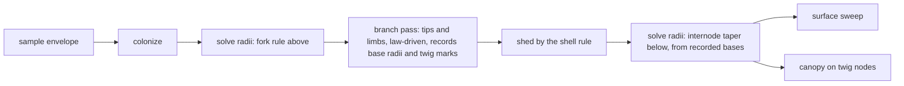

# Branch generations below the crossover, and one fixed twig

## Conversation Evidence

> user: "can you come up with a new preset for them where they ship with appropriate orders and i'll judge"
> user: "now see that doesn't look right to me.. Those branches/twigs have to fill out the volume not just bushel up at the massive trunks"
> user: "i mean i'm still confused by having 8 orders of twigs to be honest.."
> user: "isn't biologically correct always 1 order of twigs we increase the order of branches?"
> user: "well i see a problem with usability though when we make big trees all branch down to realistic twig size it'll impact performance. But I guess we can think about that later? i'd like to really push the envelope here maybe make an opensource alternative to speedtree."
> user: "I feel we have a seed of smth a bit special because I'd like to see trees with branching like this in games and i've never seen it.."
> user: "can we have thousands of realtime generated trees in a scene with this approach?"
> user: "so that it would be usable in a new version of valheim for example"
> user: "do we need to be more ambitious with frame targets? if it's to be used in games there's other stuff that takes rendering time"
> user: "we also probably need to account for procedural leaves? and have them be generated from seeds? that'd be awesome if it's achievable"
> user (edit cycle 1): "we should review the biological accuracy of this. It should be structurally close to natural in the way we generate but we should allow for supernatural parameters (not limited by size as we are in this reality, or have twisting trees etc.)"
> user (carried from fn-5's evidence): "but definitionally branches should branch until the last depths are twigs that attach to leaves no?"
> user (standing principle, carried): "hm well i'd like to take this as far as we can to get to a high perf high fidelity tree generator."
> user (standing principle, carried): "I want it to be as efficient as possible should be snappy. Top tier engineering. Each component worthy of its own library."
> user (amendment, 2026-09-05): "we need to be able to simulate a tree growing procedurally with a timestep function" / "from seed to actual tree"
> user (amendment, 2026-09-05): "we'll be working on fn-6 now have to check how that interacts?" / "can you make amendments to fn-6 to ensure compatibility"

## Goal & Context
<!-- scope: business -->
<!-- Goal & Context: 35% [user], 50% [paraphrase], 15% [inferred] -->

fn-5 built the recursion below colonization and shipped both presets at eight orders of it. Seen in clay, the result is wrong in a way the owner named at once: the fine wood does not fill the crown's volume, it bushels up at the ends of massive limbs [user]. Measured, the cause is structural rather than a dial. On Telperion, colonization hands 133 tips of 79 cm wood to the second pass, and that pass reaches 4.7 mm twigs in eight forks that together span 8 m of length, because each order is a single segment whose length is the growth step times 0.6 per order. A 79 cm limb on a real tree carries on the order of 20 m of further branching, with laterals along the whole of it. Nothing sprouts along the length of any limb in the current pass, and a finer colonization step does not help: at a quarter step the handoff wood is 31 cm on 976 tips and each cluster spans 1.9 m. The tufts get smaller and more numerous, and the volume stays empty [paraphrase].

The owner's second observation is the architecture [user]: botanically there is always one order of twig, and what grows with the tree is the number of orders of branch. A twig is the terminal shoot, a few millimetres across, with leaves along it; its size is set by the leaf's own hydraulics and does not scale with the tree. A 150 m tree and a 15 m tree have the same twig and differ in how many generations of branch lie between trunk and twig. fn-5 named its pass a twig pass and gave every generation a twig's anatomy: one short segment forking at its end. That is right for the last two or three generations and wrong for the five or six above them, which are branches metres long. "Eight orders of twigs" was the wrong name for "the branches, branchlets and twigs colonization never reached", and the confusion it caused the owner is the same defect seen from the parameter side [paraphrase].

This spec replaces the local rules below the crossover with two things: branch generations that have a branch's anatomy, and one fixed twig. The count of generations stops being a dial and follows from the wood, since it is the number of halvings of cross-section from the trunk's radius to the twig's [paraphrase]. The owner's standard for it is stated in one line: structurally close to natural in the way we generate, while allowing supernatural parameters, not limited by size as we are in this reality, or twisting trees [user]. So every rule rests on the botany and is reviewed against it before it ships, and every constant the botany sets is a dial that can be driven past its natural value without the structure breaking [paraphrase]. It keeps everything fn-5 proved: the continuity assertion at the seam, the bias field consulted at every step, the shell rule, the search-radius floor, and the determinism the whole library rests on [paraphrase].

Amended on 2026-09-05, before planning, for a request that arrived after capture: the owner wants the tree simulated growing, seed to mature tree, under a timestep function [user]. That is its own spec, fn-7, and it is not built here. It was checked against this design before this spec was planned, and the check found the design compatible on one condition: the pass below the crossover has to be a function of the wood it is handed, and of nothing else [paraphrase]. Colonization is already a round-by-round simulation, each round extending every active tip by one internode and appending in round order, so the tree at round r is a prefix of the mature node array; the tree at any age is then that prefix, its radii solved on the wood it has, and this spec's pass run on the result. A young tree's tips are thin under the pipe model, so they hand off at twig scale and the seedling comes out as colonization plus one twig per tip, which is correct, and the laterals this spec grows along limbs are exactly the twigs a limb bore when its segment was the tip, taken as a snapshot. None of the rules change for it. What the amendment adds is the three properties the pass must have so that a later spec can re-run it on a younger tree, stated in the Architecture, held by R8, and bounded below [paraphrase].

It serves the strategy directly. The Growth track is "the one recursion from trunk to twig: branch generations with real length and laterals, the twig as a fixed botanical anatomy" [strategy:Growth]. The frame this spec is measured against is the strategy's game budget, not the whole frame: a hero tree inside 2 ms of GPU time on the named machine [strategy:Rendering at scale]. The owner's ambition is an open-source alternative to SpeedTree, usable for forests in a game like Valheim, with branching nobody has seen in a game [user]; this spec is the structural half of that, and the rendering half is bounded out below so it can be its own spec.

## Architecture & Data Models
<!-- scope: technical -->

- **One twig, fixed.** The terminal generation is a single anatomy stated once at botanical defaults with sources: diameter, internode length, leaf stations per internode, and the phyllotaxis the canopy already places leaves with. It does not scale with envelope height or trunk radius, and both presets share it; what differs between the Two Trees at twig scale is the field that bends them and their stiffness, never the twig itself. [paraphrase]
- **Branch generations are branches.** Every generation below the crossover is a branch: a run of several internodes, with a length taken from its parent branch's length by the taper ratio, bearing laterals along its length at the divergence angle, each lateral the root of the next generation. For the first generation the parent length is the colonization run the tip belongs to, or the limb's diameter through allometry; planning picks, having measured both. The bias field is consulted at every internode and the turn limit binds every step, exactly as in fn-5. [paraphrase]
- **The generation count is derived, not authored.** How many generations lie between the crossover and the twig follows from the handoff wood's radius, the twig's radius, and the radius law's share per fork. The `levels` dial is retired; the panel shows the derived count as a read-out. The dials that remain are the allometric ratios: fork exponent, length taper, branching angle, phyllotaxis, internodes per branch, and the supernatural terms. [paraphrase]
- **Laterals sprout along colonization limbs too.** Every colonization node whose wood is under a stated radius bears laterals of the first branch generation, not only the tips. This is what puts fine wood between the big limbs. The shell rule then sheds what lies deep inside the crown, as it does now, and becomes load-bearing rather than cosmetic. [paraphrase]
- **The crossover is now many seams, and the same invariant.** fn-5's continuity criterion applies at every point where the local pass takes over from colonization, tip or lateral origin, and its bias-field criterion applies to every branch internode. The radius solve keeps its own steeper law below the crossover, anchored to the parent's actual radius at each handoff. [paraphrase]
- **Natural at rest, supernatural by dial, and reviewed for the first half.** Every rule below the crossover has a resting value from a named botanical source and a stated rail, and the set of rules is reviewed against the literature as work of this spec before the presets are judged, so the tree at rest is structurally a real tree. The rails are not the limits of this reality: a trunk no real tree could carry, a generation count no real tree reaches, and torsion no real wood survives are all legal, because the supernatural terms drive the same rules past their resting values rather than switching to different rules. [paraphrase]
- **The pass is a pure function of the wood it is handed, so a younger tree can be asked for.** Three properties, each cheap now and expensive to retrofit, and all three are what fn-7 (growth over time) will run this pass on a prefix of colonization with. First, the radius field comes before the pass: the order is colonize, solve the fork rule above the crossover, run this pass on that field, solve the fine orders below. Today the twig pass runs before the solve and reads no radius; this spec's laterals-under-a-stated-radius and derived generation count both read one, so the pass takes the field as an argument rather than re-deriving thickness from geometry. Second, per-node determinism: the laterals a colonization node bears are a function of that node's own state, its arrival direction, its lineage phase and its radius, and never of whether it is currently a tip, of a global counter, or of the order the tips were visited in. A node that is a tip at one round and a limb at the next then bears the same laterals both times, and the fine wood of a tree being aged does not flicker. The current pass carries the phyllotactic phase per lineage from the tip, which is the right mechanism; the laterals-along-limbs rule seeds the same frame from the node's own arrival direction. Third, the twig never scales, which R2 already holds: it is what lets a seedling and a landmark bear the same twig. [paraphrase]
- **Radii first, and the pass owns the law below the crossover.** The order is colonize, solve the fork rule over the colonization skeleton under the tree's own thickness parameters, run the pass on that field, then solve below under the same parameters. The growth entry points therefore take the thickness parameters alongside the skeleton parameters, and a preset's radii reach both solves; a harness dial on trunk radius or fork exponent changes the handoff radii and with them the generations. The pass computes every appended branch's base radius from its parent's radius by the allometric fork rule, child radius equal to parent radius times the length ratio to a stated power, and records what it assigned; the solve below the crossover reads those base radii and applies only the length taper along each internode. One owner for the law, and a young tree handed the same field grows the same wood. [paraphrase]
- **The first generation's length comes from the wood, not the run.** A branch leaving a handoff node has the length elastic similarity gives its diameter, length proportional to radius to the two thirds, anchored so that the shipped trees' handoff wood carries the length their diameter implies. The colonization run's own length is not used, because a node's run is unfinished while it is a tip and finished once it is a limb, and R8 needs the two to agree. [paraphrase]
- **Recursion ends on radius, not on a counter, and the twig is the radius it ends at.** A branch whose law-given base radius is at or below the twig's radius is a twig, and the radius recorded for it is the twig's own, not the law's smaller value; a twig carries no thinning along its length beyond the stated tip fraction. That is what makes the twig one anatomy across handoffs of different radii, envelope heights and presets, and it is the one place the recorded radius departs from the recursive law. Anything thicker is a branch that bears laterals and a leader. The generation count is therefore per handoff and emerges from the wood, and the level cap is a safety stop that is reported when hit, never the thing that decides depth. [paraphrase]
- **Laterals collide against the node's own arrival direction.** Today a lateral is dropped when it lies within half the branching angle of the accepted leader. For R8 a node's laterals must not depend on whether it currently carries a leader, so the reference direction for the collision test is the direction the node was arrived at, which a tip and the limb it becomes share. The leader itself is exempt from the test. [paraphrase]
- **A lateral's radius is its own, not a share of its parent.** The fine-order solve today shares a parent's radius among the children it appended; a lateral leaving a 2 m limb would inherit the limb. Under the allometric rule a lateral's base radius follows from its length ratio to the parent branch, and the limb keeps its radius, which is what the pipe model says of a limb that thickened for wood above it. [paraphrase]
- **The pass's records survive shedding.** The shell rule removes nodes and re-indexes the survivors; the branch ids, base radii and twig marks the pass recorded are compacted with them and the branch ids remapped through the same index map, so the solve and the canopy downstream read records that name the nodes that are still there. [paraphrase]
- **The pass refuses what it cannot grow, and says so.** A skeleton whose parent indices are not parent-before-child, or a field whose length is not the skeleton's, is returned unchanged with the refusal named in the result; nothing throws, which is the library's rule, and nothing grows on invalid input, which is R8's. [paraphrase]
- **The twig is the natural instanced element.** Because the twig never scales, one twig with its leaves can become the unit the canopy instances, the way games draw twig cards. This spec only has to leave the twig's anatomy stateable as a single element; drawing it that way is the rendering spec's. [paraphrase]

## Edge Cases & Constraints
<!-- scope: technical -->

- The node budget is re-derived from what a branch generation can add, since laterals along limbs multiply the count colonization hands over; reaching the ceiling is reported and never silently truncates. [paraphrase]
- A skeleton with fewer than two nodes yields no branches; non-finite parameters fall back to documented defaults through the same rail idiom every stage uses. [paraphrase]
- A colonization tip whose wood is already at or below twig radius gets a twig and no branch generations; a handoff whose recursion reaches the level cap before twig radius is reported as such rather than clamped silently. [paraphrase]
- Same seed and parameters give a byte-identical tree; the colonization stage above the crossover is unchanged byte for byte on both presets, so every difference is attributable to this pass. [paraphrase]
- fn-7 will rebuild the fine wood once per age sample, so this spec's build time (R6) is what will bound an age dial's drag. With per-node determinism the pass can cache each colonization node's subtree and re-run only the nodes whose radius has moved; that cache is fn-7's to build, and this spec's design must not preclude it, which per-node determinism is sufficient for. [paraphrase]
- The CPU build is the constraint fn-5 measured, not the GPU. The build time at the shipped configuration is measured and reported on both presets, and the harness's settle-after-the-last-notch mechanism keeps the dial draggable. [paraphrase]

## Approach

Seven tasks, in dependency order, each sized for one work iteration.

1. **The law before the pass, and the tuft measured before it is replaced.** A pure module states the branch law: length from radius by elastic similarity, child radius from the length ratio to a stated power, the fixed twig anatomy, and generations-until-twig for a handoff radius. It is measured on both presets' colonization skeletons before anything grows: how much branching each handoff carries, how many generations, how many nodes the whole pass would add. The two fill metrics are written here too, in shedding's own shell units, and taken on the shipped eight-order trees so R4 has the tuft as its baseline before task 2 removes the dial that made it. The biological review of every rule and its source is recorded here. This is the early proof point.
2. **Branches from the tips.** The pass is rewritten to grow a branch from every handoff tip under the law, taking the radius field as an argument, recording per appended node its branch and the base radius assigned, recursing until twig radius, marking twigs at the twig's own radius, refusing invalid input by name, and carrying its records through shedding. The growth entry points take the thickness parameters so both solves share them. The `levels` dial and the per-order twig anatomy go; the structural-key tests follow.
3. **Thickness reads the pass, and the seam becomes many seams.** The solve below the crossover consumes the recorded base radii and applies internode taper; the continuity suite generalises from one crossover to every handoff and asserts at each; the bias-field suite carries over.
4. **Laterals along the limbs.** Colonization nodes under the stated radius bear laterals under the same law, colliding against their own arrival direction; the node budget is re-derived; the pass is proven a per-node pure function by the R8 prefix test.
5. **Fill, shed, and the twig's leaves.** The two metrics from task 1 are taken on the new trees against the tuft baseline, and thresholds are chosen by the stated procedure; the shell rule is checked as load-bearing; the canopy keys its shoots on twig nodes so the leaf sits on the twig.
6. **The harness and the two trees.** After the foliage sits on the twig, the orders dial is retired for a read-out of generations and handoffs, the ceiling notice is reworded, both presets state the twig and the ratios and no depth, the round-trip tests follow, and the owner's R7 verdict is taken; any preset value the verdict moves is re-measured against R4 before it ships.
7. **The cost on the named machine, and the docs.** Both presets measured with the rig at the display's own pixel ratio, the rig's sweep extended to reach it, against the 2 ms hero budget and the build timer; every module header, the README, the barrel and the harness comments that still say orders are rewritten.



## Quick commands

```bash
npx vitest run src/skeleton/twigs.test.ts src/skeleton/continuity.test.ts src/skeleton/grow.test.ts
npx vitest run src/presets src/radius.test.ts harness
npx tsc --noEmit
npx vitest run
```

## Acceptance Criteria
<!-- scope: both -->

- **R1:** Below the crossover, every generation is a branch: a run of several internodes whose length derives from its parent's, bearing laterals along its length at the divergence angle, with the bias field consulted and the turn limit enforced at every internode. Colonization nodes under a stated radius bear laterals of the first generation as well as tips. Every rule's resting value is stated with its botanical source and the set is reviewed against the literature before the presets are judged, with the review recorded in the spec. Measured on Telperion, the branching carried by a handoff limb spans a total length within the allometric range for its diameter, on the order of 20 m for 79 cm wood, rather than the 8 m of one segment per order. Errors: a branch whose derived length is under one internode collapses to a twig rather than a zero-length run; a lateral that would leave below the bare-trunk line is not placed. [paraphrase] [strategy:Growth]
- **R2:** There is one twig. Its diameter, internode and leaf stations are stated once at botanical defaults with sources, are identical on both presets at rest, and the tree never scales them: envelope height, trunk radius and the derived generation count leave the twig as it is. A preset may still drive the twig's terms past their resting values, because that is a dial and not the tree's size doing it. The leaf stays a botanical multiple of the twig it hangs on at rest. Errors: no error surface beyond R1's rails. [paraphrase]
- **R3:** The number of branch generations is derived from the handoff radius, the twig radius and the radius law, never authored. The `levels` dial is retired from the library's parameters and the panel, and the derived count is shown as a read-out on both presets. Changing trunk radius or fork exponent changes the count; changing envelope height alone does not change the twig. The ratios the count derives from carry no ceiling taken from this reality: a trunk, a height or a count no real tree reaches is legal, and the structure stays one recursion under it. Errors: a derived count above the level cap is reported with the cap applied, never silently clamped. [paraphrase]
- **R4:** Fine wood fills the crown's shell rather than clustering at colonization tips. Measured on both presets against a threshold taken first on the tight case and then set at the number a clay render cannot distinguish: the fraction of the envelope's shell volume that contains leaf-bearing wood, and the fraction of twig nodes lying within a stated distance of a colonization tip, both reported and both held. Errors: a shell rule that sheds everything or nothing fails by the leaf culler's own floor-and-ceiling guard. [paraphrase]
- **R5:** fn-5's continuity criterion holds at every handoff, tip and lateral origin alike, and its bias-field criterion holds for every branch internode: one term driven to an extreme moves the branches with the limbs, and every term at zero reproduces an unbiased recursion byte-identically. Errors: a parameter set with no handoffs is reported as untested rather than passing vacuously. [paraphrase]
- **R6:** The cost is measured on both presets at the shipped configuration: nodes, twigs, leaves, triangles, CPU build time, and GPU frame cost from the existing rig at native pixel ratio on the RTX 3080. The hero tree renders inside 2 ms of GPU time. Hitting the node ceiling is reported, and the build stays draggable by the mechanism fn-5 shipped. Errors: when the timer-query extension is unavailable the panel says so and reports no number; a configuration the machine cannot build interactively is reported rather than hanging the tab; a shipped tree that cannot meet 2 ms is reported as the reason the rendering spec is needed sooner, not clamped. [strategy:Rendering at scale] [paraphrase]
- **R8:** The pass below the crossover is a pure function of the colonization skeleton, its radius field and its parameters, taking the field as an argument, with the solve above the crossover run before it and the fine orders' solve after. Per node, it is deterministic in that node's own state: run on a round-boundary prefix of colonization under the mature tree's own radii, it appends for every node present in both the same laterals, byte for byte, as it appends on the mature tree, the prefix's tips differing only by the leader continuation a tip carries and a limb does not. Errors: a skeleton whose parent indices are not parent-before-child (a self parent, a forward parent, an out-of-range parent) is returned unchanged with the refusal named in the result, never grown; a field whose length is not the skeleton's is refused the same way, not padded. The pass cannot see colonization's round boundaries in a node array, so a prefix cut mid-round is a valid skeleton to it and grows a valid tree; refusing or exposing round boundaries is fn-7's contract, when colonization learns to report them. [paraphrase]
- **R7:** The owner confirms in clay that the branches fill the crown's volume rather than bushelling at the ends of the limbs, that the tree reads as a tree of its size, and that Telperion still reads as Telperion and Laurelin as Laurelin with every supernatural term at its preset value. [user]

## Boundaries
<!-- scope: business -->

- **Rendering at scale is a separate spec:** instanced twigs, the LOD ladder, GPU or worker generation, archetypes instanced into forests, engine export. This spec leaves the twig stateable as one element and measures the frame; it does not change how anything is drawn. [paraphrase]
- **Growth over time is fn-7, not this spec.** No timestep function, no age dial, no age profile for the envelope, and no shedding of colonization wood are built here. This spec only holds the three properties in R8 that let fn-7 run the pass on a younger tree. The one approximation that will follow from running a snapshot pass on an aging tree is stated here so it is not mistaken for a defect of this spec: a lateral disappears when its limb thickens past the stated radius, where a real tree would have made it a branch or shed it. That is fine-scale and reads as self-pruning; it is fn-7's to measure. [paraphrase]
- **Rejected, and recorded so it is not re-proposed under fn-7: a developmental model** in which every bud extends every year, laterals are born and persist, wood thickens by the pipe model and shaded wood is shed (Palubicki et al. 2009, "Self-organizing tree models for image synthesis"). It would make the laterals history rather than a snapshot, and it would replace fn-5 and this spec rather than sit on them; a 150 m tree's life under it is tens of millions of internodes, which is not a build a dial can drag. Per-node determinism (R8) is what keeps that door open without walking through it. [paraphrase]
- **Procedural leaves generated from seeds are a separate spec.** The owner asked for them and they are recorded here so they are not lost; the flat placeholder element stands until that spec lands. [user]
- **Performance beyond the measurement in R6 is deferred on purpose:** "we can think about that later". [user]
- Limb interpenetration and blunt tips stay fn-4's. [paraphrase]
- No change to the envelope's authored silhouette, the bias field's terms, or the plaited surface. [paraphrase]
- Not a light-competition simulation; the shell rule is the stated approximation. [paraphrase]
- No wind, sway or animation. [paraphrase]

## Strategy Alignment

Active tracks served by this plan:
- **Growth** — this is the track's own sentence: branch generations with real length and laterals, the twig as a fixed botanical anatomy, continuity asserted at every seam.
- **The supernatural field** — the bias field is consulted at every branch internode, and every botanical constant is a dial that can be driven past nature; the presets are re-stated without a depth and judged in clay.
- **Rendering at scale** — the twig becomes one stateable element, the frame is measured against the 2 ms hero budget, and the pass's per-node purity is what a later age dial and a per-node cache rest on.

## Decision Context
<!-- scope: both -->

### Motivation
<!-- scope: business -->

- **The owner's biology is the architecture.** "Always 1 order of twigs, we increase the order of branches" is the correct framing and a better parameterization than fn-5's: it dissolves the depth dial and R8's judgement of a depth, because the tree's own size decides the count. What the owner judges instead is whether branches read as branches and twigs as twigs. [user]
- **Natural in structure, unlimited in parameter.** The owner's standard on read-back: "structurally close to natural in the way we generate but we should allow for supernatural parameters (not limited by size as we are in this reality, or have twisting trees etc.)". The botany supplies the rules and their resting values, and is reviewed for accuracy; the supernatural is what the same rules do when driven past them. A second rule set for magical trees is rejected, because it would put the seam back at the point where nature ends. [user]
- **Rejected: the colonization run's length as the first generation's parent length.** It is unfinished while a node is a tip and finished once it is a limb, so a pass that read it could not be a per-node pure function (R8). Allometry from the node's own radius is the same number in both states. [paraphrase]
- **Rejected: an authored or global generation count.** Apical dominance means the leader keeps most of the cross-section, so a balanced-fork estimate is wrong and a single number misleads the read-out. Recursion until twig radius, per handoff, is what the wood does; the panel shows the range. [paraphrase]
- **Rejected: sharing the parent's radius among laterals.** It is the current fine-order rule and it gives a lateral off a metre-thick limb the limb's own radius. Weber and Penn's radius-from-length-ratio rule, the one tree-gen and Arbaro ship, is the botanical one and it keeps limbs where they are. [paraphrase]
- **The seam moved, it did not go away.** fn-5 merged two specs to kill a seam between a skeleton and a twig layer, then reintroduced the defect one level down by giving branches a twig's anatomy. The continuity machinery is the part that was right and it carries over whole. [paraphrase]
- **Rejected: a finer colonization step.** Measured at half and a quarter of the shipped step the tufts shrink and multiply and the volume stays empty. Attractors decide where the tree is asked to grow; length and laterals decide whether it fills what it reaches. [paraphrase]
- **Rejected: fewer orders.** Six orders leave 2 cm wood at the tips with leaves stuck on it, which is fn-5's original defect again. The count of eight was right; the anatomy per generation was wrong. [paraphrase]
- **Rejected: treating count and ratio as the criterion.** fn-5 hit its leaf count and its leaf-to-twig ratio on tufts, exactly the failure its own Decision Context warned of. R4 is the structural criterion that was missing. [paraphrase]
- **The frame budget is a game's, not a demo's.** The owner asked whether 16.7 ms was ambitious enough given what else a game renders; the strategy now holds a hero tree to 2 ms and this spec inherits it. [user]
- **Compatibility with growth over time was checked before planning, not after.** The owner raised the timestep simulation while this spec was captured and unplanned and asked how it interacts. The finding: the rules here are already the snapshot of what a tree grows over time, and only the shape of the pass, radii first and per node, decides whether fn-7 can reuse it or has to rewrite it. Three properties added to a pass that is being written cost nothing; retrofitting them into one that has shipped and been judged in clay would re-open R7. [user]
- **Performance is deferred knowingly, and the twig is the reason it can be.** A fixed twig is the unit every engine instances as a card, so the biology framing also opens the rendering path; the owner chose to build the structure first and think about the cost later. [user]

## Measured

Telperion as shipped after fn-5, and the two finer steps, in the unit-test sweep on this machine. Handoff wood is the median radius of colonization tips; reach is the summed internode length of one cluster.

| step | orders | colonization nodes | tips handed off | handoff wood | cluster reach | median tip | leaves |
|---|---|---|---|---|---|---|---|
| 3.26 m (shipped) | 8 | 808 | 133 | 79 cm | 8.0 m | 4.7 mm | 136,808 |
| 1.63 m | 6 | 3,140 | 472 | 44 cm | 3.9 m | 10.4 mm | 123,695 |
| 0.81 m | 6 | 8,626 | 976 | 31 cm | 1.9 m | 10.4 mm | 231,561 |

Elastic similarity puts about 21 m of branching on 79 cm wood in a tree whose 14.8 m trunk carries 148 m. Eight orders in 8 m is the tuft.

Colonization's own clock, measured for the amendment on both presets as shipped: Telperion is 51 rounds (19 of them the bare-trunk climb, 32 of crown growth) to 808 nodes, Laurelin 57 rounds (11 climb, 46 crown) to 2,442, and colonization alone is under 20 ms on either. Every round boundary is a valid prefix of the mature node array, which is the property R8 is written against; at Telperion's 60th percentile round the prefix is 136 nodes on 27 tips at 90 m, and its tips solve thinner than the mature handoff wood, which is why a young tree hands off at twig scale under this spec's derived count.

## Parked unknowns

- Whether the shell rule alone yields a real crown's shell once fine wood is everywhere. Task 5 measures R4 on the shell rule as it stands; if the shell rule cannot meet the threshold a clay render distinguishes, a light term is a new spec and not a change to this one. [paraphrase]

## Early proof point

Task fn-6-branch-generations-below-the-crossover.1 validates the approach: that the allometric law, applied to both presets' colonization skeletons as they are, puts branching of the order of 20 m on 79 cm handoff wood, reaches twig radius within the level cap on every handoff, and predicts a node count the ceiling can carry. If the law cannot do all three on the shipped trees, the recursion-by-radius design is reconsidered before the pass is rewritten in task 2.

## Requirement coverage

| Req | Description | Task(s) | Gap justification |
|-----|-------------|---------|-------------------|
| R1 | Generations are branches: length, internodes, laterals along limbs | fn-6-branch-generations-below-the-crossover.1, fn-6-branch-generations-below-the-crossover.2, fn-6-branch-generations-below-the-crossover.4 | — |
| R2 | One fixed twig | fn-6-branch-generations-below-the-crossover.1, fn-6-branch-generations-below-the-crossover.2, fn-6-branch-generations-below-the-crossover.5 | — |
| R3 | Generation count derived; `levels` retired | fn-6-branch-generations-below-the-crossover.2, fn-6-branch-generations-below-the-crossover.6 | — |
| R4 | Fine wood fills the shell, measured | fn-6-branch-generations-below-the-crossover.1, fn-6-branch-generations-below-the-crossover.5 | — |
| R5 | Continuity and bias field at every handoff | fn-6-branch-generations-below-the-crossover.3 | — |
| R6 | Cost measured against the 2 ms hero budget | fn-6-branch-generations-below-the-crossover.7 | — |
| R7 | Owner's eye in clay | fn-6-branch-generations-below-the-crossover.6 | Manual gate; .6 prepares the comparison |
| R8 | Pass is pure in (skeleton, field, params); radii first; per-node deterministic | fn-6-branch-generations-below-the-crossover.2, fn-6-branch-generations-below-the-crossover.4 | — |


