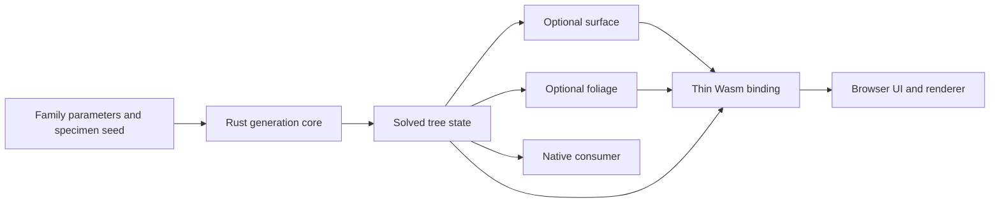

# Lean Rust tree generation core

## Overview

Replace the procedural generation core with one native Rust library and a thin browser Wasm binding, while retaining the existing browser controls and renderer. The result should make botanical rules easy to inspect, change and extend toward realistic procedural tree simulation.

## Approach

Keep tree data independent of rendering and binding libraries. Parameters describe the family, species presets provide named parameter sets, and the seed determines the specimen. Preserve final FN-6's generation behaviour as the migration reference, including its provisional pointed branches; improvements to botanical form get their own reference-driven species work.

Use compact owned arrays, explicit stage inputs and outputs, and small modules named for the domain. A native consumer can generate and inspect structure without constructing a mesh; surface and foliage outputs are independently requested from the same solved tree. Prefer safe Rust and straightforward code; every unsafe boundary or additional dependency needs a concrete purpose and a local explanation.

The native contract consists of a validated family/seed request producing an owned solved tree plus generation diagnostics, and separate surface and foliage functions consuming that tree. Tree data retains current parent, lineage, phase, twig and radius information; it introduces no speculative timestep or stable-identity system. Foliage results distinguish leaf-element geometry from transforms so consumers can reuse an element. The browser adapter copies returned arrays into JS ownership before releasing or reusing Wasm storage; zero-copy lifetime machinery is unnecessary until measured transfer costs justify it.

Preserve the existing deterministic node-cap/partial-tree report. Check buffer-size arithmetic and use fallible allocation for output buffers; output allocation failure returns an error rather than a truncated successful mesh. Retain meaningful finite-input clamping and valid zero modes, while rejecting non-finite or structurally invalid inputs at the new API boundary. Browser initialization may be asynchronous, but FN-8 does not require worker execution or cancellation of a synchronous Wasm call; any asynchronous rebuild path must discard and dispose stale results.

## Boundaries / non-goals

No compatibility promise for existing TypeScript APIs, saved formats or seed outputs across the migration; equivalent current specimens are a regression check, not a permanent format commitment. Remove the production TypeScript generator at cutover; a frozen reference in Git and verification fixtures may remain for testing. Preserve current supported controls and their meaning.

Lifecycle simulation, new species templates, fixes to pokey branches, fork redesign, GPU generation, multithreading, forest LOD and game-specific adapters are subsequent work. This migration exposes renderer-independent tree state and optional existing representations; a general spatial-field sampler and Minecraft/Valheim integrations remain subsequent consumers, without speculative plugin machinery or empty extension interfaces now.

## Strategy Alignment

- **The core and integration** - one lean Rust core supports native and browser consumers, with generation separated from optional representations.
- **Growth and botanical fidelity** - explicit botanical stages and reproducible specimens keep later model changes local and testable.
- **Surface and rendering at scale** - migrate surfaces and foliage with measured build and transfer costs, keeping GPU results separate from CPU improvements.
- **The supernatural field** - preserve shared field semantics and named controls across the migration.

## Decision context

The owner's mantra is "Minimalist af, efficient af and beautiful". Small domain interfaces, explicit ownership and measured improvements are the architectural standard; a generic engine framework, permanent dual core and compatibility layer add no value to this young project.

FN-7 measured a browser surface-only gain on frozen pre-final-FN-6 inputs. It did not establish whole-generation speed, total memory reduction or GPU improvement. Keep that report as historical evidence and compare FN-8 directly with final FN-6, without refreshing the disposable prototype.

The final FN-6 reference is commit fdafb099b1495519de75a6b9a66d37f7d07e47bd. Its recorded builder medians are 4.9234 s for Telperion and 7.7384 s for the comparison; native-DPR GPU medians are 5.846528 ms and 9.09824 ms respectively. Those are historical observations on the recorded machine; collect a contemporaneous reference under the same measurement conditions before attributing gains to Rust.

## Acceptance Criteria

- **R1:** Pin final-FN-6 fixtures and a reproducible equivalence runner for ordinary scale, both giant presets and boundary cases before porting the algorithms. Compare topology, parent ordering, twig/leaf membership and counts exactly, and positions, radii, bounds, mesh attributes and transforms with declared absolute/relative tolerances established before migration results are judged; compare clay views with the same seed, parameters, camera and lighting. Errors: missing reference revision or mismatched fixture provenance fails the comparison; empty/single-edge cases, crown crossings, degenerate edges, capped generation and leaf-free outputs are represented explicitly. Numeric differences that change topology or visible shape fail the pin and require diagnosis rather than silently relaxing it.
- **R2:** Provide one native Rust core for parameters, presets, deterministic RNG, envelope, shared bias field, colonization, branch generations, twigs, radius solving and shedding. Preserve final-FN-6 control semantics and emit finite parent-before-child structure; repeated builds are byte-identical on each supported target/toolchain, with cross-target differences governed by R1's comparison policy. Errors: non-finite parameters, invalid ranges and invalid tree references return explicit errors; valid zero/empty cases retain their reference meaning, and node limits return an explicit capped result without corrupting structure.
- **R3:** Generate surface geometry and foliage data through independent requests against the solved tree, using renderer-independent buffers and metadata. A structural-only request creates neither mesh nor foliage output; a surface-only request avoids foliage work; foliage placement and shell culling do not require constructing the wood surface. Errors: empty requested output is a valid empty buffer set; invalid indices, incompatible buffers and unsupported request values fail clearly without partial usable output. Validate winding, normals, bounds and instance membership against R1.
- **R4:** Expose a small Wasm binding and a native library API over the same core. Specify ownership, release and view lifetime, including whether a later call can invalidate a view; perform coarse stage/build calls and bounded transfers rather than per-node language crossings. Errors: malformed requests, buffer-length mismatches, out-of-range counts and stale/released handles are rejected safely wherever handles are exposed; memory growth and allocation failure must not leave dangling views or a falsely successful build. Wasm traps/load failures surface as errors in the adapter.
- **R5:** Switch the browser harness to Rust/Wasm, retaining Telperion, Laurelin, comparison mode, all currently supported dials, clay/foliage display, skeleton diagnostics and CPU/GPU measurement controls. Errors: initialization/build failure leaves a visible error and a coherent previous scene; replacement disposes owned resources; if builds become asynchronous, stale completions cannot replace the latest requested tree. Browser tests and matched clay captures verify the port at ordinary and giant scales.
- **R6:** Demonstrate lower median whole-build browser latency for both giant presets and their comparison against contemporaneous final-FN-6 runs at unchanged output work and measurement conditions. Record warmups, raw samples, environment, stage timings, transfer/materialization costs and native results; establish tolerances and sampling before the comparison, and increase samples when timing variation makes improvement inconclusive. Report peak memory by available measurement domain, repeated build/dispose behaviour, and real GPU timer results independently. Errors: unavailable memory or GPU instrumentation is labelled unavailable, never substituted with a differently named metric; regressions or inconclusive performance fail the CPU improvement gate and require investigation. Existing frame-budget misses remain visible and are not solved by claiming a Rust CPU gain.
- **R7:** Ship one production core with a clean native/Wasm build, a thin TypeScript consumer and maintained tests/documentation. Port behavioural tests to their owning Rust modules, retain browser integration tests, and remove superseded production algorithms and stale API examples. Document the public data/ownership contract, reproducible setup and final benchmark limits. Errors: a clean checkout with documented prerequisites must build and test without temporary machine-specific paths; missing Wasm artifacts must be built by the documented flow or produce an actionable error. Lean design is checked through concrete dependency/module ownership and absence of duplicate generation or speculative frameworks, not a line-count target.

## Early proof point

Task fn-8-lean-rust-tree-generation-core.1 pins the final reference and proves deterministic foundational data can be generated natively and transferred through Wasm with explicit ownership. If the boundary or numerical contract fails, simplify it before migrating the remaining stages.

## Requirement coverage

| Req | Description | Task(s) | Gap justification |
|-----|-------------|---------|-------------------|
| R1 | Final reference and equivalence | .1, .2, .3, .4, .5, .6 | None |
| R2 | Complete botanical generation | .1, .2, .3 | None |
| R3 | Optional surface and foliage | .4, .5 | None |
| R4 | Native and Wasm contract | .1, .5, .6 | None |
| R5 | Browser cutover | .6 | None |
| R6 | Whole-pipeline measurements | .7 | None |
| R7 | Lean production cutover and docs | .1, .6, .7 | None |
