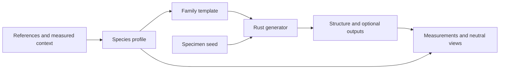

# Real-species profiles and procedural templates

## Conversation Evidence

> E1: "yes i'd agree with fidelity first"
> E2: "it'll also require procedural leavees right? to make needles and different shapes and stuff"
> E3: "alright i think the spec should be first finding species and reference images to work off of and then for each species create a template where every seed looks recognizably like the reference species."
> E4: "also figure out the actual \"specs\" of a tree. And see if we're in the right ball park in terms of branches and leaves, height etc. etc."
> E5: "so each species has a profile that we work towards with the template"
> E6: "I think we should have all \"supernatural\" attributes be separated from natural ones. and by default have them off."
> E7: "ofc the supernatural templates will have the supernatural traits on.."

## Goal & Context

Research real species, define their botanical profiles, and build procedural templates whose seed variations remain recognizably that species. Geometry and foliage fidelity come first, supported by measurements and visual references. A profile is the target; family parameters express its anatomy; a seed selects a reproducible specimen.

## Overview

Standard-depth plan, with plan review explicitly omitted at the owner's request. Initial scope is two contrasting species: one broadleaf and one needle-bearing conifer. Task 1 selects the actual species on evidence quality and architectural contrast, and fixes one mature growing context per species. A later catalogue can extend this method.

Viewer users gain named species selection and specimen variation. Native and browser consumers receive the same Rust-owned templates. An overnight executor can research, generate, measure and capture on a CPU-only host; visual conclusions require inspecting the resulting images.

## Architecture & Data Models

Keep botanical reference profiles separate from runtime family parameters. Profiles carry stable species identity, scientific/common names, growth stage, growing context, identifying traits, cited measurement ranges, units, confidence and measurement definitions. Template identity maps explicitly to profile identity; selection must not depend on catalogue ordering. Profile research does not become an extensible runtime rules language.

Rust remains the source of generation behavior. Extend existing branching and procedural foliage only where the selected profiles demonstrate a missing capability. Keep output representations optional; measurements use actual structure and foliage, never conservative spatial occupancy as anatomical truth. Browser parameter metadata continues to be generated from the Wasm schema.

Natural orientation and tropism remain botanical parameters. Authored supernatural writhe/spiral effects form an explicit separate group with neutral ordinary defaults; natural lean or gravitropism must not disappear merely because it currently shares that group. Existing supernatural templates explicitly retain their intended enabled effects. A disabled supernatural group has no residual influence on the same-seed natural result.



## Approach

Research profiles and an anatomy capability matrix first. Build measurement tooling, targeted branching improvements and procedural foliage support against that frozen target. Calibrate each template with the shared measurements, expose both through the existing native/browser viewer path, then inspect fixed and previously untuned seeds against the references.

Use 12 fixed seeds per species for repeatable numeric validation and 12 additional seeds drawn and recorded after initial calibration. Render at least three fixed and three fresh specimens per species, plus every numerical failure, in whole-tree, bare-branch and foliage-detail views. Retain fresh failures as regressions; never resample them away. This is an engineering sample, not proof about every possible seed.

Task 1 defines a small species-specific visual rubric covering crown silhouette, branching habit, crown gaps, terminal taper and foliage shape/attachment, as well as which numeric ranges are gating versus contextual. Evidence-backed ranges are fixed before tuning; a revision needs independent evidence and a recorded explanation.

## Edge Cases & Constraints

Define height, DBH (including measurement height), crown dimensions, branch order/branch counts, twigs, individual leaves or needles, fascicles/leaflets, retained instances and leaf area before comparing values. Node count is not branch count; a needle cluster instance is not one needle. Distinguish pre-cull from retained foliage and projected from actual surface area. Missing or estimated biological quantities remain labelled and cannot silently become passing checks.

Incomplete growth, resource truncation, non-finite geometry, unavailable references and failed captures produce explicit failed/unassessed cases. Preserve completed case results across interruption and return a failing summary for required cases that did not pass. Do not revise targets to fit output or conceal systematic differences in averages.

Pin cameras, resolution, neutral materials and capture environment. Software WebGL is acceptable for visual QA; record the actual renderer backend. Numerical success, visual assessment and owner feedback are separate evidence fields. The executor must inspect images and report trait-level results; never attribute approval to the owner without their feedback.

Record generation time, counts and output sizes on the same host before/after relevant changes. This spec does not invent a new GPU performance gate or claim software rendering predicts hardware frame time. Keep compact reproducible evidence and source manifests; avoid committing large generated buffers.

## Acceptance Criteria

- **R1:** Select the two contrasting species and gather attributed whole-tree, branching and foliage references for their chosen stage/context. Profile readiness requires enough evidence to identify anatomy and establish meaningful dimensional checks. Errors: missing, conflicting or ambiguous evidence is recorded; replace an inadequately documented candidate during research or leave that profile unready.
- **R2:** Define each species' anatomy and target ranges for height, trunk/crown dimensions, branches and foliage dimensions/abundance; compare generated measurements using matching units and definitions. Errors: distinguish estimates and unavailable quantities; incomplete/non-finite outputs and violated gating ranges fail, with per-seed discrepancies retained. [paraphrase] (E4, E5)
- **R3:** Ship one named template per selected species through native and browser selection. Same parameters and seed reproduce a specimen; different seeds vary specimens while retaining identifying traits. Ordinary templates have separate, disabled supernatural attributes; supernatural templates explicitly enable intended traits. Errors: unknown identity/invalid new parameters fail clearly; observed identity counterexamples remain failures until corrected. [paraphrase] (E3, E6, E7)
- **R4:** Procedural foliage supplies each profile's leaf/needle geometry and attachment, including any required grouping and orientation. Errors: unsupported anatomy remains unmet, not a generic substitute; empty/degenerate/non-finite geometry and invalid attachment parameters are rejected or handled explicitly without corrupting bounds or counts. [paraphrase] (E2, E3)
- **R5:** Complete the fixed/fresh seed protocol in neutral materials with whole-tree, bare-branch and foliage-detail reference comparisons, and record numerical and inspected visual results separately. Errors: missing references, failed captures, uninspected images and trait mismatches prevent an unqualified fidelity pass; all failing cases are retained.
- **R6:** Correct shared generation limitations demonstrated by the selected profiles and recheck affected natural and supernatural templates. Errors: remaining structural mismatches stay unmet; geometry bounds, junction/tip defects and cross-template regressions cannot be hidden by tuning only the selected showcase seeds. No other error surface beyond R2–R5.

## Boundaries

Geometry and foliage anatomy precede texturing/material realism. Lifecycle simulation, GPU acceleration, LOD, wind, environmental response and external-engine adapters belong to their captured follow-up specs. No exhaustive catalogue, universal botanical grammar, reference scraper service, or speculative new integration layer.

## Strategy Alignment

- **Growth and botanical fidelity** — measured real-species profiles make branching and foliage rules answerable to references.
- **The core and integration** — one lean Rust core and generated bindings keep template changes accessible to native and browser consumers.
- **Surface and rendering at scale** — neutral geometry checks expose silhouette, junction and foliage defects while recording runtime costs.
- **The supernatural field** — ordinary anatomy and explicitly enabled supernatural character remain independently controllable.

## Decision Context

FN8 is the merged foundation (PR #1, merge 2fcac35), despite its stale open Flow lifecycle; it is available, not a new blocking dependency. FN10, FN11, FN13, FN14 and FN15 already depend on FN9. FN12 research and FN17 target discovery remain independently schedulable.

Two species provide the smallest useful broadleaf/conifer contrast. Select species from evidence before committing to a particular branching architecture. A universal tree grammar is unnecessary for this first pair; introduce only concrete shared rules supported by their profiles.

Repo and research scouts confirmed the need for R1's bounded research, R5's visual sampling and R6's evidence-driven engine fixes, consuming the capture's inferred tags. Current foliage has one broadleaf element and a twig-global placement rule; current family defaults also mix natural and authored biases. These are explicit implementation targets, not evidence that every existing procedural method is inadequate.

## Quick commands

```bash
cargo test --release -p telperion-core --test growth --test foliage
npm run typecheck
```

Use the repository's documented Rust toolchain. Task-specific commands add measurement and visual runners as those land; the final task runs the full integration gates once.

## Early proof point

Task fn-9.1 must produce two evidence-ready profiles and a baseline discrepancy/capability matrix, proving that the targets can be measured and visually judged. If a candidate lacks usable evidence, replace it during task 1 before dependent implementation begins.

## Open Questions

Exact species, context-qualified numeric targets and required attachment anatomy are research outputs owned by task 1, not unanswered implementation assumptions. No owner decision blocks planning.

## References

- [Tree architectural measurements and their hierarchy](https://academic.oup.com/aobpla/article/17/4/plaf029/8160858)
- [USFS Silvics: Oregon white oak, including growing-context differences](https://research.fs.usda.gov/silvics/oregon-white-oak)
- [Stochastic tree reconstruction and structural comparison](https://silvafennica.fi/pdf/1413)
- [Architectural modeling across contrasting species](https://academic.oup.com/treephys/article/44/5/tpae045/7663033)
- [Three.js instanced bounds and updates](https://threejs.org/manual/en/how-to-update-things.html)
- [Playwright visual environment reproducibility](https://playwright.dev/docs/test-snapshots)

## Requirement coverage

| Requirement | Tasks | Gap justification |
|---|---|---|
| R1 | fn-9.1 | — |
| R2 | fn-9.1, fn-9.2, fn-9.5, fn-9.6, fn-9.9 | — |
| R3 | fn-9.3, fn-9.5, fn-9.6, fn-9.7, fn-9.8, fn-9.9 | — |
| R4 | fn-9.4, fn-9.5, fn-9.6, fn-9.7, fn-9.8, fn-9.9 | — |
| R5 | fn-9.1, fn-9.8, fn-9.9 | — |
| R6 | fn-9.3, fn-9.4, fn-9.5, fn-9.6, fn-9.9 | — |
